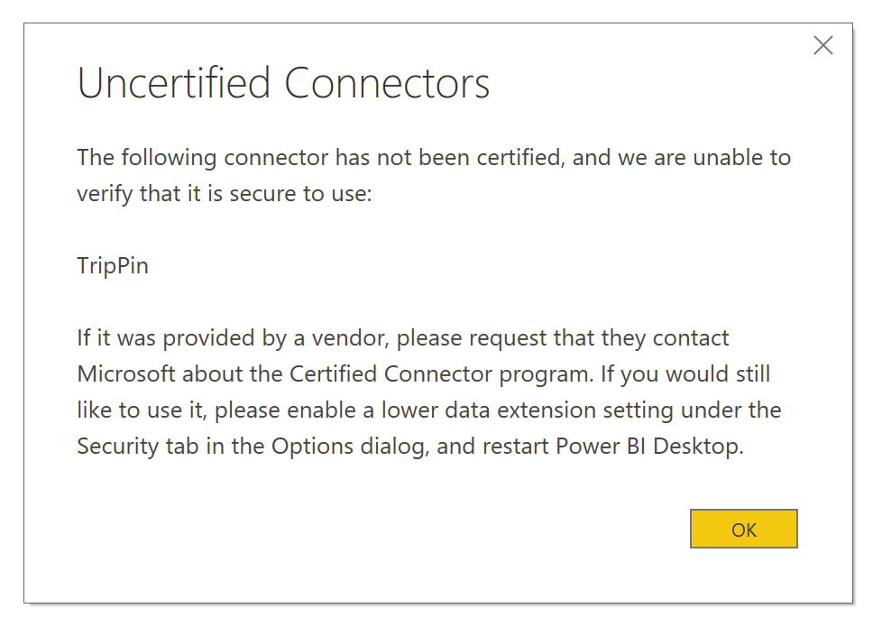

# Connector extensibility in Power BI

In Power BI, customers and developers can extend the data sources to which they can connect in many ways, such as using existing connectors and generic data sources (such as ODBC, OData, Oledb, Web, CSV, XML, JSON). In addition to those data sources, developers can create data extensions referred to as **Custom Connectors**, and certify a connector to make them become **Certified Connectors**.

In previous versions of Power BI, the ability to use **Custom Connectors** was enabled using a feature switch. Now there is a menu that allows you to securely control the level of custom code you want to allow to run on your system: all custom connectors, or only connectors that are certified and distributed by Microsoft in the **Get Data** dialogue.

## Custom connectors

**Custom Connectors** can include a wide range of possibilities ranging from small APIs that are critical to your business, to large industry-specific services that Microsoft hasn't implemented. Most such connectors will be distributed by the vendor themselves, and if you have need for a specific data connector, you should contact a vendor.

To use a **Custom Connector**, put them in the *\[Documents]\\Power BI Desktop\\Custom Connectors* folder, and adjust the security settings as described in the following section.

You do not need to adjust security settings to use **Certified Connectors**.

## Data extension security

To change data extension security settings, in **Power BI Desktop** select **File > Options and Settings > Options > Security**.

Under **Data Extensions** you can select from two levels of security:

* (Recommended) Only allow certified extensions to load
* (Not Recommended) Allow any extension to load without warning

If you plan on using **Custom Connectors** or connectors that you or a third party have developed and distribute, you must select **(Not Recommended) Allow any extension to load without warning**. We do not recommend that security setting unless you plan on running **Custom Connectors**.

At the **(Recommended)** security setting, if there are custom connectors on your system, an error is displayed describing the connectors that cannot load due to security.

To resolve the error and use those connectors, you must change your security settings to the **(Not Recommended)** setting as described earlier, and restart **Power BI Desktop**.

## Certified connectors

A limited subset of data extensions are considered **Certified**, and such certified connectors are available using the **Get Data** dialogue, but the responsible party for maintenance and support is still the third party developer who created the connector. While Microsoft distributes these, we are not responsible for their performance or continued functionality.

If you would like a custom connector to be certified, please have your vendor contact Microsoft.
