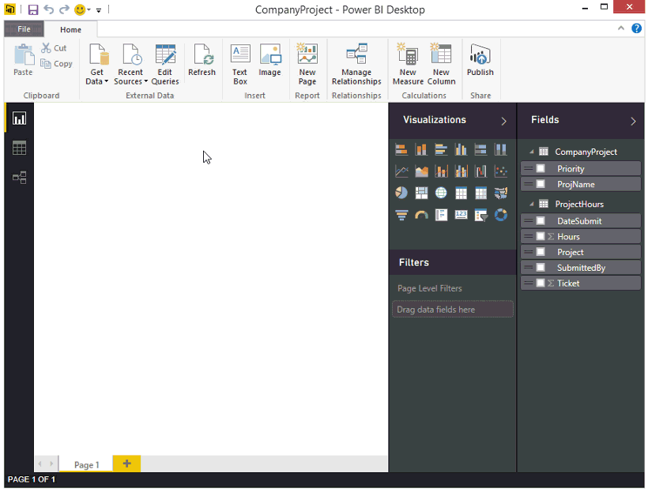
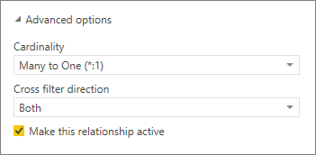
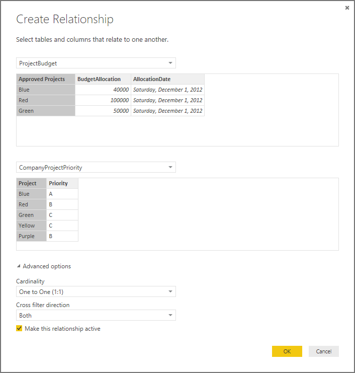
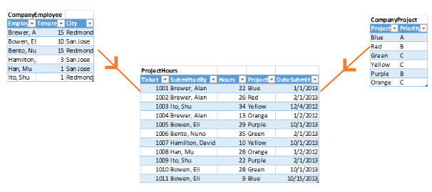
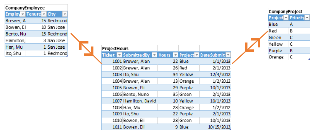
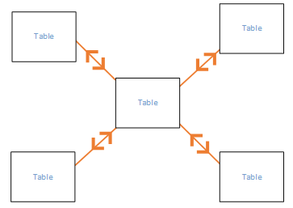
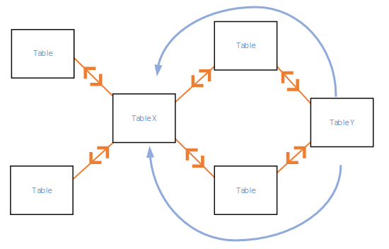
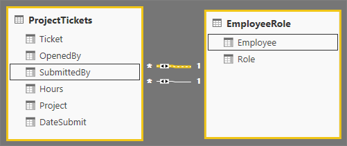

# Create and manage relationships in Power BI Desktop
When you import multiple tables, chances are you’re going to do some analysis using data from all those tables. Relationships between those tables are necessary in order to accurately calculate results and display the correct information in your reports. Power BI Desktop makes creating those relationships easy. In-fact, in most cases you won’t have to do anything, the Autodetect feature can do it for you. However, in some cases you might have to create relationships yourself, or you might need to make some changes to a relationship. Either way, it’s important to understand relationships in Power BI Desktop and how to create and edit them.

## Autodetect during load
If you query two or more tables at the same time, when the data is loaded, Power BI Desktop will attempt to find and create relationships for you. Cardinality, Cross filter direction, and Active properties are automatically set. Power BI Desktop looks at column names in the tables you are querying to determine if there are any potential relationships. If there are, those relationships are created automatically. If Power BI Desktop cannot determine with a high-level of confidence there is a match, it will not automatically create the relationship. You can still use the Manage Relationships dialog to create or edit relationships.

## Create a relationship by using Autodetect
On the **Home** tab, click **Manage Relationships** \> **AutoDetect**.

## Create a relationship manually
1. On the **Home** tab, click **Manage Relationships** \> **New**.
2. In the **Create Relationship** dialog, in the first table drop-down list, select a table,  and then select the column you want to use in the relationship.
3. In the to second table drop-down list, select the other table you want in the relationship, then select the other column you want to use, and then click **OK**.

By default, Power BI Desktop will automatically configure the Cardinality (direction), Cross filter direction, and Active properties for your new relationship; however, you can change these if necessary in Advanced options. To learn more, see the Understanding advanced options section later in this article.

## Edit a relationship
1. On the **Home** tab, click **Manage Relationships**.
2. In the **Manage Relationships** dialog, select the relationship, then click **Edit**.

## Configure advanced options
When you create or edit a relationship, you can configure advanced options.  By default, advanced options are automatically configured based on a best guess. This can be different for each relationship based on the data in the columns.

## Cardinality
**Many to One (\*:1)** - This is the most common, default type. This means the column in one table can have more than one instance of a value, and the other related table, often know as the Lookup table, has only one instance of a value.

**One to One (1:1)** - This means the column in one table has only one instance of a particular value, and the other related table has only one instance of a particular value.

See the Understanding advanced options section later in this article for more details about when to change cardinality.

## Cross filter direction
**Both** - This is the most common, default direction. This means for filtering purposes, both tables are treated as if they're a single table.  This works well with a single table that has a number of lookup tables that surround it.  An example is a Sales actuals table with a lookup table for department.  This is often called a Star schema configuration (a central table with several Lookup tables.)  However, if you have two or more tables that also have lookup tables (with some in common) then you wouldn't want to use the Both setting.  To continue the previous example, in this case, you also have a budget sales table that records target budget for each department.  And, the department table is connected to both the sales and the budget table.  Avoid the Both setting for this kind of configuration.

**Single** - This means that filtering choices in connected tables work on the table where values are being aggregated. If you import a Power Pivot in Excel 2013 or earlier data model, all relationships will have a single direction. 

See the Understanding advanced options section later in this article for more details about when to change cross filter direction.

## Make this relationship active
When checked, this means the relationship serves as the active, default relationship.  In cases where there are more than one relationship between two tables, the active relationship provides a way for Power BI Desktop to automatically create visualizations that include both tables.

See the Understanding advanced options section later in this article for more details about when to make a particular relationship active.

## Understanding relationships
Once you have connected two tables together with a relationship, you can work with the data in both tables as if they were a single table, freeing you from having to worry about relationship details, or flattening those tables into a single table before importing them.  In many situations, Power BI Desktop can automatically create relationships for you, so creating those relationships yourself might not even be needed. However, if Power BI Desktop can’t determine with a high-degree of certainty that a relationship between two tables should exist, it will not automatically create the relationship . In that case, you will need to create the relationship.   

Let’s do a little tutorial, to better show you how relationships work in Power BI Desktop.

**Tip:** You can complete this lesson yourself. Copy the ProjectHours table below into an Excel worksheet, select all of the cells, click **INSERT** \> **Table**. In the **Create Table** dialog, just click **OK**. Then in **Table Name**, type **ProjectHours**. Do the same for the CompanyProject table. You can then import the data by using **Get Data** in Power BI Desktop. Select your workbook and tables as a data source.

This first table, ProjectHours, is a record of work tickets that record the number of hours a person has worked on a particular project.  

**ProjectHours**

| **Ticket** | **SubmittedBy** | **Hours** | **Project** | **DateSubmit** |
| ---:|:--- | ---:|:--- | ---:|
| 1001 |Brewer, Alan |22 |Blue |1/1/2013 |
| 1002 |Brewer, Alan |26 |Red |2/1/2013 |
| 1003 |Ito, Shu |34 |Yellow |12/4/2012 |
| 1004 |Brewer, Alan |13 |Orange |1/2/2012 |
| 1005 |Bowen, Eli |29 |Purple |10/1/2013 |
| 1006 |Bento, Nuno |35 |Green |2/1/2013 |
| 1007 |Hamilton, David |10 |Yellow |10/1/2013 |
| 1008 |Han, Mu |28 |Orange |1/2/2012 |
| 1009 |Ito, Shu |22 |Purple |2/1/2013 |
| 1010 |Bowen, Eli |28 |Green |10/1/2013 |
| 1011 |Bowen, Eli |9 |Blue |10/15/2013 |

This second table, CompanyProject, is a list of projects with an assigned priority, A, B, or C. 

**CompanyProject**

| **ProjName** | **Priority** |
| --- | --- |
| Blue |A |
| Red |B |
| Green |C |
| Yellow |C |
| Purple |B |
| Orange |C |

Notice that each table has a project column. Each are named slightly different, but the values look like they’re the same. That’s important, and we’ll get back to it in a little bit.

Now that we have our two tables imported into a model, let’s create a report. The first thing we want to get is the number of hours submitted by project priority, so we select **Priority** and **Hours** from Fields.

 

If we look at our table in the Report canvas, you’ll see the number of hours is **256.00** for each project, and it’s also the total. Clearly this isn’t correct. Why? It’s because we can’t calculate a sum total of values from one table (Hours in the Project table), sliced by values in another table (Priority in the CompanyProject table) without a relationship between these two tables.

So, let’s create a relationship between these two tables.

Remember those columns we saw in both tables with a project name, but with values that look alike? We’re going to use these two columns to create a relationship between our tables.

Why these columns? Well, if we look at the Project column in the ProjectHours table, we see values like Blue, Red, Yellow, Orange, and so on. In fact, we see several rows that have the same value. In-effect, we have many color values for Project.

If we look at the ProjName column in the CompanyProject table, we see there’s only one of each of the color values for project. Each color value in this table is unique, and that’s important, because we can create a relationship between these two tables. In this case, a many-to-one relationship. In a many-to-one relationship, at least one column in one of the tables must contain unique values. There are some advanced options for some relationships, and we’ll look at those later, but for now, let’s create a relationship between the Project columns in each of our two tables.

### To create the new relationship
1. Click **Manage Relationships**.
2. In **Manage Relationships**, click **New**. This opens the **Create Relationship** dialog, where we can select the tables, columns, and any advanced settings we want for our relationship.
3. In the first table, select **ProjectHours**, then select the **Project** column. This is the many side of our relationship.
4. In the second table, select **CompanyProject**, then select the **ProjName** column. This is the one side of our relationship.  
5. Go ahead and click **OK** in both the **Create Relationship** dialog and the **Manage Relationships** dialog.

In the interest of full disclosure,  you really just created this relationship the hard way. You could've just clicked on the Autodetect button in the Manage Relationships dialog. In-fact, Autodetect would have already done it for you when you loaded the data if both columns had the same name. But, what’s the challenge in that?

Now, let’s look at the table in our Report canvas again.

 

Now that looks a whole lot better, doesn’t it?

When we sum up hours by Priority, Power BI Desktop will look for every instance of the unique color values in the CompanyProject lookup table, and then look for every instance of each of those values in the CompanyProject table, and calculate a sum total for each unique value.

That was pretty easy, in-fact, with Autodetect, you might not even have to do this much.

## Understanding advanced options
When a relationship is created, either with Autodetect or one you create manually, Power BI Desktop will automatically configure advanced options based on the data in your tables. You can configure advanced relationship properties by expanding Advanced options in the Create/Edit relationship dialog.

 

As we said, these are usually set automatically and you won’t need to mess with them; however, there are several situations where you might want to configure advanced options yourself.

## Future updates to the data require a different cardinality
Normally, Power BI Desktop can automatically determine the best cardinality for the relationship.  If you do need to override the automatic setting, because you know the data will change in the future, you can select it in the Cardinality control. Let’s look at an example where we need to select a different cardinality.

The CompanyProjectPriority table below is a list of all company projects and their priority. The ProjectBudget table is the set of projects for which budget has been approved.

**ProjectBudget**

| **Approved Projects** | **BudgetAllocation** | **AllocationDate** |
|:--- | ---:| ---:|
| Blue |40,000 |12/1/2012 |
| Red |100,000 |12/1/2012 |
| Green |50,000 |12/1/2012 |

**CompanyProjectPriority**

| **Project** | **Priority** |
| --- | --- |
| Blue |A |
| Red |B |
| Green |C |
| Yellow |C |
| Purple |B |
| Orange |C |

If we create a relationship between the Project column in the CompanyProjectPriority table and ApprovedProjects column in the ProjectBudget table, like this:

 

Cardinality is automatically set to One-to-One (1:1), and cross filtering to be Both (as shown).  This is because to Power BI Desktop, the best combination of the two tables really looks like this:

| **Project** | **Priority** | **BudgetAllocation** | **AllocationDate** |
|:--- | --- | ---:| ---:|
| Blue |A |40,000 |12/1/2012 |
| Red |B |100,000 |12/1/2012 |
| Green |C |50,000 |12/1/2012 |
| Yellow |C |  |  |
| Purple |B |  |  |
| Orange |C |  |  |

There is a one-to-one relationship between our two tables because there are no repeating values in the combined table’s Project column. The Project column is unique, because each value occurs only once, so, the rows from the two tables can be combined directly without any duplication.

But, let’s say you know the data will change the next time you refresh it. A refreshed version of the ProjectBudget table now has additional rows for Blue and Red:

**ProjectBudget**

| **Approved Projects** | **BudgetAllocation** | **AllocationDate** |
| --- | ---:| ---:|
| Blue |40,000 |12/1/2012 |
| Red |100,000 |12/1/2012 |
| Green |50,000 |12/1/2012 |
| Blue |80,000 |6/1/2013 |
| Red |90,000 |6/1/2013 |

 This means the best combination of the two tables now really looks like this: 

| **Project** | **Priority** | **BudgetAllocation** | **AllocationDate** |
| --- | --- | ---:| ---:|
| Blue |A |40,000 |12/1/2012 |
| Red |B |100,000 |12/1/2012 |
| Green |C |50,000 |12/1/2012 |
| Yellow |C |  |  |
| Purple |B |  |  |
| Orange |C |  |  |
| Blue |A |80000 |6/1/2013 |
| Red |B |90000 |6/1/2013 |

In this new combined table, the Project column has repeating values.  The two original tables won’t have a one-to-one relationship once the table is refreshed. In this case, because we know those future updates will cause the Project column to have duplicates, we want to set the Cardinality to be Many-to-One (\*:1), with the Many on the ProjectBudget side and the One on the CompanyProject side.

## Adjusting cross filter direction for a complex set of tables of relationships
For most relationships, the cross filter direction is set to ‘Both’.  There are, however, some more uncommon circumstances where you might need to set this different from the default, like if you’re importing a model from an older version of Power Pivot, where every relationship is set to a single direction. 

The Both setting enables Power BI Desktop to treat all aspects of connected tables as if they are a single table.  There are some situations, however, where Power BI Desktop cannot set a relationship’s cross filter direction to ‘Both’ and also keep an unambiguous set of defaults available for reporting purposes. If a relationship cross filter direction isn't set to Both, then it’s usually because it would create ambiguity.  If the default cross filter setting isn’t working for you, try setting it to a particular table or Both.

Single direction cross filtering works for many situations.  In fact, if you’ve imported a model from Power Pivot in Excel 2013 or earlier, all of the relationships will be set to single direction.  Single direction means that filtering choices in connected tables work on the table where aggregation work is happening.  Sometimes, understanding cross filtering can be a little difficult, so let’s look at an example.

 

With single direction cross filtering, if you create a report that summarizes the project hours and then you can choose to summarize (or filter) by CompanyProject, Priority or CompanyEmployee, City.   If however, you want to count the number of employee per projects (a less common question), it won’t work. You’ll get a column of values that are all the same.  In the example below, both relationships cross filtering direction is set to a single direction – towards the ProjectHours table:

 

Filter specification will flow from CompanyProject to CompanyEmployee (as shown in the image below)  but, it won’t flow up to CompanyEmployee.  However, if you set the cross filtering direction to Both it will work.  The Both setting allows the filter specification to flow up to Employee.

 

With the cross filtering direction set to Both, our report now appears correct:

 

Cross filtering both directions works well for a pattern of table relationships that look like the pattern above. This is most commonly called a star schema, like this:

 

Cross filtering direction does not work well with a more general pattern often found in databases, like in this diagram:

 

If you have a table pattern like this, with loops, then cross filtering can create an ambiguous set of relationships. For instance, if you sum up a field from TableX and then choose to filter by a field on TableY, then it’s not clear how the filter should travel, through the top table or the bottom table. A common example for this kind of pattern is TableX to be a Sales table with actuals data and for TableY to be budget data. Then, the tables in the middle are lookup tables that both tables use, such as Division or Region. 

Just like with active/inactive relationships, Power BI Desktop won’t allow a relationship to be set as Both if it will create ambiguity in reports. There are several different ways you can deal with this, here are the two most common:

* Delete or mark relationships as inactive to reduce ambiguity. Then you might be able to set a relationship cross filtering as Both.
* Bring in a table twice (with a different name the second time) to eliminate loops.  This makes the pattern of relationships like a star schema.  With a star schema all of the relationships can be set to Both.

## Wrong active relationship
When Power BI Desktop automatically creates relationships, it sometimes encounters more than one relationship between two tables.  When this happens only one of the relationships is set to be active.  The active relationship serves as the default relationship so that when you choose fields from two different tables, Power BI Desktop can automatically create a visualization for you.  However, in some cases the automatically selected relationship can be wrong.  You can use the Manage Relationships dialog to set a relationship as active or inactive, or you can set the active relationship in the Edit relationship dialog. 

To ensure there’s a default relationship, Power BI Desktop only allows a single active relationship between two tables at a given time.  So, you must first set the current relationship as inactive and then set the relationship you want to be active.

Let’s look at an example. This first table is ProjectTickets, and the next table is EmployeeRole.

**ProjectTickets**

| **Ticket** | **OpenedBy** | **SubmittedBy** | **Hours** | **Project** | **DateSubmit** |
| ---:|:--- |:--- | ---:|:--- | ---:|
| 1001 |Perham, Tom |Brewer, Alan |22 |Blue |1/1/2013 |
| 1002 |Roman, Daniel |Brewer, Alan |26 |Red |2/1/2013 |
| 1003 |Roth, Daniel |Ito, Shu |34 |Yellow |12/4/2012 |
| 1004 |Perham, Tom |Brewer, Alan |13 |Orange |1/2/2012 |
| 1005 |Roman, Daniel |Bowen, Eli |29 |Purple |10/1/2013 |
| 1006 |Roth, Daniel |Bento, Nuno |35 |Green |2/1/2013 |
| 1007 |Roth, Daniel |Hamilton, David |10 |Yellow |10/1/2013 |
| 1008 |Perham, Tom |Han, Mu |28 |Orange |1/2/2012 |
| 1009 |Roman, Daniel |Ito, Shu |22 |Purple |2/1/2013 |
| 1010 |Roth, Daniel |Bowen, Eli |28 |Green |10/1/2013 |
| 1011 |Perham, Tom |Bowen, Eli |9 |Blue |10/15/2013 |

**EmployeeRole**

| **Employee** | **Role** |
| --- | --- |
| Bento, Nuno |Project Manager |
| Bowen, Eli |Project Lead |
| Brewer, Alan |Project Manager |
| Hamilton, David |Project Lead |
| Han, Mu |Project Lead |
| Ito, Shu |Project Lead |
| Perham, Tom |Project Sponsor |
| Roman, Daniel |Project Sponsor |
| Roth, Daniel |Project Sponsor |

There are actually two relationships here. One is between SubmittedBy in the ProjectTickets table and Employee in the EmployeeRole table, and the other is between OpenedBy in the ProjectTickets table and Employee in the EmployeeRole table.

 

If we add both relationships to the model (OpenedBy first), then the Manage Relationships dialog will show that OpenedBy is active:

 

Now, if we create a report that uses Role and Employee fields from EmployeeRole, and the Hours field from ProjectTickets in a table visualization in the Report canvas, we’ll see only project sponsors because they’re the only ones that opened a project ticket.

 

We can change the active relationship and get SubmittedBy instead of OpenedBy. In Manage Relationships, we uncheck the ProjectTickets(OpenedBy) to EmployeeRole(Employee) relationship, and then we check the Project Tickets(SubmittedBy) to EmployeeRole(Employee) relationship.

## See all of your relationships in Relationship View
Sometimes your model has multiple tables and complex relationships between them. Relationship View in Power BI Desktop shows all of the relationships in your model, their direction, and cardinality in an easy to understand and customizable diagram. To learn more, see [Relationship View in Power BI Desktop](desktop-relationship-view.md).

