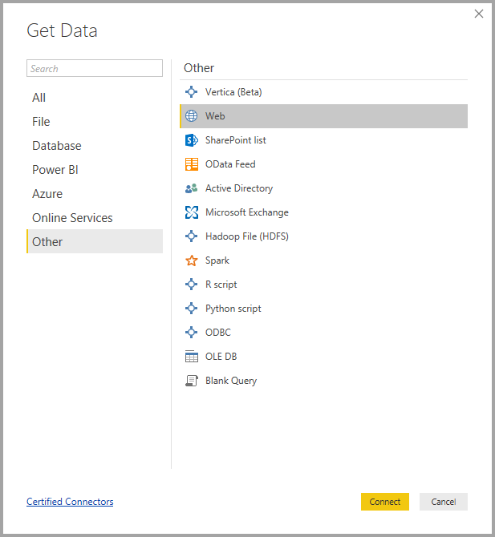
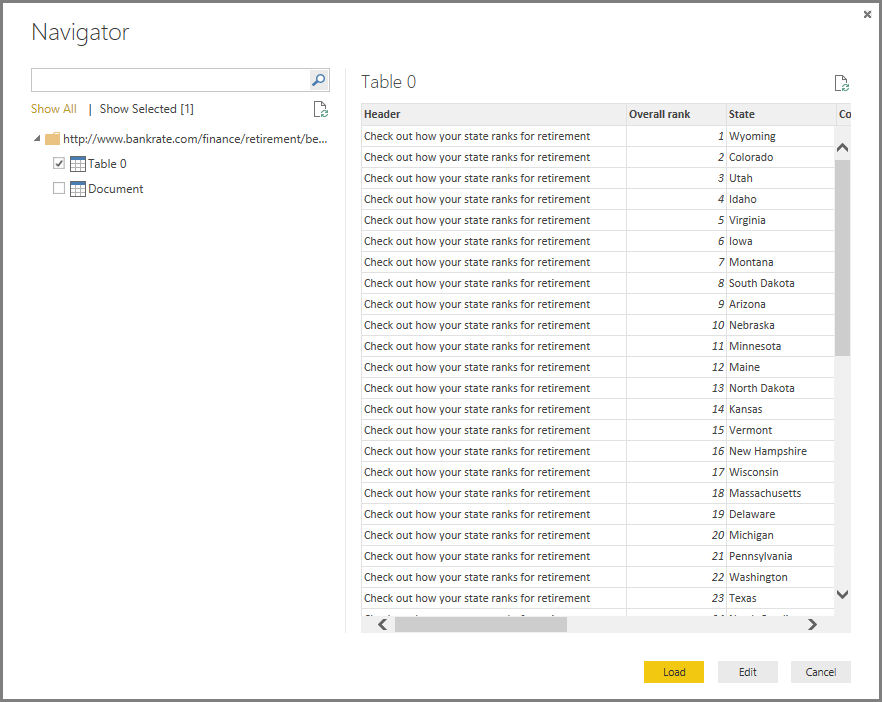

# Data sources in Power BI Desktop
With Power BI Desktop, you can connect to data from many different sources. A full list of available data sources is at the bottom of this page.

To connect to data, select **Get Data** from the **Home** ribbon. Selecting the down arrow, or the **Get Data** text on the button, shows the **Most Common** data types menu shown in the following image:

Selecting **More…** from the **Most Common** menu displays the **Get Data** window. You can also bring up the **Get Data** window (and bypass the **Most Common** menu) by selecting the **Get Data** **icon button** directly.

> [!NOTE]
> The Power BI team is continually expanding the data sources available to **Power BI Desktop** and the **Power BI service**. As such, you'll often see early versions of work-in-progress data sources marked as *Beta* or *Preview*. Any data source marked as *Beta* or *Preview* has limited support and functionality, and should not be used in production environments.
> 
> 

## Data Sources
Data types are organized in the following categories:

* All
* File
* Database
* Power BI
* Azure
* Online Services
* Other

The **All** category includes all data connection types from all categories.

The **File** category provides the following data connections:

* Excel
* Text/CSV
* XML
* JSON
* Folder
* SharePoint Folder

The following image shows the **Get Data** window for **File**.

The **Database** category provides the following data connections:

* SQL Server Database
* Access Database
* SQL Server Analysis Services Database
* Oracle Database
* IBM DB2 Database
* IBM Informix database (Beta)
* IBM Netezza
* MySQL Database
* PostgreSQL Database
* Sybase Database
* Teradata Database
* SAP HANA Database
* SAP Business Warehouse Application Server
* SAP Business Warehouse Message Server (Beta)
* Amazon Redshift
* Impala
* Google BigQuery
* Snowflake
* Exasol

> [!NOTE]
> Some database connectors require that you enable them by selecting **File > Options and settings > Options** then selecting **Preview Features** and enabling the connector. If you don't see some of the connectors mentioned above and want to use them, check your **Preview Features** settings. Also note that any data source marked as *Beta* or *Preview* has limited support and functionality, and should not be used in production environments.
> 
> 

The following image shows the **Get Data** window for **Database**.

The **Power BI** category provides the following data connections:

* Power BI datasets
* Power BI datapools (beta)

The following image shows the **Get Data** window for **Power BI**.

The **Azure** category provides the following data connections:

* Azure SQL Database
* Azure SQL Data Warehouse
* Azure Analysis Services database
* Azure Blob Storage
* Azure Table Storage
* Azure Cosmos DB (Beta)
* Azure Data Lake Store
* Azure HDInsight (HDFS)
* Azure HDInsight Spark (Beta)
* HDInsight Interactive Query (Beta)
* Azure KustoDB (beta)

The following image shows the **Get Data** window for **Azure**.

The **Online Services** category provides the following data connections:

* SharePoint Online List
* Microsoft Exchange Online
* Dynamics 365 (online)
* Dynamics NAV (Beta)
* Dynamics 365 Business Central
* Common Data Service for Apps(Beta)
* Common Data Service (Beta)
* Microsoft Azure Consumption Insights (Beta)
* Visual Studio Team Services (Beta)
* Salesforce Objects
* Salesforce Reports
* Google Analytics
* Adobe Analytics
* appFigures (Beta)
* comScore Digital Analytix (Beta)
* Dynamics 365 for Customer Insights (Beta)
* Data.World - Get Dataset (Beta)
* Facebook
* GitHub (Beta)
* MailChimp (Beta)
* Marketo (Beta)
* Mixpanel (Beta)
* Planview Enterprise One - PRM (Beta)
* Planview Projectplace (Beta)
* QuickBooks Online (Beta)
* Smartsheet
* SparkPost (Beta)
* Stripe (Beta)
* SweetIQ (Beta)
* Planview Enterprise One - CMT (Beta)
* Twilio (Beta)
* tyGraph (Beta)
* Webtrends (Beta)
* Zendesk (Beta)
* TeamDesk (Beta)

The following image shows the **Get Data** window for **Online Services**.

The **Other** category provides the following data connections:

* Vertica (Beta)
* Web
* SharePoint List
* OData Feed
* Active Directory
* Microsoft Exchange
* Hadoop File (HDFS)
* Spark (Beta)
* R Script
* ODBC
* OLE DB
* Blank Query

The following image shows the **Get Data** window for **Other**.

> [!NOTE]
> At this time, it's not possible to connect to custom data sources secured using Azure Active Directory.
> 
> 

## Connecting to a Data Source
To connect to a data source, select the data source from the **Get Data** window and select **Connect**. In the following image, **Web** is selected from the **Other** data connection category.

A connection window is displayed, specific to the type of data connection. If credentials are required, you’ll be prompted to provide them. The following image shows a URL being entered to connect to a Web data source.

When the URL or resource connection information is entered, select **OK**. Power BI Desktop makes the connection to the data source, and presents the available data sources in the **Navigator**.

You can either load the data by selecting the **Load** button at the bottom of the **Navigator** pane, or edit the query before loading data by selecting the **Edit** button.

That’s all there is to connecting to data sources in Power BI Desktop! Try connecting to data from our growing list of data sources, and check back often - we continue to add to this list all the time.

## Next steps
There are all sorts of things you can do with Power BI Desktop. For more information on its capabilities, check out the following resources:

* [What is Power BI Desktop?](desktop-what-is-desktop.md)
* [Query Overview with Power BI Desktop](desktop-query-overview.md)
* [Data Types in Power BI Desktop](desktop-data-types.md)
* [Shape and Combine Data with Power BI Desktop](desktop-shape-and-combine-data.md)
* [Common Query Tasks in Power BI Desktop](desktop-common-query-tasks.md)    
