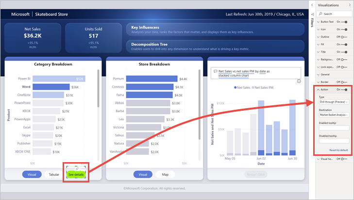

# Create a drill-through button in Power BI (preview)

When you create a button in Power BI, you can select the **Drill through (preview)** action. This action type creates a button that drills through to a focused page to get details that are filtered to a specific context.

A drill-though button can be useful if you want to increase the discoverability of important drill-through scenarios in your reports.

In this example, after the user selects the Word bar in the chart, the **See details** button is enabled.


When they select the **See details** button, they drill through to the Market Basket Analysis page. As you can see from the visual on the left, the drill-through page is now filtered for Word.


## Set up a drill-through button

To set up a drill-through button, you first need to [set up a valid drill-through page](desktop-drillthrough.md) within your report. Then, you need to create a button with **Drill through** as the action type and select the drill-through page as the **Destination**.

Because the drill-through button has two states (when drill through is enabled vs. disabled), you see that there are two tooltip options.



If you leave the tooltips boxes blank, Power BI automatically generates tooltips. Those tooltips are based on the destination and drill-through field(s).

Here's an example of the autogenerated tooltip when the button is disabled:

"To drill through to Market Basket Analysis (the destination page), select a single data point from Product (the drill-through field)."


And here's an example of the autogenerated tooltip when the button is enabled:

"Click to drill through to Market Basket Analysis (the destination page)."


However, if you'd like to provide custom tooltips, you can always input a static string. We don't yet support conditional formatting for tooltips.

You can use conditional formatting to change the button text based on the selected value of a field. To do this, you need to create a measure that outputs the desired string based on the DAX function SELECTEDVALUE.

Here's an example measure that outputs "See product details" if a single Product value is NOT selected; otherwise, it outputs "See details for [the selected Product]":

```
String_for_button = If(SELECTEDVALUE('Product'[Product], 0) == 0), "See product details", "See details for " & SELECTEDVALUE('Product'[Product]))
```

Once you've created this measure, you select the **Conditional formatting** option for the button text:


Then, you select the measure you created for the button text:


When a single product is selected, the button text reads:

"See details for Word"


When either no products are selected, or more than one product is selected, the button is disabled and the button text reads:

"See product details"


## Pass filter context

The button works like normal drill through, so you can also pass filters on additional fields by cross-filtering the visuals that contain the drill-through field. For example, using **Ctrl** + **click** and cross-filtering, you can pass multiple filters on Store to the drill-through page because your selections cross-filter the visual that contains Product, the drill-through field:


When you select the drill-through button, you see filters on both Store and Product being passed through to the destination page:


### Ambiguous filter context

Since the drill-through button isn't tied to a single visual, if your selection is ambiguous, then the button is disabled.

In this example, the button is disabled because two visuals both contain a single selection on Product. There's ambiguity about which data point from which visual to tie the drill-through action to:


## Limitations

- This button doesn't allow for multiple destinations using a single button.
- This button only supports drill throughs within the same report; in other words, it doesn't support cross-report drill through.
- The disabled state formatting for the button is tied to the color classes in your report theme. Learn more about [color classes](desktop-report-themes.md#setting-structural-colors).
- The drill-through action works for all built-in visuals, and works with *some* visuals imported from AppSource. However, it isn't guaranteed to work with *all* visuals imported from AppSource.

## Next steps
For more information about features that are similar or interact with buttons, take a look at the following articles:

* [Create buttons](desktop-buttons.md)
* [Use drill through in Power BI reports](desktop-drillthrough.md)
* [Use bookmarks to share insights and build stories in Power BI](desktop-bookmarks.md)

