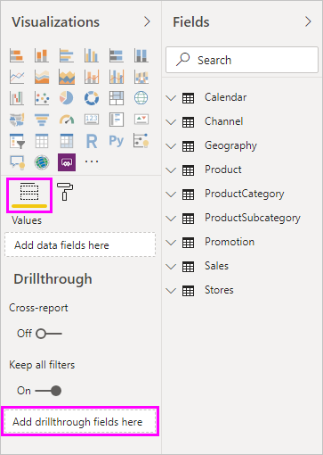
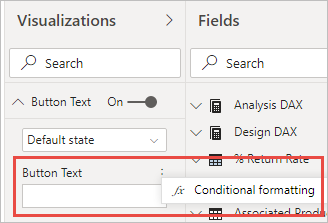
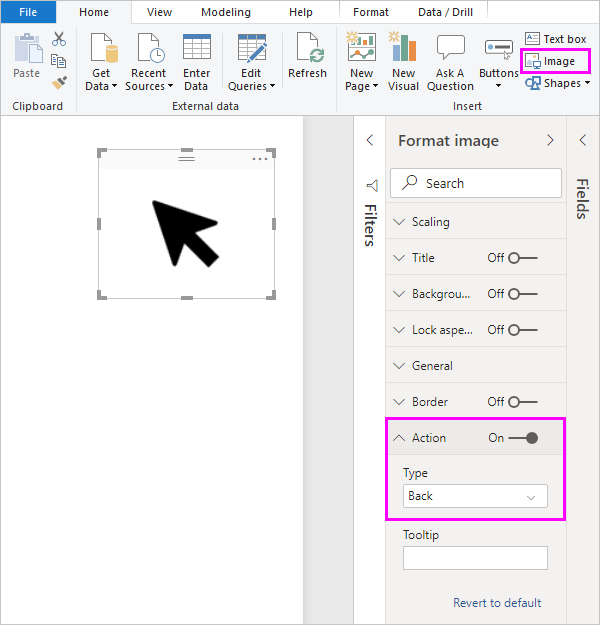
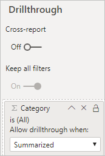

# Use drill through in Power BI reports
With *drill through* in Power BI reports, you can create a page in your report that focuses on a specific entity such as a supplier, customer, or manufacturer. You can set up drill through in your reports in Power BI Desktop or the Power BI service. 

Then when your report readers use drill through, they select it by right-clicking a data point in other report pages, and then drilling through to the focused page to get details that are filtered to that context. You can also create a button that drills through to details when they click it.


## Set up drill through
1. To use drill through, create a report page that has the visuals you want for the type of entity that you're going to provide drill through for. 

    For example, suppose you want to provide drill through for manufacturers. For this case, you might create a drill-through page with visuals that show total sales, total units shipped, sales by category, sales by region, and so on. That way, when you drill through to that page, the visuals are specific to the manufacturer you selected.

2. Then, on that drill-through page, in the **Fields** section of the **Visualizations** pane, drag the field for which you want to enable drill through into the **Drill-through filters** well.

    

    When you add a field to the **Drill-through filters** well, Power BI automatically creates a *back* button visual. That visual becomes a button in published reports. Users who consume your report in the Power BI service use this button to get back to the report page from which they came.

    

## Create a drill-through button (preview)

When you create a button, you can select the **Drill through (preview)** action.
This action type creates a button that drills through to a focused page to get details that are filtered to a specific context.

A drill-though button can be useful if you want to increase the discoverability of important drill-through scenarios in your reports.

In this example, after the user selects the Word bar in the chart, the **See details** button is enabled.


When they select the **See details** button, they drill through to the Market Basket Analysis page. The visual on the left is filtered for Word.


### Set up a drill-through button

To set up a drill-through button, you first need to [set up a valid drill-through page](#set-up-drill-through) within your report. Then, you need to create a button with **Drill through** as the action type and select the drill-through page as the **Destination**.

Because the drill-through button has two states (when drill through is enabled vs. disabled), you see that there are two tooltip options.


If you leave the tooltips boxes blank, Power BI automatically generates tooltips. Those tooltips are based on the destination and drill-through field(s).

Here's an example of the auto-generated tooltip when the button is disabled:

"To drill through to Market Basket Analysis (the destination page), select a single data point from Product (the drill-through field)."


And here's an example of the auto-generated tooltip when the button is enabled:

"Click to drill through to Market Basket Analysis (the destination page)."


However, if you'd like to provide custom tooltips, you can always input a static string. We don't yet support conditional formatting for tooltips.

You can use conditional formatting to change the button text based on the selected value of a field. To do this, you need to create a measure that outputs the desired string based on the DAX function SELECTEDVALUE.

Here's an example measure that outputs "See product details" if a single Product value is NOT selected; otherwise, it outputs "See details for [the selected Product]":

```
String_for_button = If(SELECTEDVALUE('Product'[Product], 0) == 0), "See product details", "See details for " & SELECTEDVALUE('Product'[Product]))
```

Once you've created this measure, you select the **Conditional formatting** option for the button text:



Then, you select the measure you created for the button text:


When a single product is selected, the button text reads:

"See details for Word"


When either no products are selected, or more than one product is selected, the button is disabled and the button text reads:

"See product details"


### Pass filter context

The button works like normal drill through, so you can also pass filters on additional fields by cross-filtering the visuals that contain the drill-through field. For example, using **Ctrl** + **click** and cross-filtering, you can pass multiple filters on Store to the drill-through page because your selections cross-filter the visual that contains Product, the drill-through field:


When you select the drill-through button, you see filters on both Store and Product being passed through to the destination page:


#### Ambiguous filter context

Since the drill-through button isn't tied to a single visual, if your selection is ambiguous, then the button is disabled.

In this example, the button is disabled because two visuals both contain a single selection on Product. There's ambiguity about which data point from which visual to tie the drill-through action to:


### Limitations

- This button doesn't allow for multiple destinations using a single button.
- This button only supports drill throughs within the same report; in other words, it doesn't support cross-report drill through.

## Use your own image for a back button    
 Because the back button is an image, you can replace the image of that visual with any image you want. It still operates as a back button so that report consumers can go back to their original page. 

To use your own image for a back button, follow these steps:

1. On the **Home** tab, select **Image**. Then, locate your image and place it on the drill-through page.

2. Select your new image on the drill-through page. Under the **Format image** pane, set the **Action** slider to **On**, and  then set the **Type** to **Back**. Your image now functions as a back button.

    

    
     Now users can right-click a data point in your report and get a context menu that supports drill through to that page. 

    

    When report consumers choose to drill through, the page is filtered to show information about the data point on which they right-clicked. For example, suppose they right-clicked on a data point about Contoso, a manufacturer, and selected to drill through. The drill-through page they go to is filtered to Contoso.

## Pass all filters in drill through

You can pass all applied filters to the drill-through window. For example, you can select only a certain category of products and the visuals filtered to that category, and then select drill through. You might be interested in what that drill through would look like with all those filters applied.

To keep all applied filters, in the **Drill-through** section of the **Visualizations** pane, set **Keep all filters** to **On**. 


When you then drill through on a visual, you can see which filters were applied as a result of the source visual having temporary filters applied. In the **Drill-through** section of the **Visualization** pane, those transient filters are shown in italics. 


Although you could do this with tooltips pages, that would be an odd experience because the tooltip wouldn't appear to be working properly. For this reason, so doing so with tooltips isn't recommended.

## Add a measure to drill through

Besides passing all filters to the drill-through window, you can also add a measure or a summarized numeric column to the drill-through area. Drag the drill-through field to the **Drill-through** card to apply it. 



When you add a measure or summarized numeric column, you can drill through to the page when the field is used in the *Value* area of a visual.

That's all there is to using drill through in your reports. It's a great way to get an expanded view of the entity information that you selected for your drill-through filter.

## Next steps

You might also be interested in the following articles:

* [Use cross-report drill through in Power BI reports](desktop-cross-report-drill-through.md)
* [Using slicers Power BI Desktop](visuals/power-bi-visualization-slicers.md)

