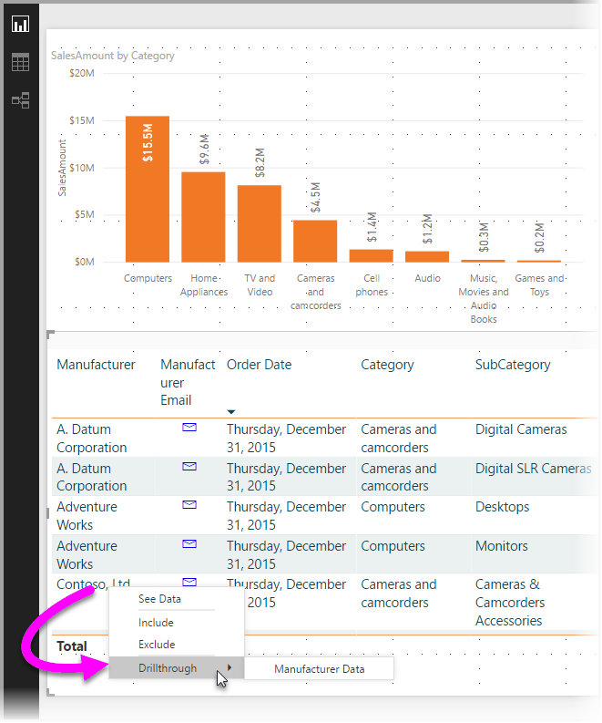
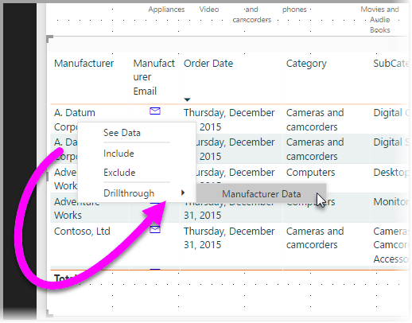

# Use drillthrough in Power BI Desktop
With **drillthrough** in **Power BI Desktop**, you can create a page in your report that focuses on a specific entity - such as a supplier, customer, or manufacturer. With that focused report page, users can right-click on a data point in other report pages and drillthrough to the focused page to get details that are filtered to that context.

## Using drillthrough
1. To use **drillthrough**, create a report page that has visuals you'd like to see for the type of entity on which you'll provide drillthrough. 

    For example, if you're interested in providing drillthrough for manufacturers, you might create a drillthrough page with visuals that show total sales, total units shipped, sales by category, sales by region, and so on. That way, when you drillthrough to that page, the visuals will be specific to the manufacturer you selected.

2. Then, on that drillthrough page, in the **Fields** section of **Visualizations** pane, drag the field about which you want to drillthrough into the **Drillthrough filters** well.

    

    When you add a field to the **Drillthrough filters** well, **Power BI Desktop** automatically creates a *back* button visual. That visual becomes a button in published reports, and lets users who are consuming your report in the **Power BI service** easily get back to the report page from which they came (the page from which they selected to drillthrough).

    

## Use your own image for a back button    
 Because the back button is an image, you can replace the image of that visual with any image you want, and it will still operate as a back button so report consumers can go back to their original page.

1. On the **Home** tab, click **Image**, then locate your image, and place it on the drillthrough page.
2. Select your new image on the Drillthrough page and under the Format Image section, set the **Link** slider to on and set the **Type** to **Back**. Your image now functions as a back button.

    

    When your **drillthrough** page is complete and users right-click a data point in your report that uses the field you put into the **Drillthrough filters** well, a context menu appears that supports drillthrough to that page.

    

    When report consumers choose to drillthrough, the page is filtered to show information about the data point on which they right-clicked. For example, if they right-clicked on a data point about Contoso (a manufacturer), and selected to drillthough, the drillthrough page they are taken to is filtered to Contoso.

## Pass all filters in drillthrough

Beginning with the May 2018 version of **Power BI Desktop**, you can pass all applied filters to the drillthrough window. For example, you might have selected only a certain category of products and the visuals filtered to that category, then you select drillthrough. You might be interested in what that drillthrough would look like with all those filters applied.

To keep all applied filters, in the **Drillthrough** section of the **Visualizations** pane, simply set the **Pass all filters** toggle to **on**. 

In versions of **Power BI Desktop** prior to May 2018, the behavior is equivalent to having this toggle set to **off**.

When you then drillthrough on a visual, you can see which filters were applied as a result of the source visual having temporary filters applied. In the drillthrough window, those transient filters are shown in italics. 

Note that you could do this with tooltips pages, but that would be an odd experience (the tooltip would not appear to be working properly), so doing so with tooltips is not recommended.

And, that's all there is to using **drillthrough** in your reports. It's a great way to get an expanded view on the entity information you select for your drillthrough filter.

## Next steps

You might also be interested in the following articles:

* [Using slicers Power BI Desktop](desktop-slicers.md)

