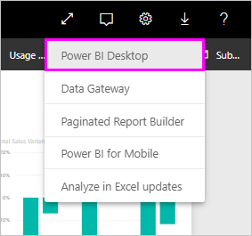
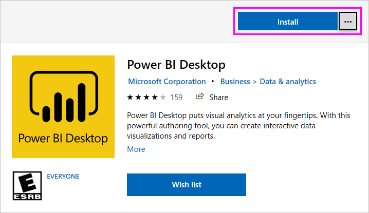
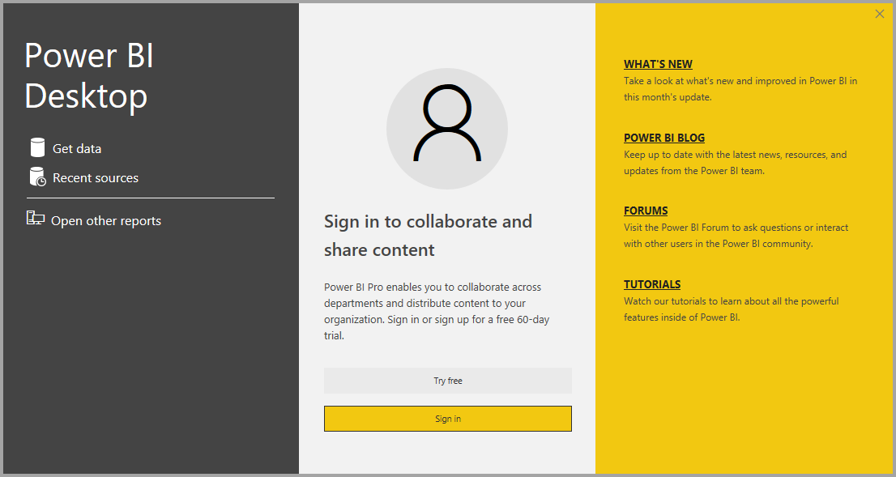

# Get Power BI Desktop
**Power BI Desktop** lets you build advanced queries, models, and reports that visualize data. With **Power BI Desktop**, you can build data models, create reports, and share your work by publishing to the Power BI service.  **Power BI Desktop** is a free download.

You can get **Power BI Desktop** in two ways, each of which is described in the following sections:

* **Download** directly (an MSI package you download and install on your computer)
* Install as an app from the **Microsoft Store**

Either approach will get the latest version of **Power BI Desktop** onto your computer, but there are a few differences worth noting, which are described in the following sections.

## Download Power BI Desktop
To download the most recent version of **Power BI Desktop**, you can select the download icon from the upper right corner of the Power BI service, and select **Power BI Desktop**.

You can also download the latest version of Power BI Desktop from the following download page:

* [**Power BI Desktop download** (both 32- and 64-bit versions)](https://powerbi.microsoft.com/desktop).
  
  

Regardless of which way you choose to download, once **Power BI Desktop** is downloaded you're prompted to run the installation file:

**Power BI Desktop** is installed as an application, and runs on your desktop.

> [!NOTE]
> Installing the downloaded (MSI) version, and the **Microsoft Store** version of **Power BI Desktop** on the same computer (sometimes referred to as a *side-by-side* installation) is not supported.
> 
> 

## Install as an app from the Microsoft Store
You can also get **Power BI Desktop** from the Microsoft Store, using the following link:

* [Install **Power BI Desktop** from the **Microsoft Store**](http://aka.ms/pbidesktopstore)

There are a few advantages to getting **Power BI Desktop** from the Microsoft Store:

* **Automatic updates** - Windows downloads the latest version automatically in the background as soon as it's available, so your version will always be up to date.
* **Smaller downloads** - The **Microsoft Store** ensures only components that have changed in each update are downloaded to your machine, resulting in smaller downloads for each update.
* **Admin priviledge is not required** - when you download the MSI directly and install, you must be an administrator for the installation to complete successfully. When you get **Power BI Desktop** from the Microsoft Store, admin priviledge is *not* required.
* **IT roll-out enabled** - the **Microsoft Store** version can more easily be deployed, or *rolled-out*, to everyone in your organization, and can make **Power BI Desktop** available through the **Microsoft Store for Business**.
* **Language detection** - the **Microsoft Store** version includes all supported languages, and checks which languages is being used on the computer each time it is launched. This also affects the localization of models created in **Power BI Desktop**; for example, built-in date hierarchies will match the language that **Power BI Desktop** was using when the .pbix file was created.

There are a few consideration and limitations for installing **Power BI Desktop** from the Microsoft Store, which include the following:

* If you use the SAP connector, you may need to move your SAP driver files to the *Windows\System32* folder.
* Installing **Power BI Desktop** from the Microsoft Store doesn't copy user settings from the MSI version. You might have to reconnect to your recent datasources and re-enter your data source credentials. 

> [!NOTE]
> Installing the downloaded (MSI) version, and the **Microsoft Store** version of **Power BI Desktop** on the same computer (sometimes referred to as a *side-by-side* installation) is not supported. You should manually uninstall **Power BI Desktop** before downloading it from the **Microsoft Store**
> 
> [!NOTE]
> The Power BI Report Server version of **Power BI Desktop** is a separate and different installation from the versions discussed in this article. For information about the Report Server version of **Power BI Desktop**, see [Create a Power BI report for Power BI Report Server](report-server/quickstart-create-powerbi-report.md).
> 
> 

## Using Power BI Desktop
When you launch **Power BI Desktop**, a *Welcome* screen is displayed.

If this is your first time using **Power BI Desktop** (if the installation is not an upgrade), you'll be prompted to fill out a form and answer a few questions, or sign in to the **Power BI service** before you'll be able to proceed.

From there, you can begin creating data models or reports, then share them with others on the Power BI service. Check out the **More information** links at the end of this article for links to guides that can help you get started using **Power BI Desktop**.

## Minimum requirements
The following list provides the minimum requirements to run **Power BI Desktop**:

* Windows 7 / Windows Server 2008 R2, or later
* .NET 4.5
* Internet Explorer 9 or later
* **Memory (RAM):** At least 1 GB available, 1.5 GB or more recommended.
* **Display:** At least 1440x900 or 1600x900 (16:9) recommended. Lower resolutions such as 1024x768 or 1280x800 are not recommended, as certain controls (such as closing the startup screen) display beyond those resolutions.
* **Windows Display settings:** If your display settings are set to change the size of text, apps, and other items to more than 100%, you may not be able to see certain dialogs that must be closed or responded to in order to proceed using **Power BI Desktop**. If you encounter this issue, check your **Display settings** by going to **Settings > System > Display** in Windows, and use the slider to return display settings to 100%.
* **CPU:** 1 gigahertz (GHz) or faster x86- or x64-bit processor recommended.

## Next steps
Once you get **Power BI Desktop** installed, the following content can help you get up and running quickly:

* [Getting Started with Power BI Desktop](desktop-getting-started.md)
* [Query Overview with Power BI Desktop](desktop-query-overview.md)
* [Data Sources in Power BI Desktop](desktop-data-sources.md)
* [Connect to Data in Power BI Desktop](desktop-connect-to-data.md)
* [Shape and Combine Data with Power BI Desktop](desktop-shape-and-combine-data.md)
* [Common Query Tasks in Power BI Desktop](desktop-common-query-tasks.md)   

