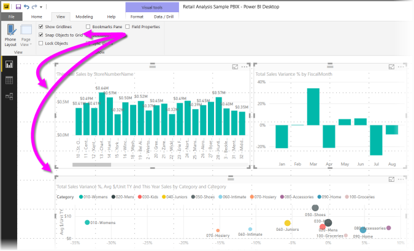
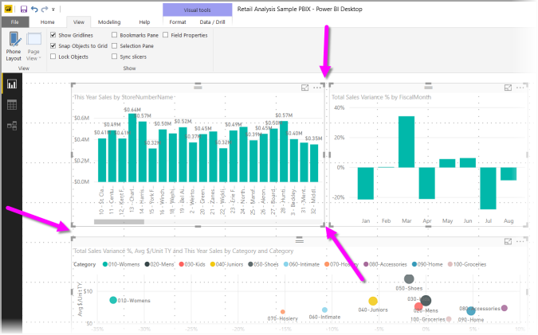
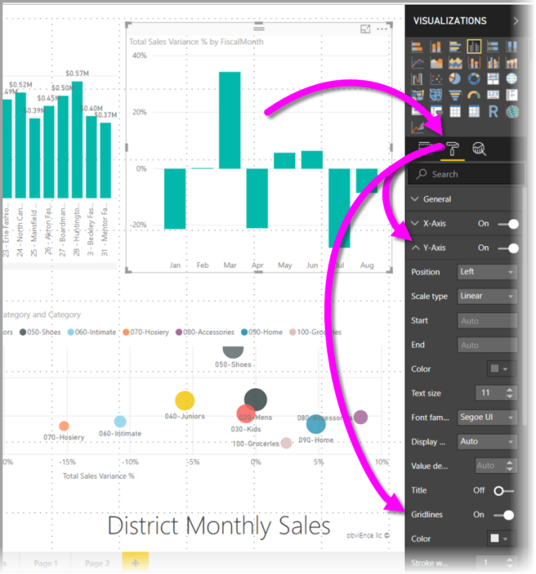

# Use gridlines and snap-to-grid in Power BI Desktop reports
The **Power BI Desktop** report canvas provides gridlines that let you neatly align visuals on a report page, and also provides snap-to-grid functionality so visuals in your reports look clean, aligned, and evenly spaced.

In **Power BI Desktop** you can also adjust the z-order (bring forward, send backward) of objects on a report, as well as align or evenly distribute selected visuals on the canvas.

### Enabling gridlines and snap-to-grid
To enable gridlines and snap-to-grid, select the **View** ribbon, then enable the checkboxes for **Show gridlines** and **Snap objects to grid.** You can select one or both boxes; they operate independently.

> [!NOTE]
> If **Show gridlines** and **Snap objects to grid** are disabled, connect to any data source and they become enabled.
> 
> 

### Using gridlines
Gridlines are visual guides that let you see whether two or more visuals are properly aligned. When you're trying to determine whether two (or more) visuals are aligned horizontally or vertically, you use the gridlines to visually determine whether their borders align.

You can use *CTRL+Click* to select more than one visual at a time, which displays all selected visuals' borders, easily letting you see whether the visuals are properly aligned.

#### Using gridlines inside visuals
In Power BI there are also gridlines inside visuals, which provide visual guides for comparing data points and values. Beginning with the September 2017 release of **Power BI Desktop**, you can now manage the gridlines within visuals using the **X-Axis** or **Y-Axis** card (as appropriate based on visual type), found in the **Format** section of the **Visualizations** pane. You can manage the following elements of gridlines within a visual:

* Turn gridlines on or off
* Change the color of gridlines
* Adjust the stroke (the width) of gridlines
* Select the line style of the gridlines in the visual, such as solid, dashed, or dotted

Modifying certain elements of gridlines can be especially useful in reports where dark backgrounds are used for visuals. The following image shows the *Gridlines* section in the **X-Axis** card.

### Using snap-to-grid
When you enable **Snap objects to grid**, all visuals on the **Power BI Desktop** canvas that you move (or resize) are automatically aligned to the nearest grid axis, making it much easier to ensure two or more visuals align to the same horizontal or vertical location or size.

And that's all there is to using **gridlines** and **snap-to-grid** to easily ensure the visuals in your reports are neatly aligned.

### Using z-order, align, and distribute
You can also manage the front-to-back order of visuals in a report, often referred to as the *z-order* of elements. This allows you to overlap visuals in any way you want, then adjust the front-to-back order of each visual. This ordering is done using the **Bring Forward** and **Send Backward** buttons, found in the **Arrange** section of **Format** ribbon, which appears as soon as you select on or more visuals on the page (and is not available if no visual is selected).

The **Format** ribbon also allows you to align your visuals in many different ways. This allows you to ensure your visuals appear on the page in the alignment that you believe looks and works best.

When one visual is selected, using the **Align** button aligns that visual to the edge (or center) of the report canvas, as shown in the following image.

When two or more visuals are selected, they are aligned together and use the existing aligned boundary of the visuals for alignment. For example, with two visuals selected and the *Align Left* button selected, the visuals will align to the left-most boundary of all selected visuals.

You can also distribute your visuals evenly across the report canvas, either vertically or horizontally. Just use the **Distribute** button from the **Format** ribbon.

With a few selections from these gridlines, alignment, and distribution tools, your reports will look just how you want them.

