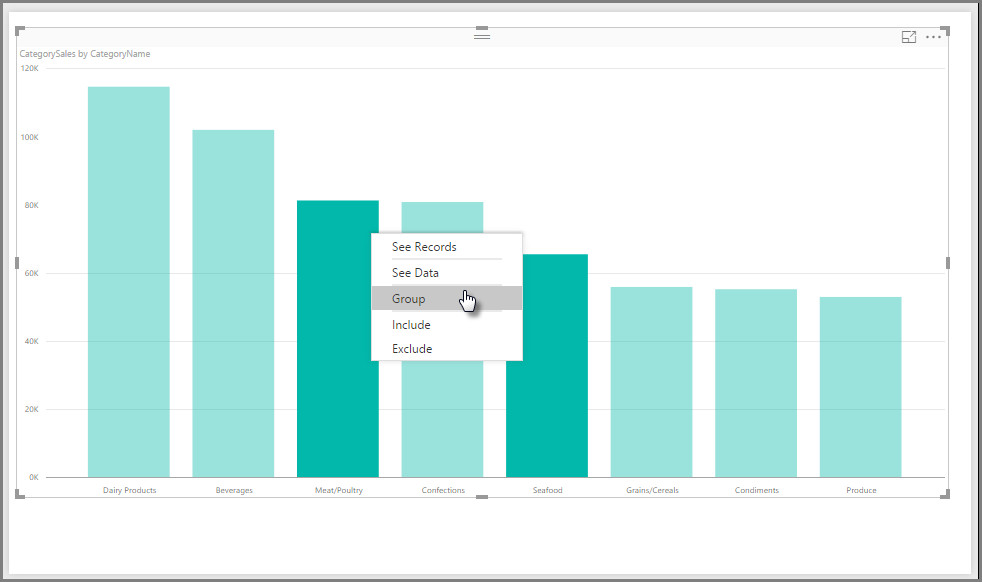
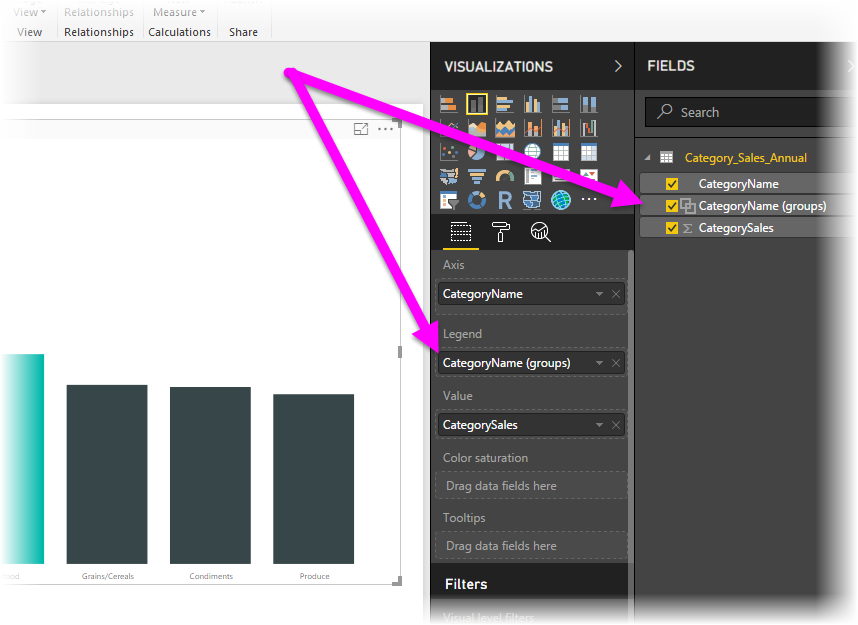
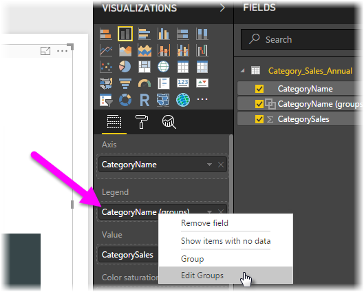
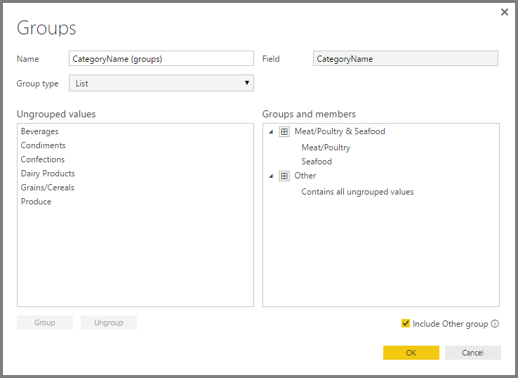
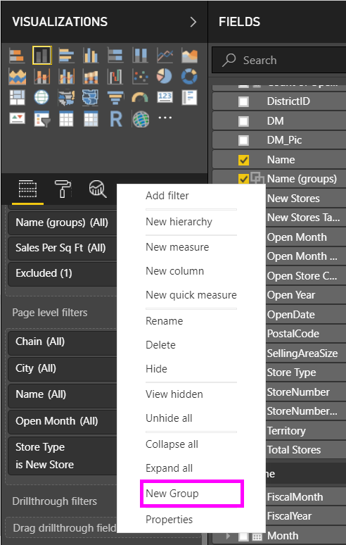
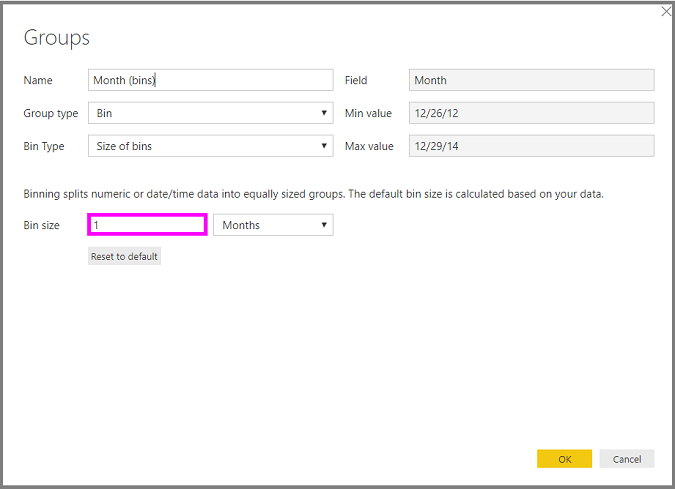
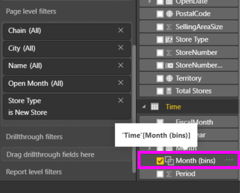

# Use grouping and binning in Power BI Desktop
When **Power BI Desktop** creates visuals, it aggregates your data into chunks (or groups) based on values found in the underlying data. Often that's fine, but there may be times when you want to refine how those chunks are presented. For example, you might want to place three categories of products in one larger category (one *group*). Or, you might want to see sales figures put into bin-sizes of 1,000,000 dollars, instead of evenly-divided, 923,983 dollars.

In Power BI Desktop, you can **Group** data points to help you more clearly view, analyze, and explore data and trends in your visuals. You can also define the **Bin size**, often called *binning*, to put values into equally sized groups that better enable you to visualized data in ways that are meaningful.

### Using grouping
To use grouping, select two or more elements on a visual by using Ctrl+click to multi-select elements. Then, right-click one of the multi-select elements and select **Group** from the menu that appears.

Once created, the group is added to the **Legend** bucket for the visual and it also appears in the **Fields** list.

Once you have a group, you can easily edit the members of that group by right-clicking the field from the **Legend** bucket, or from the **Fields** list, and selecting **Edit Groups**.

In the **Groups** window that appears, you can create new groups or modify existing groups. You can also *rename* any group by double-clicking on the group title in the **Groups and members** box and typing a new name.

There are all sorts of things you can do with groups. You can add items from the **Ungrouped values** list into a new group or into one of the existing groups. To create a new group, select two or more items (using Ctrl+click) from the **Ungrouped values** box, and then click the **Group** button below that box.

You can add an ungrouped value into an existing group: just select the Ungrouped value, then select the existing group to which you want to add it, and click the **Group** button. To remove an item from a group, select it from the **Groups and members** box and then click **Ungroup**. You can also select whether ungrouped categories should be placed into the **Other** group, or should remain ungrouped.

> [!NOTE]
> You can create groups for any field in the **Fields** well, without having to multi-select from an existing visual. Just right-click the field, and select **New Group** from the menu that appears.
> 
> 

### Using binning
You can set the bin size for numerical and time fields in **Power BI Desktop.** You can use binning to right-size the data that **Power BI Desktop** displays.

To apply a bin size, right-click a **Field** and select **New Group**.

From the **Groups** window, set the **Bin size** to the size you want.

When you select **OK**, you'll notice that a new field appears in the **Fields** pane with *(bins)* appended. You can then drag that field onto the canvas to use the bin size in a visual.

To see **binning** in action, take a look at this [video](https://www.youtube.com/watch?v=BRvdZSfO0DY).

And that's all there is to using **grouping** and **binning** to ensure the visuals in your reports show your data just the way you want them to.

