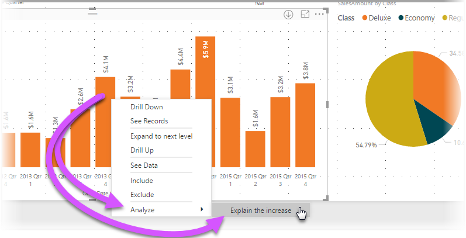
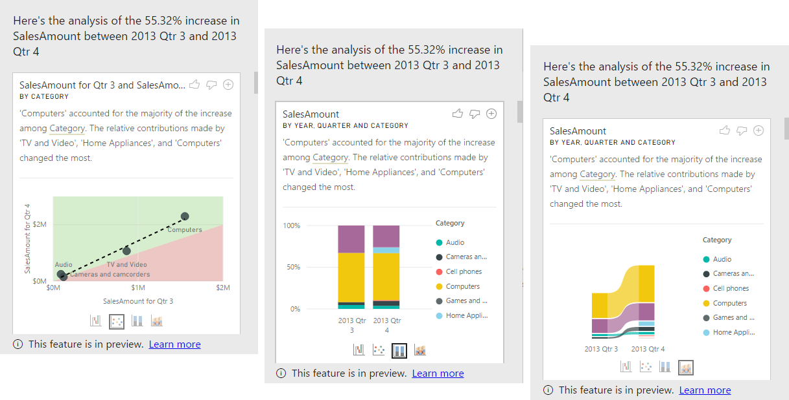

# Use insights in Power BI Desktop (Preview)
You can tell **Power BI Desktop** to explain increases or decreases in charts, and get fast, automated, insightful analysis about your data. Simply right-click on a data point, and select **Analyze > Explain the decrease** (or increase, if the previous bar was lower), and insight is delivered to you in an easy-to-use window.

The insights feature is contextual, and is based on the immediately previous data point - such as the previous bar, or column.

> [!NOTE]
> This feature is in preview, and is subject to change. The insight feature is enabled and on by default (you don't need to check a Preview box to enable it) beginning with the September 2017 version of **Power BI Desktop**.
> 
> 

## Using insights
To use insights, just right-click on any data point in a bar or line visual, and select **Analyze > Explain the increase** (or *Explain the decrease*, since all insights are based on the change from the previous data point).

**Power BI Desktop** then runs its machine learning algorithms over the data, and populates a window with a visual and a description that describes which categories most influenced the increase or decrease. By default, insights are provided as a *waterfall* visual, as shown in the following image.

By selecting the small icons at the bottom of the waterfall visual, you can choose to have insights display a scatter chart, stacked column chart, or a ribbon chart.

The *thumbs up* and *thumbs down* icons at the top of the page are provided so you can provide feedback about the visual and the feature.

And importantly, the **+** button at the top of the visual lets you add the selected visual to your report, just as if you created the visual manually. You can then format or otherwise adjust the added visual just as you would to any other visual on your report. You can only add a selected insight visual when you're editing a report in **Power BI Desktop**.

You can use insights when your report is in reading or editing mode, making it versatile for both analyzing data, and for creating visuals you can easily add to your reports.

## Considerations and limitations
Since insights are based on the change from the previous data point, they aren't available when you select the first data point in a visual. 

The following list is the collection of currently unsupported scenarios for **insights**:

* TopN filters
* Include/exclude filters
* Measure filters
* Non-additive measures and aggregates
* Show value as
* Filtered measures (it’s the new thing we use for scatter chart in insights)
* Categorical columns on X-axis unless it defines a sort by column that is scalar. If using a hierarchy, then every column in the active hierarchy has to match this condition
* Non-numeric measures

In addition, the following model types and data sources are currently not supported for insights:

* DirectQuery
* Live connect
* On-premises Reporting Services
* Embedding

## Next steps
For more information about **Power BI Desktop**, and how to get started, check out the following articles.

* [Getting Started with Power BI Desktop](desktop-getting-started.md)
* [Query Overview with Power BI Desktop](desktop-query-overview.md)
* [Data Sources in Power BI Desktop](desktop-data-sources.md)
* [Connect to Data in Power BI Desktop](desktop-connect-to-data.md)
* [Shape and Combine Data with Power BI Desktop](desktop-shape-and-combine-data.md)
* [Common Query Tasks in Power BI Desktop](desktop-common-query-tasks.md)   

