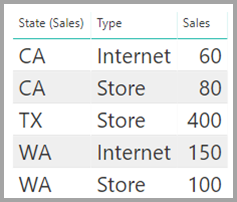
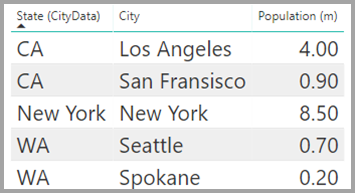
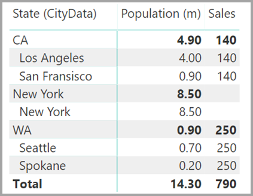
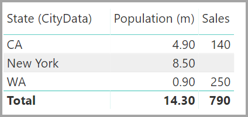

# Many-to-many relationships in Power BI Desktop (preview)

With the *many-to-many relationships* feature in Power BI Desktop, you can join tables that use a cardinality of *Many to Many*, and you can more easily and intuitively create data models that contain multiple data sources. The many-to-many relationships feature is part of the larger *composite models* capabilities in Power BI Desktop.

The many-to-many relationships capability in Power BI Desktop is part of a collection of three related features:

* **Composite models**: Allows a report to have multiple data connections, including DirectQuery connections or import, in any combination. For more information, see [Composite models in Power BI Desktop (preview)](desktop-composite-models.md).

* **Many-to-many relationships**: With *composite models*, you can establish *many-to-many relationships* between tables, which removes requirements for unique values in tables and removes prior workarounds, such as introducing new tables just to establish relationships. The feature is described further in this article.

* **Storage mode**: You can now specify which visuals require a query to back-end data sources. Visuals that don't require a query are imported even if they're based on DirectQuery. This feature helps improve performance and reduce back-end load. Previously, even simple visuals such as slicers initiated queries that were sent to back-end sources. For more information, see [Storage mode in Power BI Desktop (preview)](desktop-storage-mode.md).

## Enable the many-to-many relationships preview feature

The many-to-many relationships feature is part of the composite models capabilities and is in preview. It must be enabled in Power BI Desktop. To enable composite models, select **File** > **Options and Settings** > **Options** > **Preview Features**, and then select the **Composite Models** check box.

To enable the feature, you need to restart Power BI Desktop.

## What many-to-many relationships solves

Prior to the availability of many-to-many relationships, when a relationship between two tables was defined in Power BI, at least one of the table columns involved in the relationship had to contain unique values. In many circumstances, though, no column in the table contained unique values. 

For example, two tables might have had a column labeled *Country*, but the values of *Country* were not unique in either table. To join such tables, it was necessary to create a workaround such as introducing into the model additional tables that contained the necessary unique values. The many-to-many relationships feature provides an alternative approach that allows such tables to be joined directly by using a relationship with a cardinality of **Many to-Many**.  

## Use many-to-many relationships

When you define a relationship between two tables in Power BI, you must define the cardinality of the relationship. For example, the relationship between *ProductSales* and *Product* (using columns *ProductSales[ProductCode]* and *Product[ProductCode]*) would be defined as *Many-1*. It is defined in this way because there are many sales for each product, and the column in the *Product* table *(ProductCode)* is unique. When you define a relationship cardinality as *Many-1*, *1-Many*, or *1-1*, Power BI performs a validation to ensure that the selected cardinality matches the actual data.

For example, take a look at the simple model in the following image:

Now, imagine that the *Product* table contains just two rows, as shown:

Also imagine that the *Sales* table has just four rows, including a row for a product C, which does not exist in the *Product* table (because of a referential integrity error).

The *ProductName* and *Price* (from the *Product* table), along with the total *Qty* for each product (from the *ProductSales* table), would be displayed as shown: 

As you can see in the preceding image, there's blank *ProductName* row that's associated with sales for product C. This blank row accounts for the following:

* Any rows in the *ProductSales* table for which there is no corresponding row in the *Product* table. There's a referential integrity issue, as we see for product *C* in this example.

* Any rows in the *ProductSales* table for which the foreign key column is null. 

For these reasons, in both cases the blank row accounts for sales where the *ProductName* and *Price* are unknown.

However, it sometimes happens that the tables are joined by two columns, yet neither column is unique. For example, consider the following two tables:

* The *Sales* table contains sales data by *State*, with each row containing the sales amount for the type of sale in that state (including CA, WA, and TX). 

    

* The *CityData* table contains data on cities, including the population and state (including CA, WA, and New York).

    

Although there is a column for *State* in both tables and it's reasonable to want to report on total sales by state, along with the total population of each state, a problem exists: the *State* column is not unique in either table. 

## The previous workaround

In versions of Power BI Desktop prior to the July 2018 release, it wasn't possible to create a direct relationship between these tables. A common workaround to this problem was to do the following:

* Create a third table containing just the unique *State* IDs. The table could be any or all of the following:
  * A calculated table (defined by using Data Analysis Expressions [DAX]).
  * A table based on a query that's defined in Query Editor, which could contain the unique IDs drawn from one of the tables.
  * The unioned full set.

* Relate the two original tables to that new table by using common **Many-1* relationships.

You could either leave the workaround table visible or hide it so that it does not appear in the field list. If you hide the table, the *Many-1* relationships would commonly be set to filter in both directions, so that the *State* field from either table could be used. The subsequent cross filtering would propagate to the other table. That workaround approach is shown in the following image of the **Relationship** view.

A visual that displays *State* (from the *CityData* table), along with total *Population* and total *Sales*, would then appear as follows:

Note that given the use of the state from the *CityData* table in this workaround, only those states in that table are listed (and, thus, TX is excluded). Also, unlike *Many-1* relationships, while the total row includes all *Sales* (including those of TX), the details do not include a blank row covering such mismatched rows. Similarly, there would be no blank row covering *Sales* for which there is a null value for the *State*.

If *City* were also added to that visual, although the population per *City* is known, the *Sales* shown for *City* would simply repeat the *Sales* for the corresponding *State*. This is normally the case when the grouping in a column is unrelated to some aggregate measure, as shown in the following image:

If the new *Sales* table were defined to be the union of all *States* in this workaround, and made visible in the field list, the same visual showing *State* (on the new table), along with the total *Population* and total *Sales*, would then be as follows:

In the preceding case and as shown in the visual, *TX* (with *Sales* data but unknown *Population* data) and *New York* (with known *Population* data but no *Sales* data) would be included. 

As you can see, this workaround is not optimal and has many issues. With the creation of *many-to-many* relationships, these issues are addressed as described in the following section.

## Use many-to-many relationships instead of the workaround

In versions of Power BI Desktop starting with July 2018, you can directly relate tables such as those that are described in the previous section without needing to resort to similar workarounds. It's now possible to set the cardinality of a relationship to *Many to Many*, which indicates that neither table contains unique values. For such relationships, you can still control which table filters the other table, or apply bi-directional filtering where both tables filter each other.  

> [!NOTE]
> The ability to create *Many to Many* relationships is in preview, and while it is in preview, it's not possible to publish models that use *Many to Many* relationships to the Power BI service. 

In Power BI Desktop, cardinality defaults to *Many to Many* when it's determined that neither table contains unique values for the columns in the relationship. In such cases, a warning is displayed to confirm that relationship-setting is your intended behavior, rather than being the unintended effect of a data issue. 

For example, when you create a relationship directly between *CityData* and *Sales*, where filters should flow from *CityData* to *Sales*, the **Edit relationship** window is displayed as shown in the following image:

The resulting **Relationship** view would then contain the direct *Many to Many* relationship between the two tables. The appearance in the **Fields** list, and subsequent behavior when visuals are created, is the same as employing the workaround that's described in the previous section, where the extra table (which contains the distinct *State* data) is not made visible. For example, as described in the preceding section, a visual showing *State*, *Population*, and *Sales* data would be as follows:

The major differences between *Many to Many* relationships and the more typical *Many-1* relationships are the following:

* The values shown do not include a blank row that accounts for any mismatched rows in the other table. Nor do the values account for rows where the column used in the relationship in the other table is null.
* It is not possible to use the `RELATED()` function, because more than one row could be related.
* Using the `ALL()` function on a table does not remove filters that are applied to other tables related to it by a *Many to Many* relationship. For example, in the preceding example, a measure that's defined as shown in the following script would not remove filters on columns in the related *CityData* table:

    

    A visual showing *State*, *Sales*, and *Sales total* data would result in the following:

    

Because of this, take care to ensure that calculations that use `ALL(\<Table>)`, such as *% of grand total*, are returning the intended results. 

## Limitations and considerations

There are a few limitations for this release of many-to-many relationships and composite models.

The following Live Connect (multi-dimensional) sources cannot be used with composite models:

* SAP HANA
* SAP Business Warehouse
* SQL Server Analysis Services
* Power BI datasets
* Azure Analysis Services

When you connect to these multi-dimensional sources by using DirectQuery, you can neither connect to another DirectQuery source nor combine it with imported data.

The existing limitations of using DirectQuery still apply when you use many-to-many relationships. Many of these limitations are now per table, depending upon the storage mode of the table. For example, a calculated column on an imported table can refer to other tables, but a calculated column on a DirectQuery table is still restricted to refer only to columns on the same table. Other limitations apply to the model as a whole if any of the tables within the model are DirectQuery. For example, the QuickInsights and Q&A features are unavailable on a model if any of the tables within it has a storage mode of DirectQuery. 

## Next steps

For more information about composite models and DirectQuery, see the following articles:
* [Composite models in Power BI Desktop (preview)](desktop-composite-models.md)
* [Storage mode in Power BI Desktop (preview)](desktop-storage-mode.md)
* [Use DirectQuery in Power BI](desktop-directquery-about.md)
* [Data sources supported by DirectQuery in Power BI](desktop-directquery-data-sources.md)
