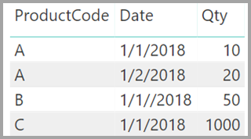
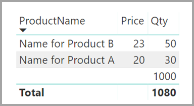

# Many-to-many relationships in Power BI Desktop (Preview)

With the **Many-to-many relationship** feature in **Power BI Desktop** you can join tables using a cardinality of **Many to Many**, and create data models that contain multiple data sources easier and more intuitively. The **many-to-many relationship** feature is part of the larger **composite models** capabilities in **Power BI Desktop**.

The **many-to-many relationships** capability in **Power BI Desktop** is part of a collection of three related features:

* **Composite models** - allows a report to have multiple data connections, including DirectQuery connections or import, in any combination thereof.
* **Many-to-many relationships** - with **composite models** you can establish **many-to-many relationships** between tables, removing requirements for unique values in tables, and removing prior work-arounds such as introducing new tables just to establish relationships. 
* **Storage mode** - you can now specify which visuals require a query to back-end data sources, and those that do no require it are imported even if based on DirectQuery, improving performance and reducing back-end load. Previously, even simple visuals like slicers initiated queries being sent to back-end sources. 

This collection of three related features for **composite models** are each described in separate articles:

* **Composite models** are described in detail in the [composite models in Power BI Desktop (Preview)](desktop-composite-models.md) article.
* **Many-to-many relationships** are described in this article.
* **Storage mode** is described in its own article, [storage mode in Power BI Desktop (Preview)](desktop-storage-mode.md).

## Enabling the many-to-many relationships preview feature

The **many-to-many relationships** feature is part of the **composite models** capabilities and is in Preview, and must be enabled in **Power BI Desktop**. To enable **composite models**, select **File > Options and Settings > Options > Preview Features**, then select the **composite models** checkbox.

You'll need to restart **Power BI Desktop** for the feature to be enabled.

## What many-to-many relationships solves

Prior to availability of **many-to-many relationships**, when defining a relationship between two tables in Power BI, at least one of the columns involved in the relationship had to contain unique values. In many circumstances though, no column in the table contained unique values. 

For example, two tables may have a column containing the *Country*, but the values of *Country* were not unique in either table. To join between such tables, it was necessary to create a workaround such as introducing additional tables into the model that contained the necessary unique values. The feature **many-to-many relationships** provides an alternative approach, allowing such tables to be joined directly using a relationship with a cardinality of **Many-to-many**.  

## Using many-to-many relationships

When defining a relationship between two tables in Power BI, you must define the cardinality of the relationship. For example, the relationship between *ProductSales* and *Product* (using columns *ProductSales[ProductCode]* and *Product[ProductCode]*) would be defined as being **Many-1**, as there are many sales for each product, and the column in the *Product* table *(ProductCode)* is unique. When defining a relationship cardinality as **Many-1**, **1-Many**, or **1-1**, Power BI performs validation to ensure the cardinaltiy selected matches the actual data.

For example, take a look at the simple model in the following image.

Then imagine the *Product* table contained just two rows.

Also imagine the *Sales* table has just four rows, including *Sales* for a product **C** that does not exist in the *Product* table (due to a referential integrity error).

A visual that displayed *ProductName* and *Price* (from the *Product* table), along with the total *Qty* for each product (from the *ProductSales* table) would display as the following image shows: 

As you can see in the previous image, there's a row in the visual with a blank *ProductName*, associated with sales for the product *C*. This blank row accounts for the following:

* Any rows in the *ProductSales* table for which there is no corresponding row in the *Product* table - there's a referential integrity issue, as we see for product *C* in this example.

* Any rows in the *ProductSales* table for which the foreign key column is Null. 

Because of these reasons, in both cases the blank row accounts for sales where the *ProductName* and *Price* are unknown.

However, it's sometimes the case that the tables are joined by two columns, yet neither column is unique. For example, consider the following two tables:

* The *Sales* table contains sales data by *State*, with each row containing the sales amount for the type of sale in that state (including states CA, WA, and TX) 

    

* The *CityData* table contains data on cities, including the population and state (including states CA, WA, and New York)

    

While there is a column for *State* in both tables and it's reasonable to want to report on total *Sales* by *State*, along with the total population of each State, a problem exists: the *State* column is not unique in either table. 

## The prior workaround

In versions of **Power BI Desktop** prior to the July 2018 release, it wasn't possible to create a relationship directly between these tables. A common workaround to this problem was to do the following:

* Create a third table containing just the unique *State* ids. This could be either a calculated table (defined using DAX), or a table defined using a query defined in **Query Editor** which could contain the unique ids drawn from one of the tables, or the unioned full set.

* Relate the two original tables to that new table, using common **Many-1* relationships.

That workaround table could either be left visible, or be hidden such that it does not appear in the field list. In the latter case, the **Many-1** relationships would commonly be set to filter in both directions, such that the *State* field from either table could be used, with subsequent cross filtering propagating to the other table. That workaround approach is shown in the following image of the **Relationship view**.

A visual showing *State* (from the *CityData* table) along with the total *Population* and total *Sales* would then be as follows.

Note that given the use of the state from the *CityData* table in this workaround, only those *State*s in that table are listed (and thus, TX is excluded). Also, unlike the case of **Many-1** relationships, while the total row includes all *Sales* (including those of TX) the details do not include a blank row covering such mismatched rows. Similarly there would be no blank row covering any *Sales* for which there was a null value for the *State*.

If *City* were also added to that visual, then while the population per *City* is known, the *Sales* shown for *City* would simply repeat the *Sales* for the corresponding *State* (as is normally the case when grouping on a column that is not related to some aggregate measure), as shown in the following image.

If the new table *Sales* were defined to be the union of all *States* in this workaround, and made visible in the field list, then the same visual showing *State* (on the new table) along with the total *Population* and total *Sales* would then be as follows.

In that case and shown in the visual, *TX* (with *Sales* but unknown population), and *New York* (with a known population but no *Sales*) would be included. 

As you can see, this workaround was not optimal and has many issues. With the creation of the **many-to-many relationship**, these issues are addressed, as described in the following section.

## Using many-to-many relationships instead of the workaround

In versions of **Power BI Desktop** starting with July 2018, you can directly relate such tables described in the previous section without needing to resort to such workarounds. It's now possible to set the cardinality of a relationship to **Many to Many**, indicating that neither table contains unique values. For such relationships, you can still control which table filters the other table, or to have bi-directional filtering where both tables filter each other.  

> [!NOTE]
> The ability to create **Many to Many** relationships is in Preview, and while it Preview, it's not possible to publish models using **Many to Many** relationships to the Power BI service. 

In **Power BI Desktop**, cardinality defaults to **Many to Many** when it's determined that neither table contains unique values for the columns in the relationship. In such cases a warning is displayed, to confirm that relationship setting is your intended behavior, rather than being the unintended effect of a data issue. 

For example, in creating a relationship directly between *CityData* and *Sales*, where Filters should flow from *CityData* to *Sales*, the relationship dialog appear as showin in the following image.

The resulting **Relationship View** would then contain the direct **Many to Many** relationship between the two tables. The appearance in the **Fields** list, and subsequent behavior when visuals are created, is then the same as employing the workaround described in the previous section, where the extra table (with the distinct *States* in it) is not made visible. For example, as in the previous section describing the workaround, a visual showing *States* along with total population and sales would be as follows.

So the major difference between **Many to Many** relationships and the more typical **Many-1** relationships are the following.

* The values shown do not include a blank row accounting for any mismatched rows in the other table, nor for rows where the column used in the relationship in the other table is null.
* It is not possible to use the *RELATED()* function (as more than one row could be related)
* Using the *ALL()* function on a table will not remove filters applied to other tables related to it by a **Many to Many** relationship. For example, a measure defined as the following in the previous example would not remove filters on columns on the related *CityData* table:

    

    As such a visual showing *State*, *Sales*, and *Sales total* would result in the following:

    

Because of this, care should be taken to ensure that calculations using *ALL(\<Table>)*, such as *% of grand total*, are returning the intended results. 

## Limitations and considerations

There are a few limitations for this release of **many-to-many relationships** and **composite models**.

The following multidimensional sources cannot be used with **composite models**:

* SAP HANA
* SAP Business Warehouse
* SQL Server Analysis Services
* Power BI datasets

When connecting to those multidimensional sources using DirectQuery, you cannot also connect to another DirectQuery source, nor combine with imported data.

The existing limitations of using DirectQuery still apply when using **many-to-many relationships**. Many of those limitations are now per table, depending upon the **storage mode** of the table. For example, a calculated column on an imported table can refer to other tables, but a calculated column on a DirectQuery table is still restricted to refer only to columns on the same table. Other limitations apply to the model as a whole, if any of the tables within the model are DirectQuery. For example, the **QuickInsights** and **Q&A** features are not available on a model if any of the tables within it has a **storage mode** of DirectQuery. 

## Next steps

The following articles describe more about composite models, and also describe DirectQuery in detail.

* [Composite Models in Power BI Desktop (Preview)](desktop-composite-models.md)
* [Storage Mode in Power BI Desktop (Preview)](desktop-storage-mode.md)

DirectQuery articles:

* [Using DirectQuery in Power BI](desktop-directquery-about.md)
* [Data sources supported by DirectQuery in Power BI](desktop-directquery-data-sources.md)

