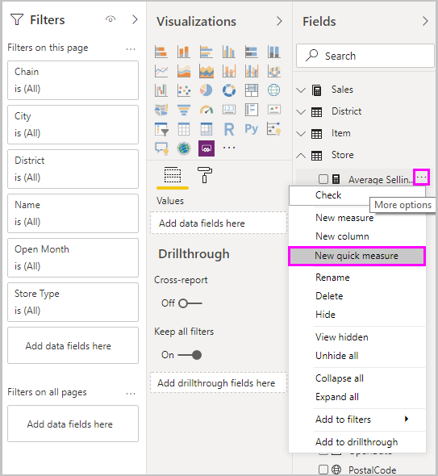
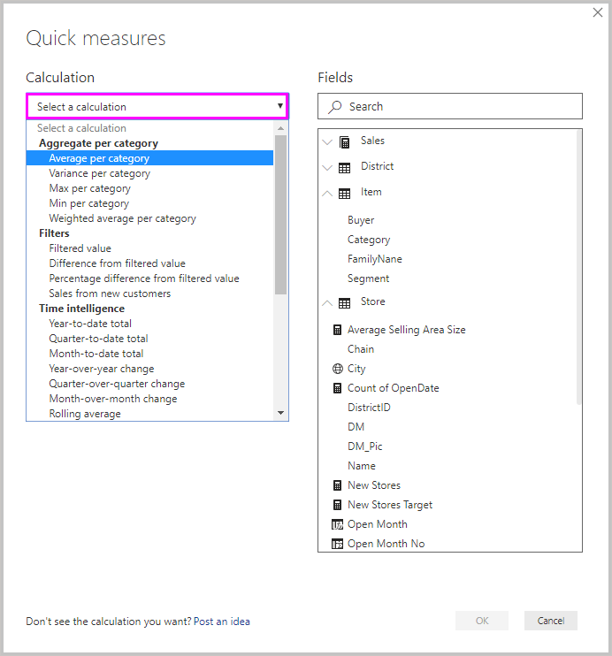
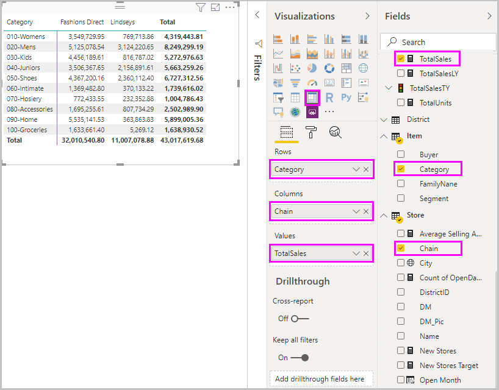
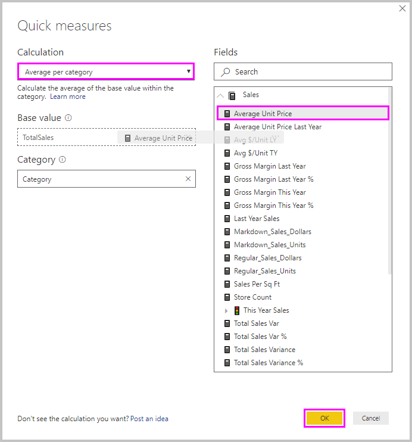
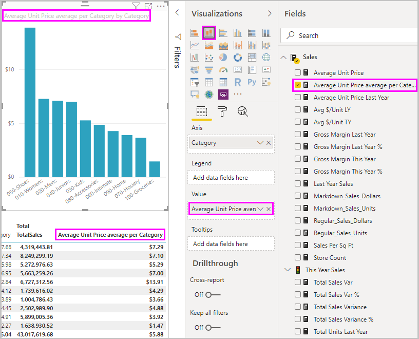
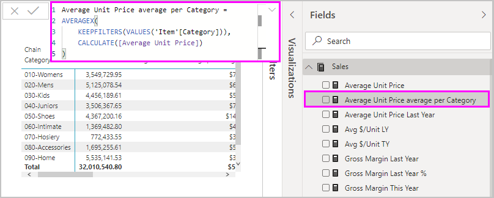
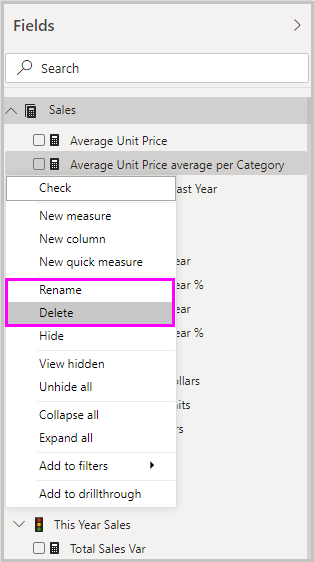

# Use quick measures to easily perform common and powerful calculations
You can use *quick measures* to quickly and easily perform common, powerful calculations. A quick measure runs a set of DAX commands behind the scenes, then presents the results for you to use in your report. You don't have to write the DAX, it's done for you based on input you provide in a dialog box. There are many available categories of calculations and ways to modify each calculation to fit your needs. Perhaps best of all, you can see the DAX that's executed by the quick measure and jump-start or expand your own DAX knowledge.

## Create a quick measure

To create a quick measure in Power BI Desktop, right-click or select **...** next to any item in the **Fields** well, and select **New quick measure** from the menu that appears. 

You can also right-click or select the drop-down arrow next to any value in the **Value** list for an existing visual, and select **New quick measure** from the menu. 

When you select **New quick measure**, the **Quick measures** window appears, letting you select the calculation you want and the fields to run the calculation against. 

Select the **Select a calculation** field to see a long list of available **Quick measures**. 

The five quick measure calculation types, with their calculations, are as follows:

* **Aggregate per category**
  * Average per category
  * Variance per category
  * Max per category
  * Min per category
  * Weighted average per category
* **Filters**
  * Filtered value
  * Difference from filtered value
  * Percentage difference from filtered value
  * Sales from new customers
* **Time intelligence**
  * Year-to-date total
  * Quarter-to-date total
  * Month-to-date total
  * Year-over-year change
  * Quarter-over-quarter change
  * Month-over-month change
  * Rolling average
* **Totals**
  * Running total
  * Total for category (filters applied)
  * Total for category (filters not applied)
* **Mathematical operations**
  * Addition
  * Subtraction
  * Multiplication
  * Division
  * Percentage difference
  * Correlation coefficient
* **Text**
  * Star rating
  * Concatenated list of values

To submit your ideas about new quick measures you'd like to see, or underlying DAX formulas and other quick measures ideas for consideration, see the end of this article.

> [!NOTE]
> When using SQL Server Analysis Services (SSAS) live connections, some quick measures are available. Power BI Desktop displays only the quick measures that are supported for the version of SSAS you're connecting to. If you're connected to a SSAS live data source and don't see certain quick measures in the list, it's because the SSAS version you're connected to doesn't support the DAX measures used to implement those quick measures.

After you select the calculations and fields you want for your quick measure, select **OK**. The new quick measure appears in the **Fields** well, and the underlying DAX formula appears in the formula bar. 

## Quick measure example
Let's take a look at a quick measure in action.

The following Matrix visual shows a sales table for various products. It's a basic table that includes the total for each category.

Select a value in the **Values** field well and select **New quick measure**. In the **Quick measures** window, under **Calculation**, select **Average per category**. Under **Base value**, select **Sum of SalesAmount**, and then drag **SalesAmount** from the **Fields** pane into the **Category** section on the left.

When you select **OK**, several interesting things happen.

1. The **Matrix** visual now has a new column that shows the calculated **Average SalesAmount within SalesAmount**.
   
   
   
2. The new measure appears in the **Fields** well, and is selected and highlighted. 
   
   This measure is available to any visual in the report, not just the visual you created it for. The following image shows a quick bar chart visual created by using the new quick measure field.
   
   
   
3. The DAX formula for the new quick measure appears in the formula bar.
   
   Let's head to the next section to discuss the third item, the DAX formula.

## Learn DAX by using quick measures
A great advantage of quick measures is that they show you the DAX formula that implements the measure. When you select a quick measure in the **Fields** well, the **Formula bar** appears, showing the DAX formula that Power BI created to implement the measure.

The formula bar not only shows you the formula behind the measure, but perhaps more importantly, lets you use quick measures to see how to create the DAX formulas underlying quick measures.

Imagine you need to do a year-over-year calculation, but you're not sure how to structure the DAX formula, or you have no idea where to start. Instead of banging your head on the desk, you can create a quick measure using the **Year-over-year change** calculation, and see how it appears in your visual and how the DAX formula works. Then you can either make changes directly to the DAX formula, or create a similar measure that meets your needs and expectations.

It's like having a teacher that immediately responds to what-if questions you ask with a few clicks. You can always delete those measures from your model if you don't like them. That's as easy as right-clicking or selecting **...** next to the measure and selecting **Delete**.

You can also rename a quick measure whatever you like by using the right-click or more options menu. 

## Limitations and considerations
There are a few limitations and considerations to keep in mind.

- You can use a quick measures added to the **Fields** well with any visual in the report.
- You can always see the DAX associated with a quick measure by selecting the measure in the **Fields** well and looking at the formula in the formula bar.
- Quick measures are only available if you can modify the model. That isn't the case when you're working with some Live connections. SSAS tabular live connections are supported, as previously described.
- You can't create time intelligence quick measures when working in DirectQuery mode. The DAX functions used in these quick measures have performance implications when translated into the T-SQL statements that get sent to your data source.

> [!IMPORTANT]
> DAX statements for quick measures use only commas for argument separators. If your version of Power BI Desktop is in a language that uses commas as decimal separators, quick measures will not work properly.

### Quick measures now generally available
Beginning with the February 2018 release of Power BI Desktop, quick measures are generally available. If you're using an earlier release of Power BI Desktop, you can try quick measures beginning with the April 2017 release of Power BI Desktop. Select **File** > **Options and Settings** > **Options** > **Preview Features**, and then select the checkbox next to **Quick measures**. Restart Power BI Desktop after making this selection.

### Time intelligence and quick measures
Beginning with the October 2017 update to Power BI Desktop, you can use your own custom date tables with time intelligence quick measures. If you're using an external tabular model, make sure that when the model was built, the primary date column in the table was marked as a date table, as described in [Specify Mark as Date Table for use with time-intelligence](https://docs.microsoft.com/sql/analysis-services/tabular-models/specify-mark-as-date-table-for-use-with-time-intelligence-ssas-tabular). If you're importing your own date table, make sure to mark it as a date table, as described in [Set and use date tables in Power BI Desktop](desktop-date-tables.md).

### Additional information and examples
Have an idea for a Quick measure that isn't already provided? Great! Check out the [Power BI Ideas](https://go.microsoft.com/fwlink/?linkid=842906) page, and submit your ideas and DAX formulas for quick measures you'd like to see in Power BI Desktop. We'll consider adding them to the quick measures list in a future release.

