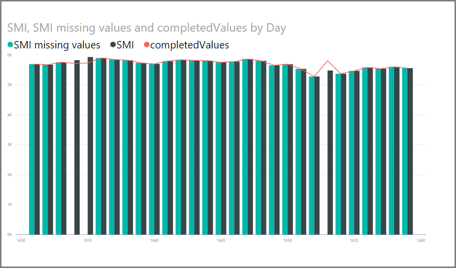

# Use R in Power Query Editor

[The R language](https://mran.microsoft.com/documents/what-is-r) is a powerful programming language that many statisticians, data scientists, and data analysts use. You can use R in Power BI Desktop's Power Query Editor to:

* Prepare data models

* Create reports

* Do data cleansing, advanced data shaping, and dataset analytics, which include missing data completion, predictions, clustering, and more.  

## Install R

You can download R for free from the [Revolution R Open download page](https://mran.revolutionanalytics.com/download/) and the [CRAN Repository](https://cran.r-project.org/bin/windows/base/).

## Install mice

As a prerequisite, you must install the [mice library](https://www.rdocumentation.org/packages/mice/versions/3.5.0/topics/mice) in your R environment. Without mice, the sample script code won't work properly. The mice package implements a method to deal with missing data.

To install the mice library:

1. Launch the R.exe program (for example, C:\Program Files\Microsoft\R Open\R-3.5.3\bin\R.exe)  

2. Run the install command from the R prompt:

   ``` 
   install.packages('mice') 
   ```

## Use R in Power Query Editor

To demonstrate using R in Power Query Editor, we'll use an example stock market dataset contained in  a .csv file and work through the following steps:

1. [Download the **EuStockMarkets_NA.csv** file](https://download.microsoft.com/download/F/8/A/F8AA9DC9-8545-4AAE-9305-27AD1D01DC03/EuStockMarkets_NA.csv). Remember where you save it.

1. Load the file into Power BI Desktop. From the **Home** tab, select **Get Data** > **Text/CSV**.

   

1. Select the EuStockMarkets_NA.csv file, and then choose **Open**. The CSV data is displayed in the **Text/CSV file** dialog box.

   

1. Select **Load** to load the data from the file. After Power BI has loaded the data, the new table appears in the **Fields** pane.

   

1. To open Power Query Editor, from the **Home** ribbon select **Edit Queries**.

   

1. From the **Transform** tab, select **Run R script**. The **Run R script** editor appears. Rows 15 and 20 have missing data, as do other rows you can't see in the image. The following steps show how R completes those rows for you.

   

1. For this example, enter the following script code in the **Script** box of the **Run R script** window. Replace *&lt;Your File Path&gt;* with the path to **EuStockMarkets_NA.csv** on your local file system, for example, C:/Users/John Doe/Documents/Microsoft/EuStockMarkets_NA.csv.

    ```r
       dataset <- read.csv(file="<Your File Path>/EuStockMarkets_NA.csv", header=TRUE, sep=",")
       library(mice)
       tempData <- mice(dataset,m=1,maxit=50,meth='pmm',seed=100)
       completedData <- complete(tempData,1)
       output <- dataset
       output$completedValues <- completedData$"SMI missing values"
    ```

    > [!NOTE]
    > You might need to overwrite a variable named *output* to properly create the new dataset with the filters applied.

7. Select **OK**. Power Query Editor displays a warning about data privacy.

   
8. After the warning message, select **Continue**. In the **Privacy levels** dialog box that appears, set all data sources to **Public** for the R scripts to work properly in the Power BI service. 

   

   For more information about privacy settings and their implications, see [Power BI Desktop privacy levels](desktop-privacy-levels.md).

 9. Select **Save** to run the script. 

   Notice a new column in the **Fields** pane called **completedValues**. This column has a few missing data elements, such as on row 15 and 18. Take a look at how R handles that in the next section.

   With just five lines of R script, Power Query Editor filled in the missing values with a predictive model.

## Create visuals from R script data

Now we can create a visual to see how the R script code with the mice library completed the missing values.



You can save all completed visuals in one Power BI Desktop .pbix file and use the data model and its R scripts in the Power BI service.

> [!NOTE]
> You can [download a .pbix file](https://download.microsoft.com/download/F/8/A/F8AA9DC9-8545-4AAE-9305-27AD1D01DC03/Complete%20Values%20with%20R%20in%20PQ.pbix) with all these steps completed.

After you've uploaded the .pbix file to the Power BI service, you need to take additional steps to enable service data refresh and updated visuals:  

* **Enable scheduled refresh for the dataset**: To enable scheduled refresh for the workbook containing your dataset with R scripts, see [Configuring scheduled refresh](refresh-scheduled-refresh.md). This article also includes information about personal gateways.

* **Install a personal gateway**: You need a personal gateway installed on the machine where the file and R are located. The Power BI service accesses that workbook and re-renders any updated visuals. For more information, see [Use personal gateways in Power BI](service-gateway-personal-mode.md).

## Limitations

There are some limitations to queries that include R scripts created in Power Query Editor:

* All R data source settings must be set to **Public**. All other steps in a Power Query Editor query must also be public. To get to data source settings, in Power BI Desktop, select **File** > **Options and settings** > **Data source settings**.

  

  In the **Data source settings** dialog box, select one or more data sources, and then select **Edit Permissions**. Set the **Privacy Level** to **Public**.

      
* To schedule refresh of your R visuals or dataset, enable scheduled refresh and install a personal gateway on the computer containing the workbook and R. 

There are all sorts of things you can do with R and custom queries. Explore and shape your data just the way you want it to appear.

## Next Steps

* [Introduction to R](https://mran.microsoft.com/documents/what-is-r) 

* [Run R scripts in Power BI Desktop](desktop-r-scripts.md) 

* [Use an external R IDE with Power BI](desktop-r-ide.md) 

* [Create visuals by using R packages in the Power BI service](service-r-packages-support.md)
