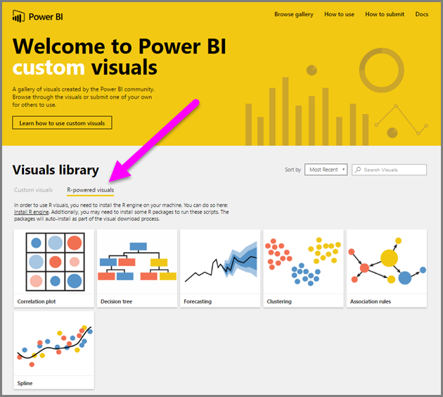
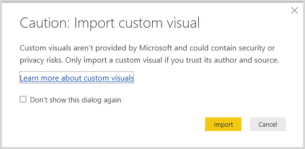
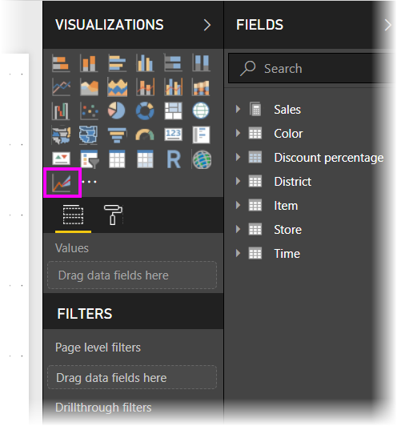
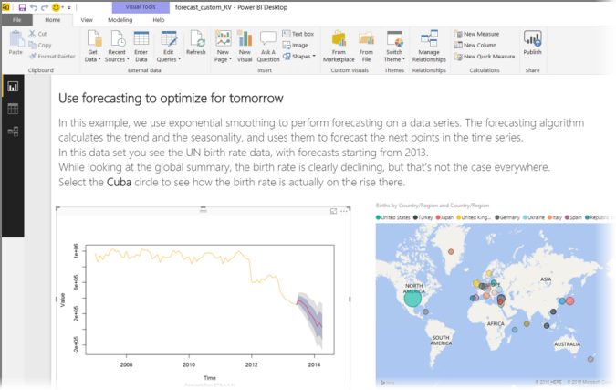
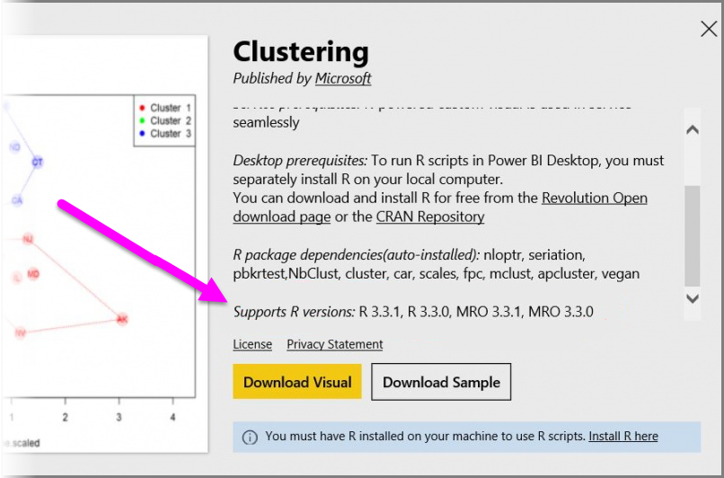

# Use R-powered custom visuals in Power BI
With the October 2016 release of **Power BI Desktop**, and in the **Power BI service**, you can use R-powered custom visuals without any knowledge of R, and without any R scripting. This enables you to harness the analytic and visual power of R visuals, and R scripts, without learning R or doing any programming yourself.

To use R-powered custom visuals, you first select and download the R custom visual you're interested in using from the **R-powered visuals** section of the Power BI **custom visuals** gallery.

The following sections describe how to select, load, and use R-powered visuals in **Power BI Desktop**.

### Using R custom visuals
To use R-powered custom visuals, you need to download each visual from the **custom visuals** library, then you can use the visual like any other type of visual in **Power BI Desktop**. Here are the steps:

1. Navigate to the [custom visuals](http://app.powerbi.com/visuals) library, found at [http://app.powerbi.com/visuals](http://app.powerbi.com/visuals). Select the *R-powered visuals* link, near the top of the page.
   
   
2. Select the **R-powered visual** you're interested in using from the gallery. A dialog presenting additional details appears. Select **Download Visual** to download.
   
   > Note: For authoring in **Power BI Desktop**, you need to have R installed on your local machine. But when users want to view an R-powered visual in the **Power BI service** they do *not* need R installed locally.
   > 
   > 
   
   
   
   You do not need to install R to use R-powered custom visuals in the **Power BI service**, however, if you want to use R-powered custom visuals in **Power BI Desktop** you *must* install R on the local machine. You can download R from the following locations:
   
   * [CRAN 3.3.1](https://cran.r-project.org/bin/windows/base/R-3.3.1-win.exe)
   * [MRO 3.3.1](https://mran.microsoft.com/install/mro/3.3.1/microsoft-r-open-3.3.1.msi)
3. Once the visual is downloaded (which is like downloading any file from your browser), go to **Power BI Desktop** and right-click the ellipsis (the ...) in the **Visualizations** pane, and select **Import a custom visual**.
   
   
4. You're cautioned about importing a custom visuals, as shown in the following image:
   
   
5. Navigate to where the visual file was saved, then select the file. **Power BI Desktop** custom visualizations have the .pbiviz extension.
   
   
6. When you return to Power BI Desktop, you can see the new visual type in the **Visualizations** pane.
   
   
7. When you import the new visual (or open a report that contains a R-powered custom visual), **Power BI Desktop** installs the required R packages.
   
   

From there, you can add data to the visual just as you would any other **Power BI Desktop** visual. When complete, you can see your finished visual on the canvas. In the following visual, the **Forecasting** R-powered visual was used with United Nations (UN) birth rate projections (the visual on the left).

Like any other **Power BI Desktop** visual, you can publish this report with its R-powered visuals to the **Power BI service** and share it with others.

Check the [R-powered custom visuals](https://app.powerbi.com/visuals/R-powered) library often, since new visuals are being added all the time.

### Contributing R-powered custom visuals
If you create your own R visuals for use in your reports, you can share those visual with the world by contributing your custom visual to the **custom visuals gallery**. Contributions are made through GitHub, and the process is outlined in the following location:

* [Contributing to the R-powered custom visuals gallery](https://github.com/Microsoft/PowerBI-visuals#building-r-powered-custom-visual-corrplot)

### Troubleshooting R-powered custom visuals
R-powered custom visuals have certain dependencies that must be met for the visuals to work properly. When R-powered custom visuals don't run or load properly, the problem is usually one of the following:

* The R engine is missing
* Errors in the R script on which the visual is based
* R packages are missing or out of date

The following section describes troubleshooting steps you can take to help address trouble you run into.

#### Missing or outdated R packages
When attempting to install an R-powered custom visual, you can run into errors when there are missing or outdated R packages; this is usually due to one of the following reasons:

* The R installation is incompatible with the R package,
* A firewall, anti-virus software, or proxy settings are preventing R from connecting to the Internet
* The Internet connection is slow, or there's an Internet connection problem

The Power BI team is actively working on mitigating these issues before they reach you, and the next Power BI Desktop will incorporate updates to address these problems. Until then, you can take one or more of the following steps to mitigate the issues:

1. Remove the custom visual, then install it again. This initiates a re-installation of the R packages.
2. If your installation of R is not current, upgrade your R installation, then remove/re-install the custom visual as described in the previous step.
   
   * Supported R versions are listed in the description of each R-powered custom visual, as shown in the following image.
     
     > **Note:** You can keep the original R installation, and only associate Power BI Desktop with the current version you install. Go to **File > Options and settings > Options > R scripting**.
3. Install R packages manually, using any R console. The steps for this approach are the following:
   
   a.  Download the R-powered visual installation script, and save that file to a local drive.
   
   b.  From the R console, run the following:
   
       > source(“C:/Users/david/Downloads/ScriptInstallPackagesForForecastWithWorkarounds.R”)    
   
   Typical default installation locations are the following:
   
       c:\Program Files\R\R-3.3.x\bin\x64\Rterm.exe (for CRAN-R)
       c:\Program Files\R\R-3.3.x\bin\x64\Rgui.exe (for CRAN-R)
       c:\Program Files\R\R-3.3.x\bin\R.exe (for CRAN-R)
       c:\Program Files\Microsoft\MRO-3.3.x\bin\R.exe (for MRO)
       c:\Program Files\Microsoft\MRO-3.3.x\bin\x64\Rgui.exe (for MRO)
       c:\Program Files\RStudio\bin\rstudio.exe (for RStudio)
4. If the previous steps don't work, try the following:
   
   a. Use **R Studio** and follow the step outlined in 3.b. above (run the script line from the R console).
   
   b. If the previous step doesn't work, change **Tools > Global Options > Packages** in **R Studio**, and enable the checkbox for **Use Internet Explorer library/proxy for HTTP**, then repeat step 3.b. from the above steps.

### More Information
Take a look at the following additional information about R in Power BI.

* [Power BI custom visuals gallery](https://app.powerbi.com/visuals/)
* [Running R Scripts in Power BI Desktop](desktop-r-scripts.md)
* [Create R visuals in Power BI Desktop](desktop-r-visuals.md)
* [Use an external R IDE with Power BI](desktop-r-ide.md)

