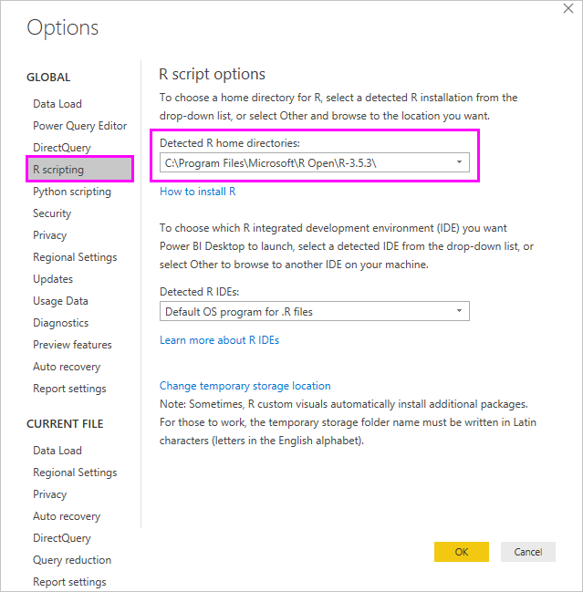
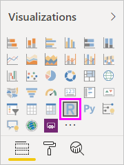
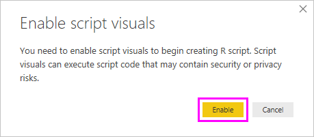
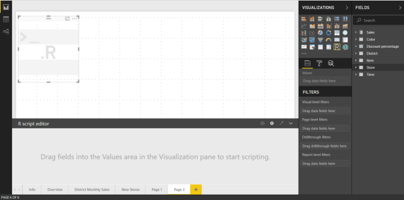
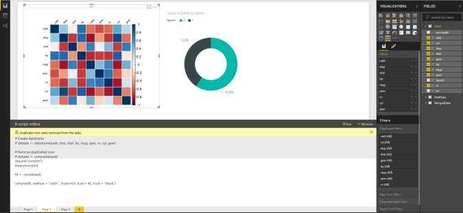
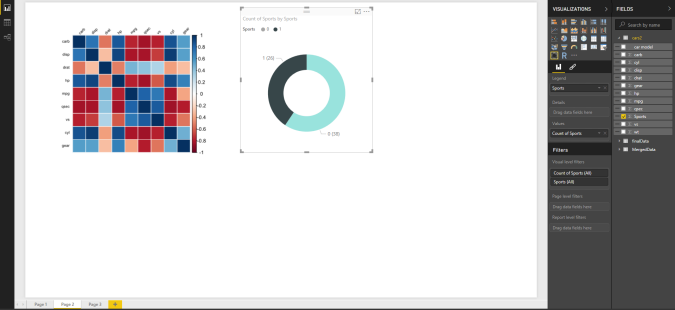

# Create Power BI visuals using R
With Power BI Desktop, you can use *R* to visualize your data. [R](https://mran.revolutionanalytics.com/documents/what-is-r) is a language and environment for statistical computing and graphics.

## Install R
By default, Power BI Desktop doesn't include, deploy, or install the R engine. To run R scripts in Power BI Desktop, you must separately install R on your local computer. You can download and install R for free from many locations, including the [Revolution Open download page](https://mran.revolutionanalytics.com/download/), and the [CRAN Repository](https://cran.r-project.org/bin/windows/base/). The current release of R scripting in Power BI Desktop supports Unicode characters as well as spaces (empty characters) in the installation path.

## Enable R visuals in Power BI Desktop
After you've installed R, Power BI Desktop enables it automatically. To verify that Power BI Desktop has enabled R in the correct location, follow these steps: 

1. From the Power BI Desktop menu, select **File** > **Options and settings** > **Options**. 

2. On the left side of the **Options** page, under **Global**, select **R scripting**. 

3. Under **R script options**, verify that your local R installation is specified in **Detected R home directories** and that it properly reflects the local R installation you want Power BI Desktop to use. In the following image, the path to the local installation of R is **C:\Program Files\R Open\R-3.5.3\\**.
   
   

After you've verified your R installation, you’re ready to begin creating R visuals.

## Create R visuals in Power BI Desktop
1. Select the **R Visual** icon in the **Visualization** pane to add an R visual.
   
   

2. In the **Enable script visuals** window that appears, select **Enable**.

   

   When you add an R visual to a report, Power BI Desktop makes the following changes:
   
   - A placeholder R visual image appears on the report canvas.
   
   - The **R script editor** appears along the bottom of the center pane.
   
   

3. In the **Values** section of the **Visualization** pane, drag fields from the **Fields** pane that you want to consume in your R script, just as you would with any other Power BI Desktop visual. Alternatively, you can also select the fields directly in the **Fields** pane.
    
    Only fields that you've added to the **Values** section are available to your R script. You can add new fields or remove unneeded fields from the **Values** section while working on your R script in the **R script editor**. Power BI Desktop automatically detects which fields you've added or removed.
   
   > [!NOTE]
   > The default aggregation type for R visuals is *do not summarize*.
   > 
   > 
   
4. Now you can use the data you selected to create a plot: 

    - As you select fields, the **R script editor** generates supporting R script binding code for those fields in the gray section along the top of the editor pane.
    - If you remove a field, the **R script editor** automatically removes the supporting code for that field.
   
   In the example shown in the following image, three fields are selected: hp, gear, and drat. As a result of those selections, the R script editor generates binding code, which is summarized as follows:
   
   * Create a dataframe called **dataset**, which is comprised of the different fields selected by the user.
   * The default aggregation is: *do not summarize*.
   * Similar to table visuals, fields are grouped and duplicate rows appear only once.
   
   
   
   > [!TIP]
   > In certain cases, you may not want automatic grouping to occur, or you may want all rows to appear, including duplicates. In that case, add an index field to your dataset, which causes all rows to be considered unique and prevents grouping.
   > 
   > 
   
   The generated dataframe is named **dataset**, and you access selected columns by their respective names. For example, access the gear field by adding *dataset$gear* to your R script. For fields with spaces or special characters, use single quotes.

5. With the dataframe automatically generated by the fields you selected, you’re ready to write an R script, which Power BI Desktop plots to the R default device. After you've completed the script, select **Run script** on the right side of the **R script editor** title bar.
   
    When you select **Run script**, Power BI Desktop identifies the plot and presents it on the canvas. Because the process is executed on your local R installation, make sure the required R packages are installed.
   
   Power BI Desktop replots the visual when any of the following events occur:
   
   * You select **Run script** from the **R script editor** title bar.
   * A data change occurs because of data refreshing, filtering, or highlighting.

     The following image shows an example of the correlation plot code, which plots the correlations between attributes of different types of cars.

     

6. To get a larger view of the visualizations, minimize the **R script editor**. Like other visuals in Power BI Desktop, you can cross filter the correlation plot by selecting a specific section (such as sports cars) in the donut-shaped visual (the round visual on the right).

    

7. Modify the R script to customize the visual, and take advantage of the power of R by adding parameters to the plotting command.

    The original plotting command is:

    ```
    corrplot(M, method = "color",  tl.cex=0.6, tl.srt = 45, tl.col = "black")
    ```

    Change the R script so that the plotting command is as follows:

    ```
    corrplot(M, method = "circle", tl.cex=0.6, tl.srt = 45, tl.col = "black", type= "upper", order="hclust")
    ```

    As a result, the R visual now plots circles, only considers the upper half, and reorders the matrix to cluster correlated attributes.

    

    When you execute an R script that results in an error, an error message displays on the canvas instead of the R visual plot. For details on the error, select **See details** from the R visual error.

    

## R scripts security 
R visuals are created from R scripts, which might contain code with security or privacy risks. When attempting to view or interact with an R visual for the first time, a user is presented with a security warning message. Only enable R visuals if you trust the author and source, or after you review and understand the R script.


## Known limitations
R visuals in Power BI Desktop have the following limitations:

* Data sizes: Data used by an R visual for plotting is limited to 150,000 rows. If more than 150,000 rows are selected, only the top 150,000 rows are used and a message is displayed on the image.

* Calculation times: If an R visual calculation exceeds five minutes, it causes a time-out error.

* Relationships: As with other Power BI Desktop visuals, if data fields from different tables with no defined relationship between them are selected, an error occurs.

* Refreshes: R visuals are refreshed upon data updates, filtering, and highlighting. However, the image itself isn't interactive and can't be the source of cross-filtering.

* Highlights: R visuals respond if you highlight other visuals, but you can't select elements in the R visual to cross filter other elements.

* Display devices: Only plots that are plotted to the R default display device are displayed correctly on the canvas. Avoid explicitly using a different R display device.

* RRO installations: In this release, the 32-bit version of Power BI Desktop doesn't automatically identify RRO installations; you must manually provide the path to the R installation directory in **Options and settings** > **Options** > **R Scripting**.

## Next steps
For more information about R in Power BI, see the following articles:

* [Running R Scripts in Power BI Desktop](desktop-r-scripts.md)
* [Use an external R IDE with Power BI](desktop-r-ide.md)

