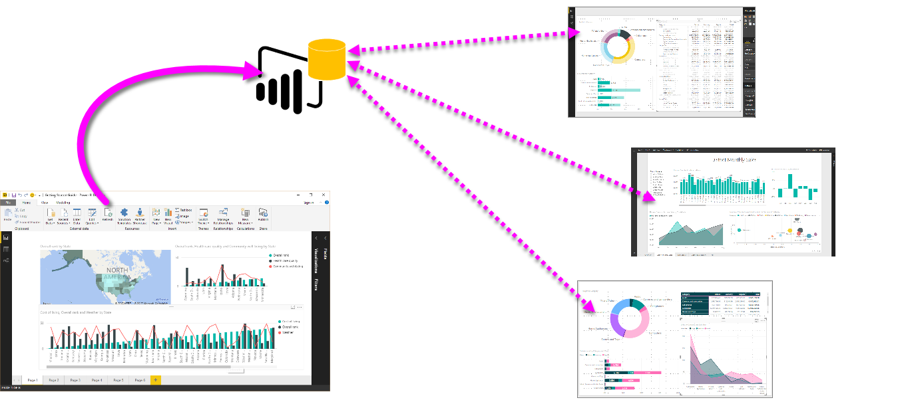
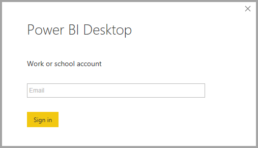
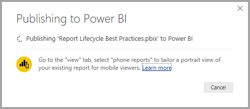
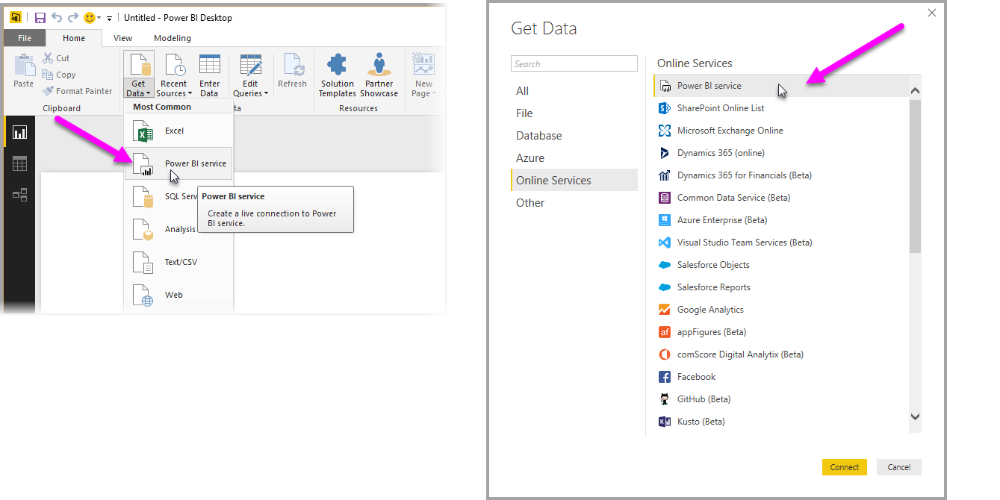
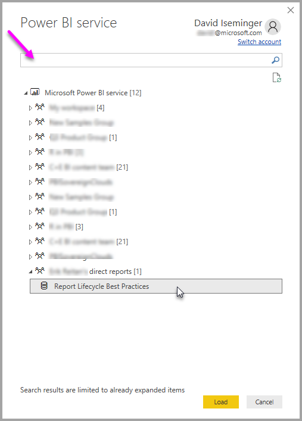

# Connect to datasets in the Power BI service from Power BI Desktop
You can establish a live connection to a shared dataset in the Power BI service, and create many different reports from the same dataset. This means you can create your perfect data model in Power BI Desktop, publish it to the Power BI service, then you and others can create multiple different reports (in separate .pbix files) from that same, common data model. This feature is called **Power BI service Live connection**.

There are all sorts of benefits of this feature, including best practices, which we’ll discuss during this article. There are also a few considerations and limitations, so please make sure you read through those - they're found at the end of this article.

## Using a Power BI service live connection for report lifecycle management
One challenge with the popularity of Power BI is the proliferation of reports, dashboards, and their underlying data models. Here's why: it's easy to create compelling reports in **Power BI Desktop**, then share ([publish](desktop-upload-desktop-files.md)) those reports in the **Power BI service**, and to create great dashboards from those datasets. Since so many people were doing so, often using the same (or nearly the same) datasets, knowing which report was based on which dataset - and how fresh each dataset might be - became a challenge. The **Power BI service Live Connection** addresses that challenge, and makes creating, sharing, and expanding upon common-dataset reports and dashboards easier and consistent.

### Create a dataset everyone can use, then share it
Let's say Anna (a business analyst) is on your team, and she's great at creating good data models (often called datasets). With Anna's expertise, she can create a dataset and report, and then share that report in the **Power BI service**.

Everyone loves her report, and her dataset, and that's where the trouble would begin - everyone on her team would attempt to create *their own version* of that dataset, then share their own reports with the team. All of the sudden there was a multitude of reports (from different datasets) in your team's workspace in the **Power BI service**. Which was the most recent? Were the datasets the same, or only almost? What were the differences? With the **Power BI service Live Connection** feature, all that can change for the better. In the next section, we see how others can use Anna's published dataset for their own reports, and enable everyone to use the same solid, vetted, published dataset to build their unique reports.

### Connect to a Power BI service dataset using a live connection
Once Anna creates her report (and creates the dataset it's based upon), she publishes it to the **Power BI service**, it shows up in her team's workspace in the Power BI service. Now it's available for everyone in her workspace to see and use.

Other members of her workspace can now establish a live connection to Anna's shared data model (using the **Power BI service live connection** feature), and create their own unique reports, from *her original dataset*.

In the following image, you see how Anna creates one **Power BI Desktop** report, and publishes it (which includes its data model) to the **Power BI service**. Then others in her workspace can connect to her data model using the **Power BI service live connection**, and create their own unique reports based on her dataset.

> [!NOTE]
> Datasets are only shared in one workspace. To establish a Power BI service live connection, the dataset to which you connect must be in a shared workspace of which you are a member.
> 
> 

## Step-by-step for using the Power BI service live connection
Now that we know how useful the **Power BI service live connection** is, and how you can use it as a best practice approach to report lifecycle management, let's walk through the steps that get us from Anna's great report (and dataset) to a shared dataset that teammates in her Power BI workspace can use.

### Publish a Power BI report and dataset
The first step in managing the report lifecycle using a **Power BI service live connection** is to have a report (and dataset) that teammates want to use. So Anna must first **publish** her report from **Power BI Desktop**. She does this by selecting **Publish** from the **Home** ribbon in Power BI Desktop.

If she isn't signed in to her Power BI service account, she's prompted to do so.

From there, she can choose the workspace destination to which the report and dataset will be published. Remember, only members who have access to the workspace where a report is published can access its dataset using a **Power BI service live connection**.

The publishing process begins, and **Power BI Desktop** shows the progress.

Once complete, **Power BI Desktop** shows you success, and provides a couple links to get you to the report itself in the **Power BI service**, and a link to get **Quick Insights** on the report.

Next, let's see how other teammates who have access to the workspace where the report (and dataset) were published can connect to the dataset and build our own reports.

### Establish a Power BI service live connection to the published dataset
To establish a connection to the published report, and create your own report based on the published dataset, select **Get Data** from the **Home** ribbon in **Power BI Desktop**, and select **Power BI service**. You can also select it from **Get Data > Online Services > Power BI service**.

If you're not signed in to Power BI, you'll be prompted to do so. Once logged in, you're presented with a window that shows which workspaces you're a member of, and you can select which workspace contains the dataset to which you want to establish a **Power BI service live connection**.

The number in brackets beside the workspace shows how many shared datasets are available in that workgroup, and selecting the triangle to the left expands the workspace, allowing you to select the shared dataset.

There are a few items to note from the previous **Power BI service** live connection window:

* You can search for a shared dataset, but the search results are limited to the expanded items, and won't include any workspaces that you have not expanded.
* You can expand more than one workspace to expand your search.

When you select **Load** from the window, you establish a live connection to the selected dataset, which means the data you see (the fields, and their values) are loaded into **Power BI Desktop** in real time.

Now you (and others) can create and share custom reports, all from the same dataset. This is a great way to have one knowledgeable person create a well-formed dataset (such as what Anna does), and allow many teammates use that shared dataset to create their own reports.

> [!NOTE]
> When you create reports based on dataset using a live connection to the **Power BI service**, you can only publish that report to the same Power BI service workspace that contains the dataset being used.
> 
> 

## Limitations and considerations
When using the **Power BI service live connection**, there are a few limitations and considerations to keep in mind.

* Read-only members of a workspace cannot connect to datasets from **Power BI Desktop**.
* Only users who are part of the same **Power BI service** workspace can connect to a published dataset using the **Power BI service live connection**. Users can (and often do) belong to more than one workspace.
* Since this is a live connection, left-navigation and modeling are disabled, similar to the behavior when connected to **SQL Server Analysis Services**.
* Since this is a live connection, RLS (row- and role-level security), OneDrive for Business, and other such connection behaviors are enforced, just as they are when connected to **SQL Server Analysis Services**.
* When selecting which dataset to connect to in the **Power BI service**, the search box only applies to workspaces that have been expanded.
* If the owner modifies the original shared .pbix file, the dataset and report that is shared in the **Power BI service** is overwritten.
* Members of a workspace cannot replace the originally shared report. Attempts to do so result in a warning that prompts you to rename the file, and publish.
* If you delete the shared dataset in the **Power BI service**, then other **Power BI Desktop** (.pbix files) will no longer work properly or display their visuals.
* For Content Packs, you must first create a copy of a content pack before using it as a basis for sharing a .pbix report and dataset to the **Power BI service**.
* For Content Packs from *My Organization*, once copied, you cannot replace the report created on the service and/or a report created as part of copying a Content Pack with a live connection. Attempts to do so result in a warning that prompts you to rename the file, and publish. In this situation, you can only replace published live connected reports.
* When you create a report based on dataset using a live connection to the **Power BI service**, you can only publish that report to the same Power BI service workspace that contains the dataset being used.
* Deleting a shared dataset in the **Power BI service** means you can no longer access that dataset from **Power BI Desktop**.

