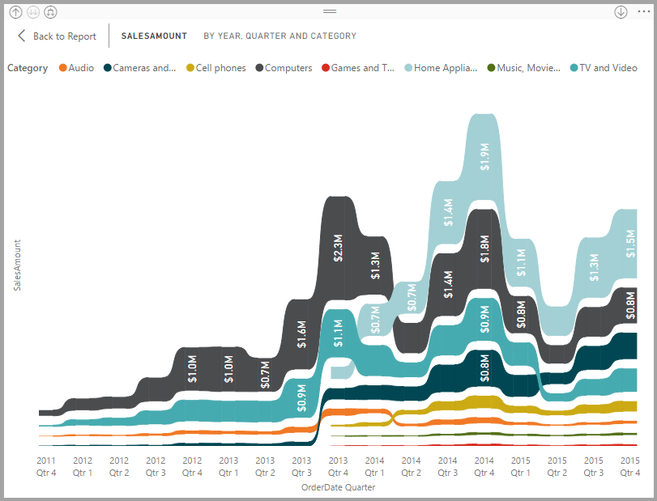

# Use ribbon charts in Power BI
You can use ribbon charts in **Power BI** to visualize data, and quickly determine which category of data has the highest rank (largest value). Ribbon charts are effective at showing rank change, with the highest range (value) always displayed on top for each time period. Ribbon charts are available in **Power BI Desktop** starting with the September 2017 release and in subsequent updates to the **Power BI service**.

## Create a ribbon chart
To create a ribbon chart, select **Ribbon chart** from the **Visualizations** panel.

Ribbon charts connect a category of data over the visualized time continuum using ribbons, thereby enabling you to see how a given category ranks throughout the span of the chart's x-axis (usually the timeline).

## Format a ribbon chart
When you create a ribbon chart, you have formatting options available in the **Format** section of the **Visualizations** pane. The formatting options for ribbon charts are similar to those for a stacked column chart, with additional formatting options that are specific to the ribbons.

These formatting options for ribbon charts let you adjust the following:

* **Spacing** lets you adjust how much space appears between ribbons. The number is the percentage of the column's maximum height.
* **Match series color** allows you to match the color of the ribbons with the series color. When off, ribbons are gray.
* **Transparency** specifies how transparent the ribbons are, with the default set to 30.
* **Border** lets you place a dark border on the top and bottom of the ribbons. By default, borders are off.

## Next steps
For more information about **Power BI Desktop**, and how to get started, check out the following articles.

* [What is Power BI Desktop?](desktop-what-is-desktop.md)
* [Query Overview with Power BI Desktop](desktop-query-overview.md)
* [Data Sources in Power BI Desktop](desktop-data-sources.md)
* [Connect to Data in Power BI Desktop](desktop-connect-to-data.md)
* [Shape and Combine Data with Power BI Desktop](desktop-shape-and-combine-data.md)
* [Common Query Tasks in Power BI Desktop](desktop-common-query-tasks.md)   

