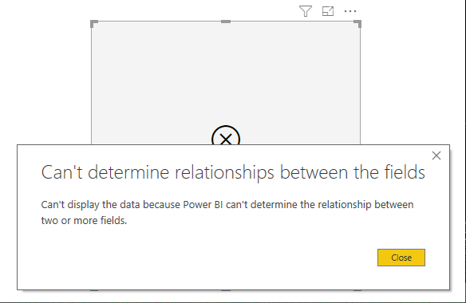
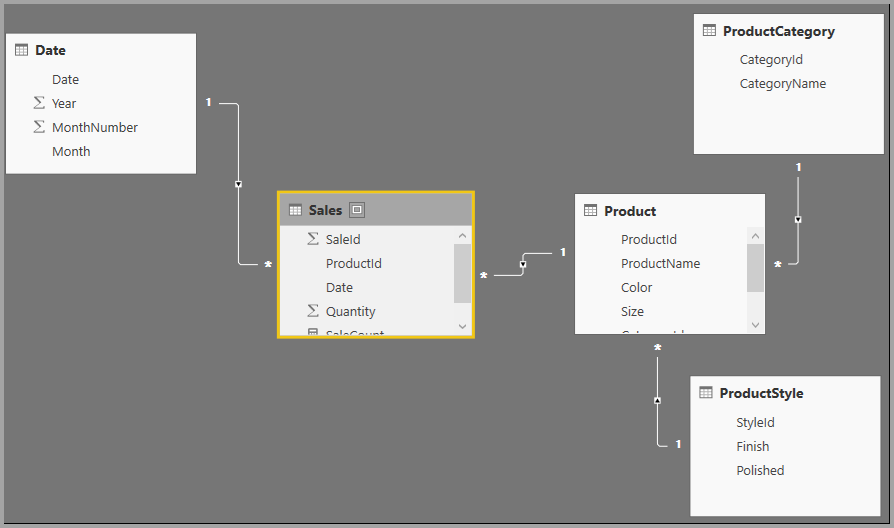

# Show items with no data in Power BI

Power BI lets you visualize all sorts of data from various sources. When creating a visual, Power BI only shows relevant data when creating a visual in order to properly manage how data is presented and displayed. Power BI determines which data is relevant based on the configuration of the visual, and the underlying data model. This article describes how Power BI behaves when determining relevant data, with examples that illustrate how determinations are made.

## Determining relevant data

To get started understanding how Power BI determines which data is relevant to display, let's consider a table as a simple example. Using the model represented in the samples section, found at the end of this article, consider building a table with the following settings:

**1. Groups from the same table:** *Product[Color] - Product[Size]*

|*Product[Color]*  |*Product[Size]*  |
|---------|---------|
|Blue     |Large         |
|Blue     |Medium         |
|Blue     |Small         |
|Red     |Large         |

In this example, Power BI displays the combinations of *[Color-Size]* that exist in the table *[Product]*. 

Now let's look at a different combination:

**2. Groups from different but directly related tables and a measure:** *ProductStyle[Finish] - Product[Color] - Sum(Sales[Quantity])*

|*ProductStyle[Finish]*  |*Product[Color]*  |*[SumQuantity]*  |
|---------|---------|---------|
|Gloss     |Blue         |10         |
|Matte     |Blue         |15         |

In this example, Power BI displays only combinations that exist. For example, it will not display ("None" + "Blue") or ("Matte" + "Red") because those combinations do not exist in the model. The condition that determines which combinations exist is the value for *Sum(Sales[Quantity])* not being blank.

Let's look at a different case: 

**3. Groups from different but related tables and no measure:** *ProductStyle[Finish] - Product[Color]*

|*ProductStyle[Finish]*  |*Product[Color]*  |
|---------|---------|
|Gloss     |Blue         |
|Gloss     |Red         |
|Matte     |Blue         |

Since there is no explicit measure and the two tables are directly related, Power BI attempts to inject a measure to constrain the combinations that result. In this case, Power BI injects a *CALCULATE(COUNTROWS('Product'))* measure, which should not be blank, since *Product* is the table that is common to both tables.

As such, Power BI displays the combinations that do have entries in the Product table, which excludes the combinations of *("None" + "Blue")* and *("Matte" + "Red")*.

**4. Groups from different and unrelated tables**

The sample model doesn't have this combination, but if there were groups from different and unrelated tables, Power BI would not be able to relate two columns, and the result would be a crossjoin of all the values of each column. In that situation, Power BI issues an error of type *unconstrained join*, because such cross joins are expensive to compute in the database, and do not provide very much information to a user. 

## Showing items with no data

The previous section described how Power BI determines which data is relevant to display. But there may be times when you *want* to show items with no data. 

The **Show items with no data** feature enables you to do exactly that - include data rows and columns that don't contain measure data (blank measure values).

To enable the **Show items with no data** feature select a visual, then in the **Fields** well, right-click the field and select **Show items with no data** from the menu that appears, as shown in the following image.

The **Show items with no data** feature does *not* have effect in the following circumstances:

* There's no measure added to the visual, and the grouping columns come from the same table
* Groups are unrelated; Power BI doesn't run queries for visuals that have unrelated groups
* The measure is unrelated to any of the groups; this is because the measure will never be blank for only some group combinations
* There's a user-defined measure filter that excludes blank measures - for example: *SalesAmount > 0*

### How Show items with no data works

The most interesting use cases of **Show items with no data** are when measures are present. Let's look at the situation when the groups are from the same table, or can be related through a path in the model. For example, *ProductStyle* is directly related to *Product* and indirectly related to *Sales*, *ProductStyle* and *ProductCategory* can be related through the *Product* table, and so on.

Let's look at a couple interesting cases, and compare when **Show items with no data** is off and then on. 

**1. Grouping columns from the same table:** *Product[Color] - Product[Size] - Sum(Sales[Quantity])*

How it appears with **Show items with no data** feature off:

|*Product[Color]*  |*Product[Size]*  |*[SumQuantity]*  |
|---------|---------|---------|
|Blue     |Medium         |15         |
|Blue     |Small         |10         |

How it appears with **Show items with no data** feature on:

|*Product[Color]*  |*Product[Size]*  |*[SumQuantity]*  |
|---------|---------|---------|
|Blue     |Large         |         |
|Blue     |Medium         |15         |
|Blue     |Small         |10         |
|Red     |Large         |         |

Notice how two new combinations showed up with the feature turned on: *Blue - Large* and *Red - Large*. Both of those entries have no corresponding *Quantity* in the *Sales* table. However, they show up in the *Product* table.

**2. Grouping columns from related tables:** *ProductStyle[Finish] - Product[Color] - Sum(Sales[Quantity])*

How it appears with **Show items with no data** feature off:

|*ProductStyle[Finish]*  |*Product[Color]*  |*[SumQuantity]*  |
|---------|---------|---------|
|Gloss     |Blue         |10         |
|Matte     |Blue         |15         |

How it appears with **Show items with no data** feature on:

|*ProductStyle[Finish]*  |*Product[Color]*  |*[SumQuantity]*  |
|---------|---------|---------|
|Gloss     |Blue         |10         |
|Gloss     |Red         |         |
|Matte     |Blue         |15         |
|None     |         |         |

Notice how *(Gloss-Red)* and *(None, blank)* appeared as combinations. Here is the reason they appeared:
* Power BI first considered ProductStyle[Finish] and selected all the values to display - this resulted in Gloss, Matte, None.
* Using each of these values, Power BI selected all the corresponding *Product[Color]* entries 
* Since *None* does not correspond to any *Product[Color]*, a blank appears for that value

It's important to note that the mechanism of selecting values for the columns is order-dependent, and can be thought of as a *Left outer join* operation between tables. If the order of the columns is changed, the results will change as well.

Let's take a look at an example of changing the order, and how it impacts results. This is the same as item **2** in this section, with the ordering changed.

**Product[Color] - ProductStyle[Finish] - Sum(Sales[Quantity])**

How it appears with **Show items with no data** feature on:

|*Product[Color]* |*ProductStyle[Finish]*  |*[SumQuantity]*  |
|---------|---------|---------|
|Blue     |Gloss         |10         |
|Blue     |Matte         |15         |
|Red     |Gloss         |         |

In this case, notice how *ProductStyle[Finish]=None* does not appear in the table. This is because, in this case, Power BI first selected all the *Color* values in the *Product* table. Then for each color, Power BI selected the corresponding *Finish* values that contained data. Since *None* does not show up in any combination of *Color*, it is not selected.

## Example data model

This section shows the sample data model used in the examples in this article.

**Model**:

**Data**:

|Product[ProductId]|	Product[ProductName]|	Product[Color]|	Product[Size]|	Product[CategoryId]|	Product[StyleId]|
|---------|---------|---------|---------|---------|---------|
|1	|Prod1	|Blue	|Small	|1	|1 |
|2	|Prod2	|Blue	|Medium	|2	|2 |
|3	|Prod3	|Red	|Large	|1	|1 |
|4	|Prod4	|Blue	|Large	|2	|2 |

|ProductCategory[CategoryId]|	ProductCategory[CategoryName]|
|---------|---------|
|1	|Phone   |
|2	|Camera |
|3	|TV |

|ProductStyle[StyleId]|	ProductStyle[Finish]|	ProductStyle[Polished]|
|---------|---------|---------|
|1	|Gloss	|Yes |
|2	|Matte	|No |
|3	|None	|No |

|Sales[SaleId]|	Sales[ProductId]|	Sales[Date]|	Sales[Quantity]|
|---------|---------|---------|---------|
|1	|1	|1/1/2012 0:00|	10 |
|2	|2	|1/1/2013 0:00|	15 |

## Next steps

This article described how you can enable the **Show items with no data** feature in Power BI. You might also be interested in the following articles. 

* [Data sources in Power BI Desktop](desktop-data-sources.md)
