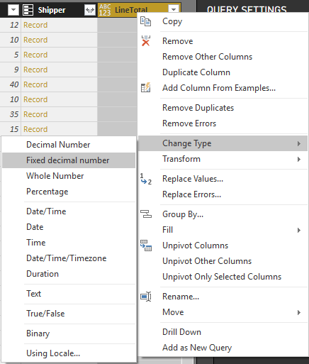
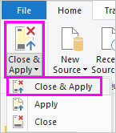
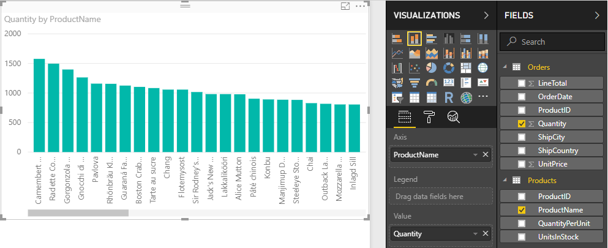
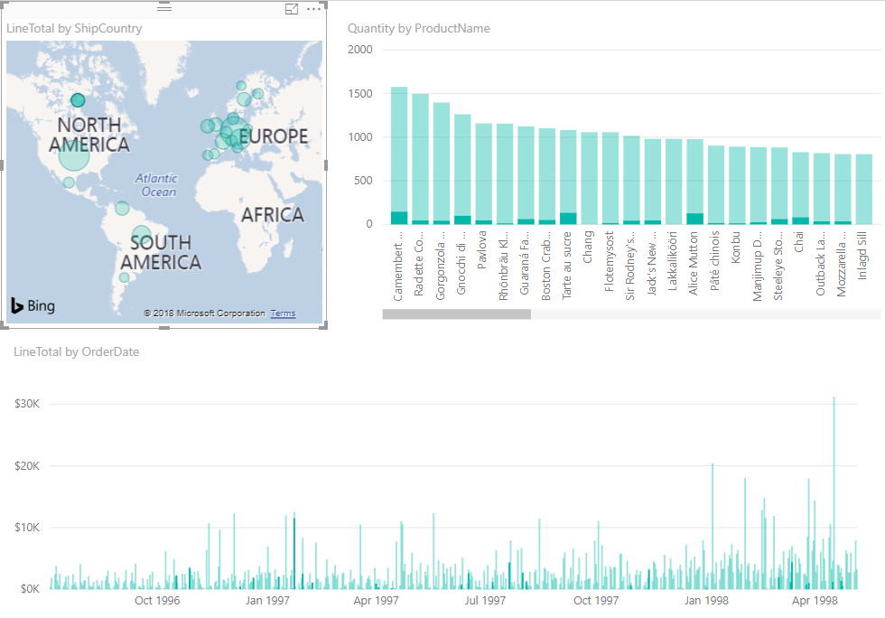

# Tutorial: Combine sales data from Excel and an OData feed

It's common to have data in multiple data sources. For example, you could have two databases, one for product information, and another for sales information. With **Power BI Desktop**, you can combine data from different sources to create interesting, compelling data analyses and visualizations. 

In this tutorial, you combine data from two data sources: 

1. An Excel workbook with product information
2. An OData feed containing orders data

You're going to import each dataset and do transformation and aggregation operations. Then, you'll use the two source's data to produce a sales analysis report with interactive visualizations. Later, you can apply these techniques to SQL Server queries, CSV files, and other data sources in Power BI Desktop.

>[!NOTE]
>In Power BI Desktop, there are often a few ways to accomplish a task. For example, you can right-click or use a **More options** menu on a column or cell to see additional ribbon selections. Several alternate methods are described in the steps below. 

## Import Excel product data

First, import the Products.xlsx Excel workbook's product data into Power BI Desktop.

1. [Download the Products.xlsx Excel workbook](http://download.microsoft.com/download/1/4/E/14EDED28-6C58-4055-A65C-23B4DA81C4DE/Products.xlsx) and save it as **Products.xlsx**.
   
2. Select the dropdown arrow next to **Get Data** in the Power BI Desktop ribbon's **Home** tab, and then, select **Excel** from the **Most Common** dropdown. 
   
   
   
   >[!NOTE]
   >You can also select the **Get Data** item itself, or select **Get Data** from the Power BI **Get started** dialog, then select **Excel** or **File** > **Excel** in the **Get Data** dialog box, and then select **Connect**.
   
3. In the **Open** dialog box, navigate to and select the **Products.xlsx** file, and then select **Open**.
   
4. In the **Navigator** pane, select the **Products** table and then select **Edit**.
   
   
   
A table preview opens in the **Power Query Editor**, where you can apply transformations to clean up the data.
   

   
>[!NOTE]
>You can also open the **Power Query Editor** by selecting **Edit Queries** > **Edit Queries** from the **Home** ribbon in Power BI Desktop, or by right-clicking or choosing **More options** next to any query in **Report View**, and selecting **Edit Query**.

## Clean up the products columns

Your combined report will use the Excel workbook's  **ProductID**, **ProductName**, **QuantityPerUnit**, and **UnitsInStock** columns. You can remove the other columns. 

1. In **Power Query Editor**, select the **ProductID**, **ProductName**, **QuantityPerUnit**, and **UnitsInStock** columns. You can use **Ctrl**+**Click** to select more than one column, or **Shift**+**Click** to select columns next to each other.
   
2. Right-click any of the selected headers. Select **Remove Other Columns** from the dropdown. 
   You can also select **Remove Columns** > **Remove Other Columns** from the **Manage Columns** group in the **Home** ribbon tab. 
   
   

## Import the OData feed's order data

Next, import the order data from the sample Northwind sales system OData feed. 

1. In **Power Query Editor**, select **New Source** and then, from the **Most Common** dropdown, select **OData feed**. 
   
   
   
2. In the **OData feed** dialog box, paste the Northwind OData feed URL, `http://services.odata.org/V3/Northwind/Northwind.svc/`. Select **OK**.
   
   
   
3. In the **Navigator** pane, select the **Orders** table, and then select **OK** to load the data into **Power Query Editor**.
   
   
   
   >[!NOTE]
   >In **Navigator**, you can select any table name, without selecting the checkbox, to see a preview.

## Expand the order data

You can use table references to build queries when connecting to data sources with multiple tables, such as relational databases or the Northwind OData feed. The **Orders** table contains references to several related tables. You can use the **Expand** operation to add the **ProductID**, **UnitPrice**, and **Quantity** columns from the related **Order_Details** table into the subject (**Orders**) table. 

1. Scroll to the right in the **Orders** table until you see the **Order_Details** column. It contains references to another table and not data.
   
   
   
2. Select the **Expand** icon () in the **Order_Details** column header. 
   
3. In the **Expand** drop-down:
   
   1. Select **(Select All Columns)** to clear all columns.
      
   2. Select **ProductID**, **UnitPrice**, and **Quantity**, and then select **OK**.
      
      

After you expand the **Order_Details** table, three new nested table columns replace the **Order_Details** column. There are new rows in the table for each order's added data. 

## Create a custom calculated column

Power Query Editor lets you create calculations and custom fields to enrich your data. You'll create a custom column that multiplies the unit price by item quantity to calculate the total price for each order's line item.

1. In the Power Query Editor's **Add Column** ribbon tab, select **Custom Column**.
   
   
   
2. In the **Custom Column** dialog box, type **LineTotal** in the **New column name** field.

3. In the **Custom column formula** field after the **=, enter **[Order_Details.UnitPrice]** \* **[Order_Details.Quantity]**. (You can also select the field names from the **Available columns** scroll box and select **<< Insert**, instead of typing them.) 

4. Select **OK**.
   
   

   The new **LineTotal** field appears as the last column in the **Orders** table.

## Set the new field's data type

When Power Query Editor connects to data, it makes a best guess as to each field's data type for display purposes. A header icon indicates each field's assigned data type. You can also look under **Data Type** in the **Home** ribbon tab's **Transform** group. 

Your new **LineTotal** column has an **Any** data type, but it has currency values. To assign a data type, right-click the **LineTotal** column header, select **Change Type** from the dropdown, and then select **Fixed decimal number**. 

>[!NOTE]
>You can also select the **LineTotal** column, then select the dropdown arrow next to **Data Type** in the **Transform** area of the **Home** ribbon tab, and then select **Fixed decimal number**.

## Clean up the orders columns

To make your model easier to work with in reports, you can delete, rename, and reorder some columns.

Your report is going to use the following columns:

* **OrderDate**
* **ShipCity**
* **ShipCountry**
* **Order_Details.ProductID**
* **Order_Details.UnitPrice**
* **Order_Details.Quantity**
* **LineTotal**

Select these columns and use **Remove Other Columns** as you did with the Excel data. Or, you can select the non-listed columns, right-click on one of them, and select **Remove Columns**. 

You can rename the columns prefixed with "**Order_Details.**" to make them easier to read:

1. Double-click or tap and hold each column header, or right-click the column header, and select **Rename** from the dropdown. 

2. Delete the **Order_Details.** prefix from each name, and then press **Enter**.

Finally, to make the **LineTotal** column easier to access, drag and drop it to the left, just to the right of the **ShipCountry** column.

## Review the query steps

Your Power Query Editor actions to shape and transform data are recorded. Each action appears on the right in the **Query Settings** pane under **Applied Steps**. You can step back through the **Applied Steps** to review your steps, and edit, delete, or rearrange them if necessary. However, changing preceding steps is risky as that can break later steps.

Select each of your queries in the **Queries** list on the left side of Power Query Editor, and review the **Applied Steps** in **Query Settings**. After applying the previous data transformations, the **Applied Steps** for your two queries should look like this:

 &nbsp;&nbsp; 

>[!TIP]
>Underlying the Applied Steps are formulas written in the **Power Query Language**, also known as the [**M** language](https://docs.microsoft.com/powerquery-m/power-query-m-reference). To see and edit the formulas, select **Advanced Editor** in the **Query** group of the Home tab of the ribbon. 

## Import the transformed queries

When you're satisfied with your transformed data and ready to import it  into Power BI Desktop Report View, select **Close & Apply** > **Close & Apply** in the **Home** ribbon tab's **Close** group. 

Once the data is loaded, the queries appear in the **Fields** list in the Power BI Desktop Report View.

## Manage the relationship between the datasets

Power BI Desktop doesn't require you to combine queries to report on them. However, you can use the relationships between datasets, based on common fields, to extend, and enrich your reports. Power BI Desktop may detect relationships automatically, or you can create them in the Power BI Desktop **Manage Relationships** dialog. For more information, see [Create and manage relationships in Power BI Desktop](desktop-create-and-manage-relationships.md).

The shared **ProductID** field creates a relationship between this tutorial's Orders and Products datasets. 

1. In Power BI Desktop Report View, select **Manage Relationships** in the **Home** ribbon tab's **Relationships** area.
   
   
   
2. In the **Manage relationships** dialog, you can see that Power BI Desktop has already detected and listed an active relationship between the Products and Orders tables. To view the relationship, select **Edit**. 
   
   
   
   The **Edit Relationship** dialog opens, showing details about the relationship.  
   
   
   
3. Power BI Desktop has autodetected the relationship correctly, so you can select **Cancel** and then **Close**.

In Power BI Desktop, on the left side, select **Model** to view and manage   query relationships. Double-click the arrow on the line connecting the two queries to open the **Edit relationship** dialog and view or change the relationship. 

To get back to Report View from Relationships View, select the **Report** icon. 

## Create visualizations using your data

You can create different visualizations in Power BI Desktop Review View to gain data insights. Reports can have multiple pages, and each page can have multiple visuals. You and others can interact with your visualizations to help analyze and understand data. For more information, see [Interact with a report in Editing view in Power BI service](service-interact-with-a-report-in-editing-view.md).

You can use both of your data sets, and the relationship between them, to help visualize and analyze your sales data. 

First, create a stacked column chart that uses fields from both queries to show the quantity of each product ordered. 

1. Select the **Quantity** field from **Orders** in the **Fields** pane at the right, or drag it onto a blank space on the canvas. A stacked column chart is created showing the total quantity of all products ordered. 
   
2. To show the quantity of each product ordered, select **ProductName** from **Products** in the **Fields** pane, or drag it onto the chart. 
   
3. To sort the products by most to least ordered, select the **More options** ellipsis (**...**) at the visualization's upper right , and then select **Sort By Quantity**.
   
4. Use the handles at the corners of the chart to enlarge it so more product names are visible. 
   
   

Next, create a chart showing order dollar amounts (**LineTotal**) over time (**OrderDate**). 

1. With nothing selected on the canvas, select **LineTotal** from **Orders** in the **Fields** pane, or drag it to a blank space on the canvas. The stacked column chart shows the total dollar amount of all orders. 
   
2. Select the stacked chart, then select **OrderDate** from **Orders**, or drag it onto the chart. The chart now shows line totals for each order date. 
   
3. Drag the corners to resize the visualization and see more data. 
   
   
   
   >[!TIP]
   >If you only see Years on the chart (only three data points), drop down the arrow next to **OrderDate** in the **Axis** field of the **Visualizations** pane, and select **OrderDate** instead of **Date Hierarchy**. 

Finally, create a map visualization showing order amounts from each country. 

1. With nothing selected on the canvas, select **ShipCountry** from **Orders** in the **Fields** pane, or drag it to a blank space on the canvas. Power BI Desktop detects that the data is country names. It then automatically creates a map visualization, with a data point for each country with orders. 
   
2. To make the data point sizes reflect each country's order amounts, drag the **LineTotal** field onto the map. You can also drag it to **Drag data fields here** under **Size** in the **Visualizations** pane. The sizes of the circles on the map now reflect the dollar amounts of the orders from each country. 
   
   

## Interact with your report visuals to analyze further

In Power BI Desktop, you can interact with visuals that cross-highlight and filter each other to uncover further trends. For more information, see [Filtering and Highlighting in Power BI Reports](power-bi-reports-filters-and-highlighting.md). 

Because of the relationship between your queries, interactions with one visualization affect all the other visualizations on the page. 

On the map visualization, select the circle centered in **Canada**. The other two visualizations filter to highlight the Canadian line totals and order quantities.

Select a **Quantity by ProductName** chart product to see the map and the date chart filter to reflect that product's data. Select a **LineTotal by OrderDate** chart date to see the map and the product chart filter to show that date's data. 
>[!TIP]
>To deselect a selection, select it again, or select one of the other visualizations. 

## Complete the sales analysis report

Your completed report combines data from the Products.xlsx Excel file and the Northwind OData feed in visuals that help you analyze different countries' order information, timeframes, and products. When your report is ready, you can [upload it to Power BI service](desktop-upload-desktop-files.md) to share it with other Power BI users.

## Next steps
* [Read other Power BI Desktop tutorials](http://go.microsoft.com/fwlink/?LinkID=521937)
* [Watch Power BI Desktop videos](http://go.microsoft.com/fwlink/?LinkID=519322)
* [Visit the Power BI Forum](http://go.microsoft.com/fwlink/?LinkID=519326)
* [Read the Power BI Blog](http://go.microsoft.com/fwlink/?LinkID=519327)
