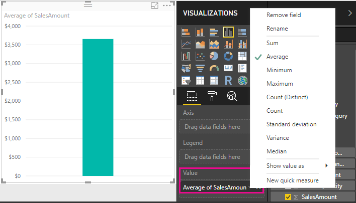
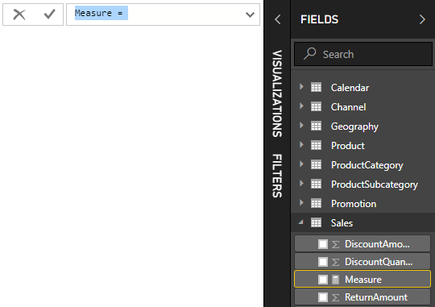
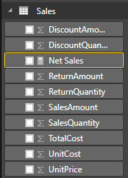
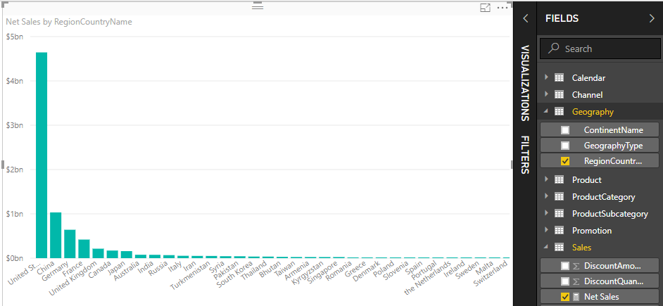
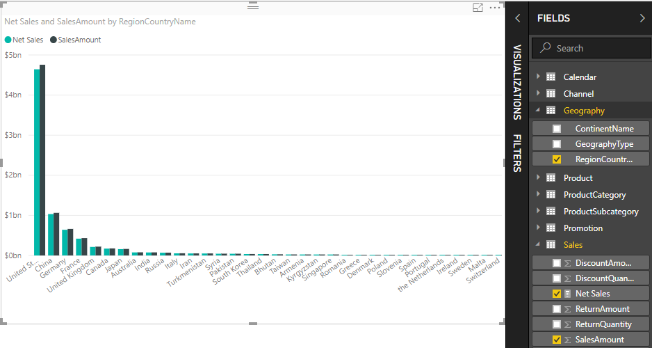
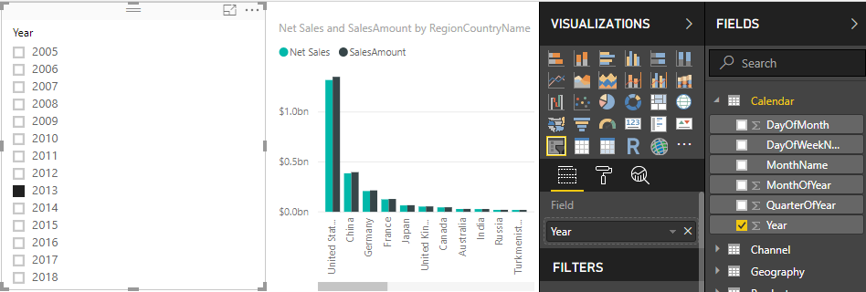
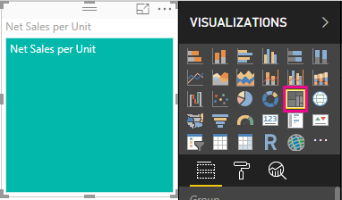
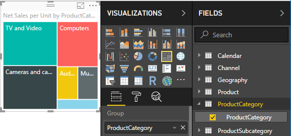

# Tutorial: Create your own measures in Power BI Desktop
You can create some of the most powerful data analysis solutions in Power BI Desktop by using measures. Measures help you by performing calculations on your data as you interact with your reports. This tutorial will guide you through understanding measures and creating your own basic measures in Power BI Desktop.

### Prerequisites
- This tutorial is intended for Power BI users already familiar with using Power BI Desktop to create more advanced models. You should already be familiar with using Get Data and Query Editor to import data, working with multiple related tables, and adding fields to the Report Canvas. If you’re new to Power BI Desktop, be sure to check out [Getting Started with Power BI Desktop](desktop-getting-started.md).
  
- Download the [Contoso Sales Sample for Power BI Desktop](http://download.microsoft.com/download/4/6/A/46AB5E74-50F6-4761-8EDB-5AE077FD603C/Contoso%20Sales%20Sample%20for%20Power%20BI%20Desktop.zip) file, which includes online sales data from the fictitious company Contoso, Inc. This data was imported from a database, so you won’t be able to connect to the datasource or view it in Query Editor. Extract the file on your own computer, and then open it in Power BI Desktop.

## Understand measures

Measures are most often created for you automatically. In the Contoso Sales Sample file, select the checkbox next to the **SalesAmount** field in the **Sales** table in the Fields well, or drag **SalesAmount** onto the report canvas. A new column chart visualization appears, showing the sum total of all values in the SalesAmount column of the Sales table.

Any field that appears in the Fields well with a sigma icon  is numeric, and its values can be aggregated. Rather than showing a table with all two million rows of SalesAmount values, Power BI Desktop detected a numeric datatype and automatically created and calculated a measure to aggregate the data. Sum is the default aggregation for a numeric datatype, but you can easily apply different aggregations like average or count. Understanding aggregations is fundamental to understanding measures, because every measure performs some type of aggregation. 

To change the chart aggregation to average, in the **Value** area of the Visualizations pane, click the down arrow next to **SalesAmount** and select **Average**. The visualization changes to an average of all sales values in the SalesAmount field.

You can change the type of aggregation depending on the result you want, but not all types of aggregation apply to every numeric datatype. For example, for the SalesAmount field, Sum and Average make sense. Minimum and Maximum have their place as well. But Count won’t really make much sense for the SalesAmount field, because while its values are numeric, they’re really currency.

Values calculated from measures change in response to your interactions with your report. For example, dragging the **RegionCountryName** field from the **Geography** table to your chart shows the average sales amounts for each country.

When the result of a measure changes because of an interaction with your report, you have affected your measure’s *context*. Every time you interact with your report visualizations, you are changing the context in which a measure calculates and displays its results.

## Create and use your own measures

In most cases, Power BI automatically calculates and returns values according to the types of fields and aggregations you choose, but in some cases you might want to create your own measures to perform more complex, unique calculations. With Power BI Desktop, you can create your own measures with the Data Analysis Expressions (DAX) formula language. 

DAX formulas use many of the same functions, operators, and syntax as Excel formulas. However, DAX functions are designed to work with relational data and perform more dynamic calculations as you interact with your reports. There are over 200 DAX functions that do everything from simple aggregations like sum and average to more complex statistical and filtering functions. There are many resources to help you learn more about DAX. After you've finished this tutorial, be sure to see [DAX basics in Power BI Desktop](desktop-quickstart-learn-dax-basics.md).

When you create your own measure, it's added to the Fields list for the table you select and is called a *model* measure. Some advantages of model measures are that you can name them whatever you want, making them more identifiable; you can use them as arguments in other DAX expressions; and you can make them perform complex calculations very quickly.

>[!TIP]
>Starting with the February 2018 release of Power BI Desktop, many common calculations are available as **quick measures**, which write the DAX formulas for you based on your inputs to a dialog box. These quick, powerful calculations are also great for learning DAX or seeding your own customized measures. To create or explore quick measures, select **New quick measure** in a table's **More options** list or under **Calculations** in the Home tab of the ribbon. See [Use quick measures](desktop-quick-measures.md) for more about creating and using quick measures.

### Create a measure

You want to analyze your net sales by subtracting discounts and returns from total sales amounts. For whatever context exists in your visualization, you need a measure that subtracts the sum of DiscountAmount and ReturnAmount from the sum of SalesAmount. There's no field for Net Sales in the Fields list, but you have the building blocks to create your own measure to calculate net sales. 

1.  Right-click the **Sales** table in the Fields well, or hover over the table and select the **More options** **More options** (...), and then select **New Measure**. This will save your new measure in the Sales table, where it will be easier to find.
    
    
    
    You can also create a new measure by selecting **New Measure** in the Calculations group on the Home tab of the Power BI Desktop ribbon.
    
    
    
    >[!TIP]
    >When you create a measure from the ribbon, it could be created in any of the tables, but it will be easier to find if you create it where you plan to use it. In this case, select the Sales table first to make it active, and then select **New Measure**. 
    
    The formula bar appears along the top of the Report canvas, where you can rename your measure and enter a DAX formula.
    
    
    
2.  By default, a new measure is simply named Measure. If you don’t rename it, additional new measures will be named Measure 2, Measure 3, and so on. You want your measures to be more identifiable, so highlight **Measure** in the formula bar, and then type **Net Sales**.
    
3.  Now you can begin entering your formula. After the equals sign, start to type **Sum**. As you type, a drop-down suggestion list appears, showing all the DAX functions beginning with the letters you type. Scroll down if necessary to select **SUM** from the list, and then press Enter.
    
    
    
    An opening parenthesis appears, along with another drop-down suggestion list of all of the available columns you can pass to the SUM function.
    
    
    
    Expressions always appear between opening and closing parentheses. Your expression will contain a single argument to pass to the SUM function: the SalesAmount column. Begin typing "SalesAmount" until only one value is left in the list: Sales(SalesAmount). The column name preceded by the table name is called the *fully-qualified name* of the column. Fully-qualified column names make your formulas easier to read. 
    
    
    
4. Select **Sales[SalesAmount]**, and then type a closing parenthesis.
    
    > [!TIP]
    > Syntax errors are most often caused by a missing or misplaced closing parenthesis.
    
    
    
5.  To subtract the other two columns:
    1. After the closing parenthesis for the first expression, type a space, a minus operator (**-**), and another space. 
    2. Enter another SUM function, and start typing "DiscountAmount" until you can choose the **Sales[DiscountAmount]** column as the argument. Add a closing parenthesis. 
    3. Type a space, another minus operator, space, another SUM function with **Sales[ReturnAmount]** as the argument, and a closing parenthesis.
    
    
    
6.  Press Enter or click the checkmark in the formula bar to complete and validate the formula. The validated measure is now ready to use in the Field list for the Sales table. 
    
    
    
If you run out of room for entering a formula or want it to be on separate lines, select the down chevron on the right side of the formula bar to open up more space.

You can separate parts of your formula on different lines by pressing **Alt-Enter**, or move things over by using **Tab**.

### Use your measure in the report
Now you can add your Net Sales measure to the report canvas, and calculate net sales for whatever other fields you add to the report. To look at net sales by country:

1. Select the **Net Sales** measure from the **Sales** table, or drag it onto the report canvas.
    
2. Select the **RegionCountryName** field from the **Geography** table, or drag it into the chart.
    
    
    
To see the difference between net sales and total sales by country, select the **SalesAmount** field or drag it into the chart. 

The chart now uses two measures: SalesAmount, which was summed automatically, and the Net Sales measure you created. Each measure was calculated in the context of another field, RegionCountryName.
    
### Use your measure with a slicer

You can add a slicer to further filter net sales and sales amounts by calendar year.
    
1.  Click a blank area next to the chart, then in **Visualizations**, select the **Table** visualization. This creates a blank table visualization on the report canvas.
    
    
    
2.  Drag the **Year** field from the **Calendar** table into the new blank table visualization. Because Year is a numeric field, Power BI Desktop sums up its values, but that doesn’t make much sense as an aggregation. 
    
    
    
3.  In **Values** in the Visualizations pane, select the down arrow next to **Year**, and then select **Don't summarize**. The table now lists individual years.
    
    
    
4.  Select the **Slicer** icon in the Visualizations pane to convert the table into a slicer.

    
    
5.  Select any value in the **Year** slicer to filter the **Net Sales and Sales Amount by Country** chart accordingly. The Net Sales and SalesAmount measures recalculate and display results in the context of the selected Year field. 
    
    

### Use your measure in another measure

You want to find out which products have the highest net sales amount per unit sold, so you need a measure that divides net sales by the quantity of units sold. You can create a new measure that divides the result of your Net Sales measure by the sum of Sales[SalesQuantity].

1.  Create a new measure named **Net Sales per Unit** in the Sales table.
    
2.  In the formula bar, begin typing **Net Sales**. The suggestion list will show what you can add. Select **[Net Sales]**.
    
    
    
    You can also reference measures by just typing an opening bracket (**[**). The suggestion list will show only measures to add to your formula.
    
    
    
3.  Enter a space, a divide operator (**/**), another space, a SUM function, and then type **Quantity**. The suggestion list shows all the columns with Quantity in the name. Select **Sales[SalesQuantity]**, type the closing parenthesis, and press ENTER or select the checkmark to validate your formula. The formula should look like this:
    
    `Net Sales per Unit = [Net Sales] / SUM(Sales[SalesQuantity])`
    
4. Select the **Net Sales per Unit** measure from the Sales table, or drag it onto a blank area in the report canvas. The chart shows the net sales amount per unit over all products sold, which is not very informative. 
    
    
    
5. For a different look, change the chart visualization type to **Treemap**.
    
    
    
6. Select the **Product Category** field, or drag it into the treemap or into the Group field of the Visualizations pane. Now you have some good info!
    
    
    
7. Try removing the **ProductCategory** field, and dragging the **ProductName** field into the chart instead. 
    
    
    
Ok, now we're just playing, but you have to admit that's cool! Experiment with other ways to filter and format the visualization.

## What you've learned
Measures give you a lot of power to get the insights you want from your data. You've learned how to create measures by using the formula bar, name them whatever makes most sense, and find and select the right formula elements by using the DAX suggestion lists. You've also been introduced to context, where the results of calculations in measures change according to other fields or other expressions in your formula.

## Next steps
- To learn more about Power BI Desktop quick measures, which provide many common measure calculations for you, see [Use quick measures to easily perform common and powerful calculations](desktop-quick-measures.md).
  
- If you want to take a deeper dive into DAX formulas and create some more advanced measures, see [DAX basics in Power BI Desktop](desktop-quickstart-learn-dax-basics.md). This article focuses on fundamental concepts in DAX, such as syntax, functions, and a more thorough understanding of context.
  
- Be sure to add the [Data Analysis Expressions (DAX) Reference](https://msdn.microsoft.com/library/gg413422.aspx) to your favorites. This is where you'll find detailed info on DAX syntax, operators, and the over 200 DAX functions.

