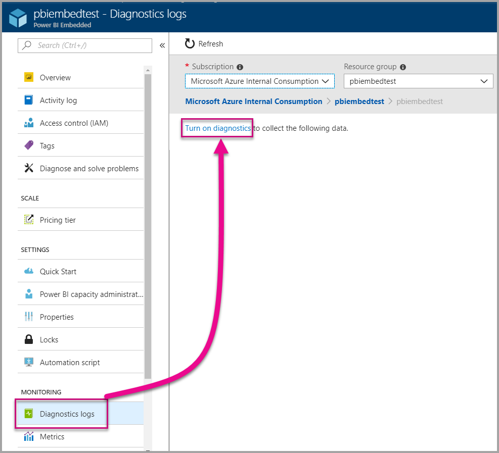
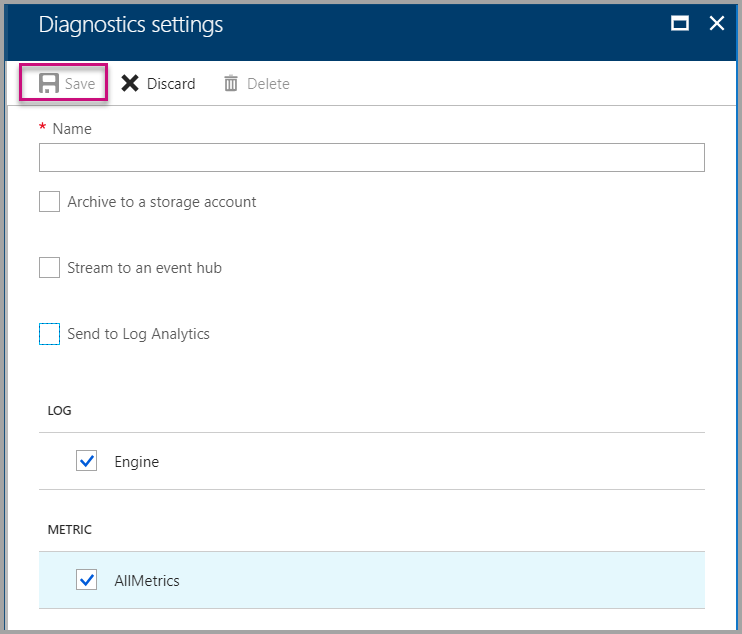
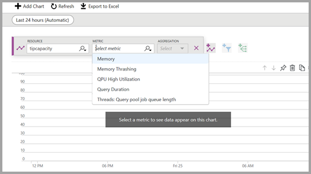

# Diagnostic logging for Power BI Embedded in Azure

With [Azure resource diagnostic logs](https://docs.microsoft.com/azure/monitoring-and-diagnostics/monitoring-overview-of-diagnostic-logs), you can log many events from your capacity, pour them into an analytics tool and get insights into the behavior of your resource. With [Azure resource diagnostic logs](https://docs.microsoft.com/azure/monitoring-and-diagnostics/monitoring-overview-of-diagnostic-logs), you can monitor and send logs to [Azure Storage](https://azure.microsoft.com/services/storage/), stream them to [Azure Event Hubs](https://azure.microsoft.com/services/event-hubs/), and export them to [Log Analytics](https://azure.microsoft.com/services/log-analytics/), a service of [Azure](https://www.microsoft.com/cloud-platform/operations-management-suite).

Using Diagnostics can answer a few scenarios, such as:

* Detection of long-running or problematic queries.
* Detecting errors when reaching the limit of your capacity.
* Derivation of [capacity metrics](https://powerbi.microsoft.com/en-us/blog/power-bi-developer-community-april-update/).
* Tracking usage of specific datasets.

## Setup diagnostics logging

### Azure portal

1. In [Azure portal](https://portal.azure.com) > Power BI embedded > dedicated capacity, click **Diagnostic logs** in the left navigation, and then click **Turn on diagnostics**.

    

2. In **Diagnostic settings**, specify the following options:

    * **Name** - Enter a name for the diagnostics setting to create.

    * **Archive to a storage account** - To use this option, you need to connect to an existing storage account. See [Create a storage account](https://docs.microsoft.com/azure/storage/common/storage-create-storage-account). Follow the instructions to create a Resource Manager, general-purpose account, then select your storage account by returning to this page in the portal. It may take a few minutes for newly created storage accounts to appear in the drop-down menu. Log file storage is in JSON format.
    * **Stream to an event hub** - To use this option, you need to connect to an existing Event Hub namespace and event hub. To learn more, see [Create an Event Hubs namespace and an event hub using the Azure portal](https://docs.microsoft.com/azure/event-hubs/event-hubs-create).
    * **Send to Log Analytics** - To use this option, either use an existing workspace or create a new Log Analytics workspace by following the steps to [create a new workspace](https://docs.microsoft.com/en-us/azure/log-analytics/log-analytics-quick-collect-azurevm#create-a-workspace) in the portal. This leverages the particularly useful [Azure Log Analytics](Azure Log Analytics), which provides built-in analysis, dashboarding and notification capabilities. You can use Log Analytics to connect more data from other resources and get a single and complete view of data across all your application’s resources. It can also be connected to [Power BI with a single click](https://docs.microsoft.com/en-us/azure/log-analytics/log-analytics-powerbi).
    For more information on viewing your logs in Log Analytics, see [View logs in Log Analytics](https://docs.microsoft.com/en-us/azure/log-analytics/log-analytics-activity).
    * **Engine** - Select this option to log the set of engine [xEvents listed above](#whats-logged). If you're archiving to a storage account, you can select the retention period for the diagnostic logs. Logs are auto-deleted after the retention period expires..
    * **AllMetrics** - Select this option to store verbose data in [Metrics](https://docs.microsoft.com/azure/analysis-services/analysis-services-monitor#server-metrics). If you are archiving to a storage account, you can select the retention period for the diagnostic logs. Logs are auto-deleted after the retention period expires.

3. Click **Save**.

    If you want to change how your diagnostic logs are saved at any point in the future, you can return to this page to modify settings.

    

### PowerShell

Here are the necessary commands to get you going.

To enable metrics and diagnostics logging by using PowerShell, use the following commands:

* To enable storage of diagnostics logs in a storage account, use this command:

   ```powershell
   Set-AzureRmDiagnosticSetting -ResourceId [your resource id] -StorageAccountId [your storage account id] -Enabled $true
   ```

   The storage account ID is the resource ID for the storage account where you want to send the logs.

* To enable streaming of diagnostics logs to an event hub, use this command:

   ```powershell
   Set-AzureRmDiagnosticSetting -ResourceId [your resource id] -ServiceBusRuleId [your service bus rule id] -Enabled $true
   ```

   The Azure Service Bus rule ID is a string with this format:

   ```powershell
   {service bus resource ID}/authorizationrules/{key name}
   ``` 

* To enable sending diagnostics logs to a Log Analytics workspace, use this command:

   ```powershell
   Set-AzureRmDiagnosticSetting -ResourceId [your resource id] -WorkspaceId [resource id of the log analytics workspace] -Enabled $true
   ```

* You can obtain the resource ID of your Log Analytics workspace by using the following command:

   ```powershell
   (Get-AzureRmOperationalInsightsWorkspace).ResourceId
   ```

You can combine these parameters to enable multiple output options.

### REST API

Learn how to [change diagnostics settings by using the Azure Monitor REST API](https://docs.microsoft.com/en-us/rest/api/monitor/). 

### Resource Manager template

Learn how to [enable diagnostics settings at resource creation by using a Resource Manager template](https://docs.microsoft.com/en-us/azure/monitoring-and-diagnostics/monitoring-enable-diagnostic-logs-using-template).

## What's logged?

You can select **Engine** and/or the **AllMetrics** categories.

### Engine

The engine category instructs the resource to log the following Events, and on each of the events there are properties:

|     Event Name     |     Event Description     |
|----------------------------|----------------------------------------------------------------------------------|
|    Audit Login    |    Records all new connection to   the engine events since the trace started.    |
|    Session Initialize    |    Records all session   initialization events since the trace started.    |
|    Vertipaq Query Begin    |    Records all VertiPaq SE query   begin events since the trace started.    |
|    Query Begin    |    Records all query begin events   since the trace started.    |
|    Query End    |    Records all query end events   since the trace started.    |
|    Vertipaq Query End    |    Records all VertiPaq SE query   end events since the trace started.    |
|    Audit Logout    |    Records all disconnect from   engine events since the trace started.    |
|    Error    |    Records all engine error   events since the trace started.    |

</br>
</br>

| Property Name | Vertipaq Query End Example | Property Description |
|-------------------|---------------------------------------------------------------------------------------------------------------------------------------------------------------------------------------------------------|--------------------------------------------------------------------------------------------------------------------------|
| EventClass | XM_SEQUERY_END | Event Class is used to categorize events. |
| EventSubclass | 0 | Event Subclass provides additional information about each event class. (e.g. 0: VertiPaq Scan) |
| RootActivityId | ff217fd2-611d-43c0-9c12-19e202a94f70 | Root activity ID. |
| CurrentTime | 2018-04-06T18:30:11.9137358Z | Time at which the event started when available. |
| StartTime | 2018-04-06T18:30:11.9137358Z | Time at which the event started when available. |
| JobID | 0 | Job ID for progress. |
| ObjectID | 464 | Object ID |
| ObjectType | 802012 | ObjectType |
| ObjectName | SalesLT Customer | ObjectName |
| ObjectPath | 5eaa550e-06ac-4adf-aba9-dbf0e8fd1527.Model.SalesLT Customer | Object path. A comma-separated list of parents, starting with the object's parent. |
| ObjectReference | <Object><Table>SalesLT Customer</Table><Model>Model</Model><Database>5eaa550e-06ac-4adf-aba9-dbf0e8fd1527</Database></Object> | Object reference. Encoded as XML for all parents, using tags to describe the object. |
| EndTime | 2018-04-06T18:30:11.9137358Z | Time at which the event ended. |
| Duration | 0 | Amount of time (in milliseconds) taken by the event. |
| SessionType | User | Session type (what entity caused the operation). |
| ProgressTotal | 0 | Progress total. |
| IntegerData | 0 | Integer data. |
| Severity | 0 | Severity level of an exception. |
| Success | 1 | 1 = success. 0 = failure (for example, a 1 means success of a permissions check and a 0 means a failure of that check). |
| Error | 0 | Error number of a given event. |
| TextData | SET DC_KIND=\"AUTO\";  SELECT  [SalesLT Customer (464)].[rowguid (606)] AS [SalesLT Customer (464)$rowguid (606)]  FROM [SalesLT Customer (464)]; [Estimated size (volume marshalling bytes): 850 6800] | Text data associated with the event. |
| ConnectionID | 3 | Unique connection ID. |
| DatasetID | 5eaa550e-06ac-4adf-aba9-dbf0e8fd1527 | Id of the dataset in which the statement of the user is running. |
| SessionID | 3D063F66-A111-48EE-B960-141DEBDA8951 | Session GUID. |
| SPID | 180 | Server process ID. This uniquely identifies a user session. This directly corresponds to the session GUID used by XML/A. |
| ClientProcessID | null | The process ID of the client application. |
| ApplicationName | null | Name of the client application that created the connection to the server. |
| CapacityName | pbi641fb41260f84aa2b778a85891ae2d97 | The name of the Power BI Embedded capacity resource. |
| RequestParameters |  |  |
| RequestProperties |  |  |

### AllMetrics

Checking the **AllMetrics** option logs the data of all the metrics that you can use with a Power BI Embedded resource.

   

## Manage your logs

Logs are typically available within a couple of hours after setting up logging. It's up to you to manage your logs in your storage account:

* Use standard Azure access control methods to secure your logs by restricting who can access them.
* Delete logs that you no longer want to keep in your storage account.
* Be sure to set a retention period, so old logs are deleted from your storage account.

## View logs in Log Analytics

Metrics and server events are integrated with xEvents in Log Analytics for side-by-side analysis. Log Analytics can also be configured to receive events from other Azure services providing a holistic view of diagnostic logging data across your architecture.

To view your diagnostic data in Log Analytics, open the Log Search page from the left menu or the Management area, as shown below.

Now that you've enabled data collection, in **Log Search**, click **All collected data**.

In **Type**, click **AzureDiagnostics**, and then click **Apply**. AzureDiagnostics includes Engine events. Notice a Log Analytics query is created on-the-fly. The EventClass\_s field contains xEvent names, which may look familiar if you've used xEvents for on-premises logging.

Click **EventClass\_s** or one of the event names and Log Analytics continues constructing a query. Be sure to save your queries to reuse later.

Be sure to see [Log Analytics](https://docs.microsoft.com/en-us/azure/log-analytics/), which provides a website with an enhanced query, dashboarding, and alerting capabilities on collected data.

## Turn on logging by using PowerShell
You can create a storage account in the same subscription and resource group as your Power BI Embedded capacity. You then use Set-AzureRmDiagnosticSetting to turn on diagnostics logging, sending output to the new storage account.

### </a>Connect to your subscriptions

Start an Azure PowerShell session and sign in to your Azure account with the following command:  

```powershell
Connect-AzureRmAccount
```

In the pop-up browser window, enter your Azure account username and password. Azure PowerShell gets all the subscriptions that are associated with this account and by default, uses the first one.

If you have multiple subscriptions, you might have to specify a specific one that was used to create your Azure Key Vault. Type the following to see the subscriptions for your account:

```powershell
Get-AzureRmSubscription
```

To specify the subscription that's associated with the Power BI Embedded account, type:

```powershell
Set-AzureRmContext -SubscriptionId <subscription ID>
```

If you have multiple subscriptions associated with your account, it is essential to specify the subscription.

### Create a new storage account for your logs

You can use an existing storage account for your logs, provided it's in the same subscription as your server. For this tutorial, you create a new storage account dedicated to Power BI Embedded logs. To make it easy, you're storing the storage account details in a variable named **sa**.

You also use the same resource group as the one that contains your Power BI Embedded Azure service. Substitute values for `pbie_resgroup`, `pbielogs`, and `West Central US` with your values:

```powershell
$sa = New-AzureRmStorageAccount -ResourceGroupName pbie_resgroup `
-Name pbielogs -Type Standard_LRS -Location 'West Central US'
```

### Identify the server account for your logs

Set the account name to a variable named **account**, where ResourceName is the name of the account.

```powershell
$account = Get-AzureRmResource -ResourceGroupName pbie_resgroup `
-ResourceName pbie -ResourceType "Microsoft.AnalysisServices/servers"
```

### Enable logging

To enable logging, use the Set-AzureRmDiagnosticSetting cmdlet together with the variables for the new storage account, server account, and the category. Run the following command, setting the **-Enabled** flag to **$true**:

```powershell
Set-AzureRmDiagnosticSetting  -ResourceId $account.ResourceId -StorageAccountId $sa.Id -Enabled $true -Categories Engine
```

The output should look something like this:

```powershell
StorageAccountId            : 
/subscriptions/a23279b5-xxxx-xxxx-xxxx-47b7c6d423ea/resourceGroups/pbie_resgroup/providers/Microsoft.Storage/storageAccounts/pbielogs
ServiceBusRuleId            :
EventHubAuthorizationRuleId :
Metrics                    
    TimeGrain       : PT1M
    Enabled         : False
    RetentionPolicy
    Enabled : False
    Days    : 0


Logs                       
    Category        : Engine
    Enabled         : True
    RetentionPolicy
    Enabled : False
    Days    : 0


    Category        : Service
    Enabled         : False
    RetentionPolicy
    Enabled : False
    Days    : 0


WorkspaceId                 :
Id                          : /subscriptions/a23279b5-xxxx-xxxx-xxxx-47b7c6d423ea/resourcegroups/pbie_resgroup/providers/microsoft.analysisservic
es/servers/pbie/providers/microsoft.insights/diagnosticSettings/service
Name                        : service
Type                        :
Location                    :
Tags                        :
```

This confirms that logging is now enabled for the server, saving information to the storage account.

You can also set the retention policy for your logs, so older logs are automatically deleted. For example, set retention policy using **-RetentionEnabled** flag to **$true**, and set **-RetentionInDays** parameter to **90**. Logs older than 90 days are automatically deleted.

```powershell
Set-AzureRmDiagnosticSetting -ResourceId $account.ResourceId`
 -StorageAccountId $sa.Id -Enabled $true -Categories Engine`
  -RetentionEnabled $true -RetentionInDays 90
```

## Next steps

You can learn more about Azure resource diagnostic logging.

> [!div class="nextstepaction"]
> [Azure resource diagnostic logging](https://docs.microsoft.com/en-us/azure/monitoring-and-diagnostics/monitoring-overview-of-diagnostic-logs)

> [!div class="nextstepaction"]
> [Set-AzureRmDiagnosticSetting](https://docs.microsoft.com/powershell/module/azurerm.insights/Set-AzureRmDiagnosticSetting)