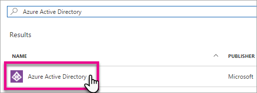
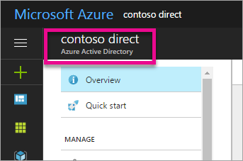
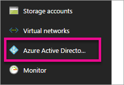
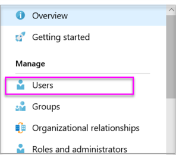

# Create an Azure Active Directory tenant to use with Power BI
Learn how to create a new Azure Active Directory (Azure AD) tenant for use with your custom application using the Power BI REST APIs.

A tenant is representative of an organization within Azure Active Directory. It is a dedicated instance of the Azure AD service that an organization receives and owns when it signs up for a Microsoft cloud service such as Azure, Microsoft Intune, or Office 365. Each Azure AD tenant is distinct and separate from other Azure AD tenants.

Once you have an Azure AD tenant, you can define an application and assign permissions so your application can make use of the Power BI REST APIs.

Your organization may already have an Azure AD tenant that you can use for your application. You can make use of that tenant for your application needs or you can create a new tenant specifically for your application. This article looks at how to create a new tenant.

## Create an Azure Active Directory tenant
In order to integrate Power BI into your custom application, you need to define an application within Azure AD. To do that, you need a directory within Azure AD. This is your tenant. If you organization doesn't have a tenant yet, because they aren't using Power BI or Office 365, you will need to create one. You may also need to create one if you don't want your application mixing with your organization's tenant. This allows you to keep things isolated.

Or, you may just want to create a tenant for testing purposes.

To create a new Azure AD tenant, do the following.

1. Browse to the [Azure portal](https://portal.azure.com) and sign in with an account that has an Azure subscription.
2. Select the **plus icon (+)** and search for *Azure Active Directory*.
   
    
3. Select **Azure Active Directory** in the search results.
   
    
4. Select **Create**.
5. Provide a **name for the organization** along with the **initial domain name**. Then select **Create**. This will create your directory.
   
    
   
   > [!NOTE]
   > Your initial domain will be part of onmicrosoft.com. You can add other domain names later. The directory, of a tenant, can have multiple domains assigned to it.
   > 
   > 
6. After your directory creation is complete, select the information box to manage your new directory.

Your directory is now created. Next we will want to add a user to the tenant.

## Create some users in your Azure Active Directory tenant
Now that we have a directory, let's create at least two users. One that will be a Global Admin for the tenant and another that will be our master user for embedding. Think of this as a service account.

1. Within the Azure portal, make sure we are on the Azure Active Directory fly out.
   
    
   
    If you are not, select the Azure Active Directory icon from the left services bar.
   
    
2. Under **Manage**, select **Users and groups**.
   
    
3. Select **All users** and then select **+ New user**.
4. Provide a name and username for this user. This will be your Global Admin for the tenant. You will also want to change the **Directory role** to *Global administrator*. You can also show the temporary password. When you are done, select **Create**.
   
    
5. You will want to do the same thing again for a regular user in your tenant. This could also be used for your master embedding account. This time, for **Directory role**, we will leave it as *User*. Be sure to make note of the password. Then select **Create**.
   
    
6. Sign up for Power BI with your user account that you created in step 5. You can do that by going to [powerbi.com](https://powerbi.microsoft.com/get-started/) and selecting **Try free** under *Power BI - Cloud collaboration and sharing*.
   
    
   
    When you sign up, you will be prompted to try Power BI Pro free for 60 days. You can opt into that to become a pro user. Now you can also start developing an embedded solution if that is what you are looking for.
   
   > [!NOTE]
   > Make sure you sign up with the email address you gave the user account.
   > 
   > 

## Next steps
Now that you have an Azure AD tenant, you can use this tenant to test items within Power BI, and/or you can move forward to embed Power BI dashboards and reports in your application. For more information on how to embed items, see [How to embed your Power BI dashboards, reports and tiles](embedding-content.md).

[What is an Azure AD directory?](https://docs.microsoft.com/azure/active-directory/active-directory-whatis)  
[How to get an Azure Active Directory tenant](https://docs.microsoft.com/azure/active-directory/develop/active-directory-howto-tenant)  

More questions? [Try asking the Power BI Community](http://community.powerbi.com/)

