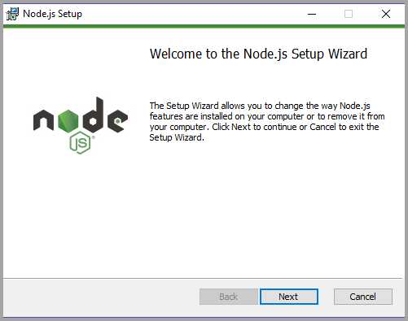
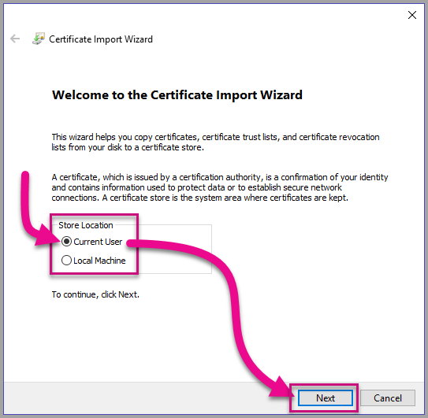
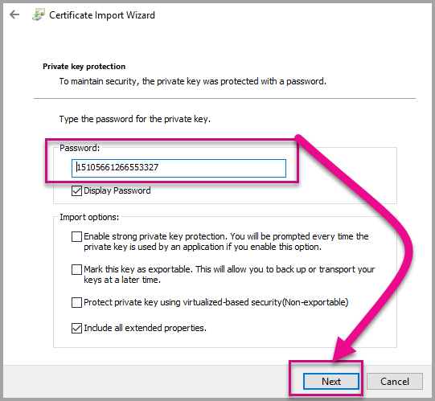
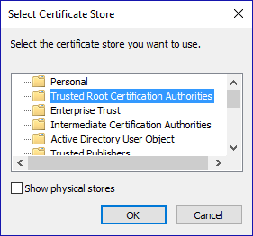
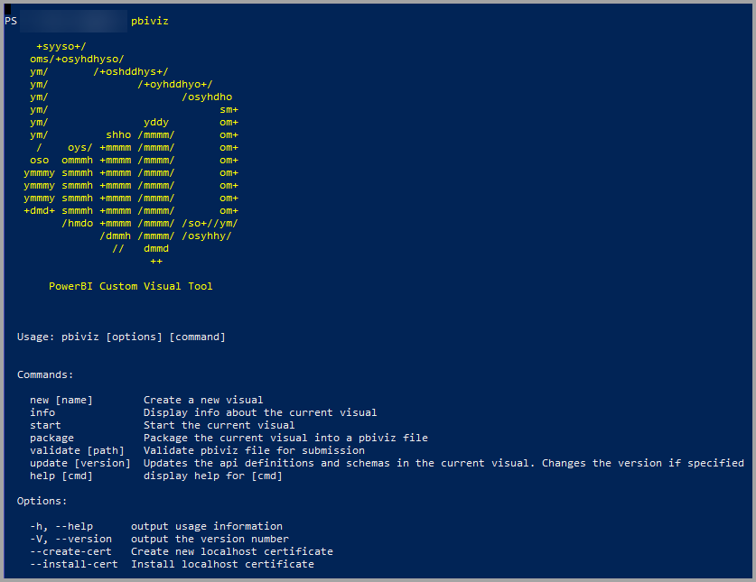
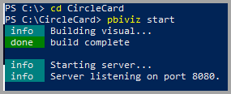
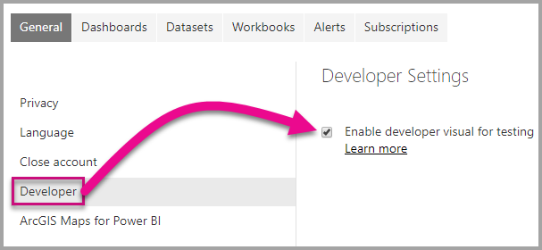

# Tutorial: Developing a Power BI Custom Visual

We’re enabling developers to easily add custom visuals into Power BI for use in dashboard and reports. To help you get started, we’ve published the code for all of our visualizations to GitHub.

Along with the visualization framework, we’ve provided our test suite and tools to help the community build high-quality custom visuals for Power BI.

This tutorial shows you how to develop a Power BI custom visual named Circle Card to display a formatted measure value inside a circle. The Circle Card visual supports customization of fill color and thickness of its outline.

In the Power BI Desktop report, the cards will be modified to become Circle Cards.

  

In this tutorial, you learn how to:
>[!div class="checklist"]
>* Create a Power BI custom visual.
>* Develop the custom visual with D3 visual elements.
>* Configure data binding with the visual elements.
>* Format data values.
>* Add visual properties.
>* Package the visual.
>* Import the custom visual into a Power BI Desktop report.

## Prerequisites

* If you're not signed up for **Power BI Pro**, [sign up for a free trial](https://powerbi.microsoft.com/en-us/pricing/) before you begin.
* You need [Visual Studio](https://www.visualstudio.com/) installed (version 2013 or later).

## Sign in to Power BI

1. Navigate to [Power BI](https://powerbi.microsoft.com) and select **Sign In** (located at the top-right corner) of the page.

2. When prompted to update the password, reenter the provided password, and then enter and confirm a new password.

3. Complete the sign-in process.

4. If prompted to stay signed in, click Yes.

5. Leave the Internet Explorer window open.

## Setting Up the Developer Environment

In addition to the prerequisites, there are a few more tools you need to install.

### Installing Node.js

1. To install Node.js, in a web browser, navigate to [Node.js](https://nodejs.org).

2. Download the latest feature MSI installer.

3. Run the installer, and then follow the installation steps. Accept the terms of the license agreement and all defaults.

   

4. Restart the computer.

### Installing Packages

Now you need to install the pbiviz package.

1. Open Windows PowerShell after the computer has been restarted.

2. To install pbiviz, enter the following command.

   ```powershell
   npm i -g powerbi-visuals-tools
   ```

### Creating and Installing a Certificate

1. To create a certificate, enter the following command.

  ```powershell
  pbiviz --create-cert
  ```

You should return a result that produces a *passphrase*. In this case, the *passphrase* is **_15105661266553327_**.

  

2. Now we need to install the certificate. to install the certificate, enter the following command.

  ```powershell
  pbiviz --install-cert
  ```

4. In the Certificate Import Wizard, ensure that the store location is set to Current User. Then select *Next*.

      

5. At the **File to Import** step, select *Next*.

6. At the **Private Key Protection** step, in the Password box, paste the passphrase you received from creating the cert.  Again, in this case it is **_15105661266553327_**.
   
      

7. At the **Certificate Store** step, select the **Place all certificates in the Following store** option. Then select *Browse*.

      

8. In the **Select Certificate Store** window, select **Trusted Root Certification Authorities** and then select *OK*. Then select *Next* on the **Certificate Store** screen.

      

9. To complete the import, click Finish.

10. If you receive a security warning, click Yes.

    

11. When notified that the import was successful, click OK.

    

> .

1. In Windows PowerShell, verify that the Power BI Visual Tools package has been installed.

    ```powershell
    pbiviz
    ```
  You should see the help output.

    <pre><code>
         +syyso+/
    oms/+osyhdhyso/
    ym/       /+oshddhys+/
    ym/              /+oyhddhyo+/
    ym/                     /osyhdho
    ym/                           sm+
    ym/               yddy        om+
    ym/         shho /mmmm/       om+
     /    oys/ +mmmm /mmmm/       om+
    oso  ommmh +mmmm /mmmm/       om+
   ymmmy smmmh +mmmm /mmmm/       om+
   ymmmy smmmh +mmmm /mmmm/       om+
   ymmmy smmmh +mmmm /mmmm/       om+
   +dmd+ smmmh +mmmm /mmmm/       om+
         /hmdo +mmmm /mmmm/ /so+//ym/
               /dmmh /mmmm/ /osyhhy/
                 //   dmmd
                       ++

       PowerBI Custom Visual Tool

    Usage: pbiviz [options] [command]

    Commands:

    new [name]        Create a new visual
    info              Display info about the current visual
    start             Start the current visual
    package           Package the current visual into a pbiviz file
    update [version]  Updates the api definitions and schemas in the current visual. Changes the version if specified
    help [cmd]        display help for [cmd]

    Options:

    -h, --help      output usage information
    -V, --version   output the version number
    --install-cert  Install localhost certificate
    </code></pre>

<a name="ssl-setup"></a>

2. Review the output, including the list of supported commands.

     

3. Navigate to your Workspace folder, using the folder path you used to install the course files.  In this case, we saved our files to the workspace folder in the c drive.

    ```
    cd C:\Workspace
    ```
4. To create a custom visual project, enter the following command. CircleCard is the name of the project.

    ```powershell
    pbiviz new CircleCard
    ```
5. Navigate to the project folder.

    ```powershell
    cd CircleCard
    ```
    

6. Start the custom visual. YoUr CircleCard visual is now running while being hosted on your computer.

    ```powershell
    pbiviz start
    ```

    

> 

2. Select **Developer** then check the **Enable Developer Visual for testing** checkbox.

    

3. Upload a Power BI Desktop report.  

    Get Data > Files > Local File.

    You can download a sample Power BI Desktop report [here](https://microsoft.github.io/PowerBI-visuals/docs/step-by-step-lab/images/US_Sales_Analysis.pbix).

    
    

    Now to view the report, select **US_Sales_Analysis** from the **Report** section in the navigation pane on the left.

    

4. Now you need to edit the report while in te Power BI service.

    Go to **Edit report**.

    

5. Select the **Developer Visual** from the **Visualizations** pane.

    

    > ![Note]
    > This visualization represents the custom visual that you started on your computer. It is only available when the developer settings have been enabled.

6. Notice that a visualization was added to the report canvas.

    

    > !{Note}
    > This is a very simple visual that displays the number of times its Update method has been called. At this stage the visual does not yet retrieve any data.

7. While selecting the new visual in the report, Go to the Fields Pane > expand Sales > select Quantity.

    

8. Then to test the new visual, resize the visual and notice the update value increments.

    

In PowerShell, to stop the custom visual running, enter Ctrl+C, and when prompted to terminate the batch job, enter Y, and then press Enter.

## Adding Visual Elements

Now you need to install the D3 JavaScript library. This includes the typings and the configure file dependencies.

Then you can develop the custom visual to display a circle with text.

> ![Note]
> D3 is a JavaScript library for producing dynamic, interactive data visualizations in web browsers. It makes use of widely implemented SVG, HTML5, and CSS standards.

1. To install D3 in PowerShell, enter the following command. For your convenience, many text entries in this tutorial can be copied from this [repository](https://github.com/uve/circlecard).

    ```powershell
    npm i d3@3.5.5 --save
    ```

2. To install type definitions for D3 library, enter the following command. This command installs TypeScript definitions based on JavaScript files, enabling you to develop the custom visual in TypeScript (which is a superset of JavaScript). Visual Studio Code is an ideal IDE for developing TypeScript applications.

    ```powershell
    npm i @types/d3@3.5
    ```

3. Launch Visual Studio Code.

    You can launch Visual Studio Code from powershell by using the command *code .*.

4. In the Explorer pane, expand the node_modules folder to verify that the D3 library was installed.
    
    