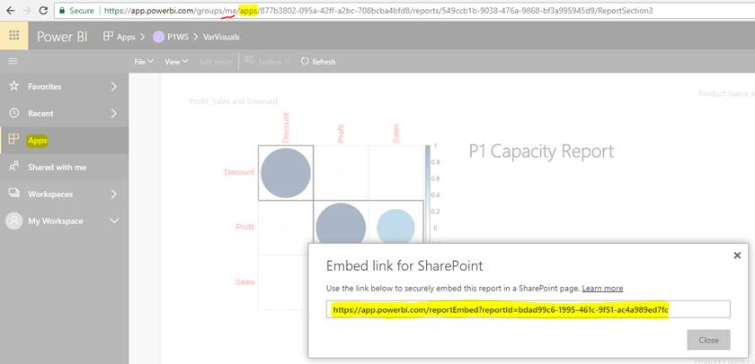

# Embed reports or dashboards from apps

In Power BI, you can create apps to bring related dashboards and reports together, all in one place, and then publish them to large groups of people in your organization. The usage of those apps is relevant when all your users are Power BI users, so you can share content with them using Power BI Apps. We would like to share few quick steps on how to accomplish embedding of content out of a published Power BI App and into a third-party application.

## How to grab Report embed URL for embedding:

1. Instantiate the application in a user workspace (‘My Workspace’) by either sharing with yourself and/or guiding another user to go through this flow.

2. Open your desired report in Power BI service.

3. Go to File->Embed In SharePoint Online and grab the report embed url from there (can be seen in the snapshot below) OR call GetReports/GetReport REST API and extract the corresponding report embedUrl field out of the response (please note that the REST call shouldn’t have a workspace identifier as part of the url as the app got instantiated in the user’s personal workspace).

4. Use the embed url retrieved in step 3 to be used with our JS SDK.

    

## How to grab Dashboard embed URL for embedding:

1. Instantiate the application in a user workspace (‘My Workspace’) by either sharing with yourself and/or guiding another user to go through this flow.

2. Call GetDashboards REST API and extract the corresponding dashboard embedUrl field out of the response (please note that the REST call shouldn’t have a workspace identifier as part of the url as the app got instantiated in the user’s personal workspace).

3. Use the embed url retrieved in step 4 to be used with our JS SDK.