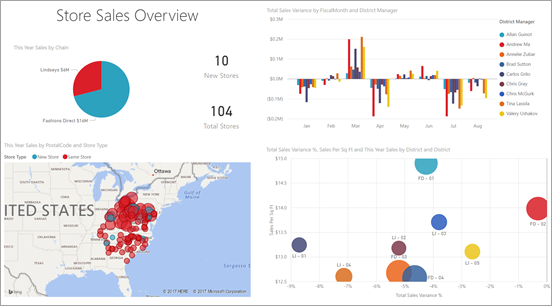
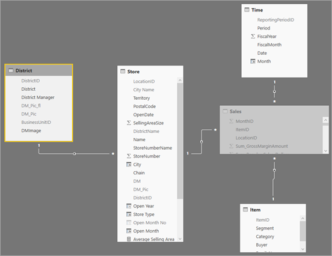
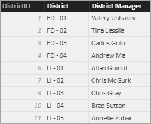
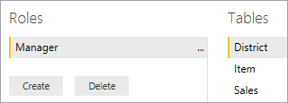
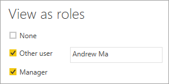

# Use row-level security with Power BI embedded content
Row level security (RLS) can be used to restrict user access to data within a report or dataset, allowing for multiple different users to use the same report while all seeing different data. RLS can be taken advantage of when embedding reports from Power BI.

If you are embedding for non-Power BI users (app owns data), which is typically an ISV scenario, then this article is for you! You will need to configure the embed token to account for the user and role. Read on to learn how to do this.

If you are embedding to Power BI users (user owns data), within your organization, RLS works the same as it does within the Power BI service directly. There is nothing more you need to do in your application. For more information see, [Row-Level security (RLS) with Power BI](../service-admin-rls.md).


To take advantage of RLS, it’s important you understand three main concepts; Users, Roles, and Rules. Let’s take a closer look at each:

**Users** – These are the actual end-users viewing reports. In Power BI Embedded, users are identified by the username property in an embed token.

**Roles** – Users belong to roles. A role is a container for rules and can be named something like *Sales Manager* or *Sales Rep*. You create roles within Power BI Desktop. For more information, see [Row-level security (RLS) with Power BI Desktop](../desktop-rls.md).

**Rules** – Roles have rules, and those rules are the actual filters that are going to be applied to the data. This could be as simple as “Country = USA” or something much more dynamic.
For the rest of this article, we’ll provide an example of authoring RLS, and then consuming that within an embedded application. Our example uses the [Retail Analysis Sample](http://go.microsoft.com/fwlink/?LinkID=780547) PBIX file.



## Adding roles with Power BI Desktop
Our Retail Analysis sample shows sales for all the stores in a retail chain. Without RLS, no matter which district manager signs in and views the report, they’ll see the same data. Senior management has determined each district manager should only see the sales for the stores they manage, and to do this, we can use RLS.

RLS is authored in Power BI Desktop. When the dataset and report are opened, we can switch to diagram view to see the schema:



Here are a few things to notice with this schema:

* All measures, like **Total Sales**, are stored in the **Sales** fact table.
* There are four additional related dimension tables: **Item**, **Time**, **Store**, and **District**.
* The arrows on the relationship lines indicate which way filters can flow from one table to another. For example, if a filter is placed on **Time[Date]**, in the current schema it would only filter down values in the **Sales** table. No other tables would be affected by this filter since all the arrows on the relationship lines point to the sales table and not away.
* The **District** table indicates who the manager is for each district:
  
    

Based on this schema, if we apply a filter to the **District Manager** column in the **District** table, and if that filter matches the user viewing the report, that filter will also filter down the **Store** and **Sales** tables to only show data for that district manager.

Here's how:

1. On the **Modeling** tab, select **Manage Roles**.
   
    
2. Create a new role called **Manager**.
   
    
3. In the **District** table, enter the following DAX expression: **[District Manager] = USERNAME()**.
   
    
4. To make sure the rules are working, on the **Modeling** tab, select **View as Roles**, and then select both the **Manager** role you just created, along with **Other user**. Enter **Andrew Ma** for the user.
   
    
   
    The reports will now show data as if you were signed in as **Andrew Ma**.

Applying the filter, the way we did here, will filter down all records in the **District**, **Store**, and **Sales** tables. However, because of the filter direction on the relationships between **Sales** and **Time**, **Sales** and **Item**, and **Item** and **Time** tables will not be filtered down. To learn more about bidirectional cross-filtering, download the [Bidirectional cross-filtering in SQL Server Analysis Services 2016 and Power BI Desktop](http://download.microsoft.com/download/2/7/8/2782DF95-3E0D-40CD-BFC8-749A2882E109/Bidirectional%20cross-filtering%20in%20Analysis%20Services%202016%20and%20Power%20BI.docx) whitepaper.

## Applying user and role to an embed token
Now that you have your Power BI Desktop roles configured, there is some work needed in your application to take advantage of the roles.

Users are authenticated and authorized by your application and embed tokens are used to grant that user access to a specific Power BI Embedded report. Power BI Embedded doesn’t have any specific information on who your user is. For RLS to work, you’ll need to pass some additional context as part of your embed token in the form of identities. This is done by way [GenerateToken](https://msdn.microsoft.com/library/mt784614.aspx) API.

The [GenerateToken](https://msdn.microsoft.com/library/mt784614.aspx) API accepts a list of identities with indication of the relevant datasets. Currently only one identity can be provided. Support for multiple datasets will be added, for dashboard embedding, in the future. For RLS to work, you will need to pass the following as part of the identity.

* **username (mandatory)** – This is a string that can be used to help identify the user when applying RLS rules. Only a single user can be listed.
* **roles (mandatory)** – A string containing the roles to select when applying Row Level Security rules. If passing more than one role, they should be passed as a string array.
* **dataset (mandatory)** – The dataset that is applicable for the report you are embedding. Only one dataset can be provided in the list of datasets. Support for multiple datasets will be supported for dashboard embedding in the future.

You can create the embed token by using the **GenerateTokenInGroup** method on **PowerBIClient.Reports**. Currently, only reports are supported.

For example, you could change the [PowerBIEmbedded_AppOwnsData](https://github.com/Microsoft/PowerBI-Developer-Samples/tree/master/App%20Owns%20Data) sample. *Home\HomeController.cs line 76 and 77* could be updated from:

```
// Generate Embed Token.
var generateTokenRequestParameters = new GenerateTokenRequest(accessLevel: "view");

var tokenResponse = await client.Reports.GenerateTokenInGroupAsync(GroupId, report.Id, generateTokenRequestParameters);
```

to

```
var generateTokenRequestParameters = new GenerateTokenRequest("View", null, identities: new List<EffectiveIdentity> { new EffectiveIdentity(username: "username", roles: new List<string> { "roleA", "roleB" }, datasets: new List<string> { "datasetId" }) });

var tokenResponse = await client.Reports.GenerateTokenInGroupAsync("groupId", "reportId", generateTokenRequestParameters);
```

If you are calling the REST API, the updated API now accepts an additional JSON array, named **identities**, containing a user name, list of string roles and list of string datasets, e.g.:

```
{
    "accessLevel": "View",
    "identities": [
        {
            "username": "EffectiveIdentity",
            "roles": [ "Role1", "Role2" ],
            "datasets": [ "fe0a1aeb-f6a4-4b27-a2d3-b5df3bb28bdc" ]
        }
    ]
}
```

Now, with all the pieces together, when someone logs into your application to view this report, they’ll only be able to see the data that they are allowed to see, as defined by our row-level security.

## Working with Analysis Services live connections
Row-level security can be used with Analysis Services live connections for on-premises servers. There are a few specific concepts that you should understand when using this type of connection.

The effective identity that is provided for the username property must be a windows user with permissions on the Analysis Services server.

**On-Premises Data Gateway configuration**

An [On-premises data gateway](../service-gateway-onprem.md) is used when working with Analysis Services live connections. When generating an embed token, with an identity listed, the master account needs to be listed as an admin of the gateway. If the master account is not listed, the row-level security will not be applied property to the data. A non-admin of the gateway can provide roles, but must specify its own username for the effective identity.

**Use of roles**

Roles can be provded with the identity in an embed token. If no role is provided, the username that was provided will be used to resolve the associated roles.

## Considerations and limitations
* Assignment of users to roles, within the Power BI service, does not affect RLS when using an embed token.
* While the Power BI service will not apply RLS setting to admins or members with edit permissions, when you supply an identity with an embed token, it will be applied to the data.
* Passing the identity information, when calling GenerateToken, is only supported for report read/write. Support for other resources will come later.
* Analysis Services live connections are supported for on-premises servers.
* Azure Analysis Services live connections are not supported.
* If the underlying dataset doesn’t require RLS, the GenerateToken request must **not** contain an effective identity.
* If the underlying dataset is a cloud model (cached model or DirectQuery), the effective identity must include at least one role. Otherwise, role assignment will not occur.
* Only one identity can be provided in the list of identities. We are using a list to enable multi-identity tokens for dashboard embedding in the future.

More questions? [Try asking the Power BI Community](https://community.powerbi.com/)

