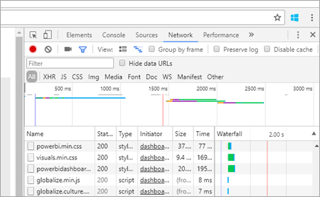

# Troubleshooting your embedded application

This article discusses some common issues you may encounter when embedding content from Power BI.

## Tools for troubleshooting

### Fiddler Trace

[Fiddler](http://www.telerik.com/fiddler) is a free tool from Telerik that monitors HTTP traffic.  You can see the back and forth with the Power BI APIs from the client machine. This may show errors and other related information.


### F12 in Browser for front end debugging

F12 will launch the developer window within your browser. This provides the ability to look at network traffic and other information.



### Extracting error details from Power BI response

This code snippet shows how to extract the error details from HTTP exception:

```
public static string GetExceptionText(this HttpOperationException exc)
{
    var errorText = string.Format("Request: {0}\r\nStatus: {1} ({2})\r\nResponse: {3}",
    exc.Request.Content, exc.Response.StatusCode, (int)exc.Response.StatusCode, exc.Response.Content);
    if (exc.Response.Headers.ContainsKey("RequestId"))
    {
        var requestId = exc.Response.Headers["RequestId"].FirstOrDefault();
        errorText += string.Format("\r\nRequestId: {0}", requestId);
    }

    return errorText;
}
```
We recommend logging the request ids (and error details for troubleshooting).
Please provide the request id when approaching Microsoft support.

## App registration

**App registration failure**

Error messages within the Azure portal or the Power BI app registration page will mention insufficient privileges. In order to register an application, you must be an admin in the Azure AD tenant or application registrations must be enabled for non-admin users.

**Power BI Service does not appear in Azure portal when registering a new App**

At least one user must be signed up for Power BI. If you do not see **Power BI Service** listed within the API list, no user is signed up for Power BI.

## REST API

**API call returning 401**

A fiddler capture may be required to investigate further. The required permission scope may be missing for the registered application within Azure AD. Verify the required scope is present within the app registration for Azure AD within the Azure portal.

**API call returning 403**

A fiddler capture may be required to investigate further. There could be several reason for a 403 error.

* The user have exceeded the amount of embed token that can be generated on a shared capacity. You need to purchase Azure capacities to generate embed tokens, and assign the workspace to that capacity. See [Create Power BI Embedded capacity in the Azure portal](https://docs.microsoft.com/azure/power-bi-embedded/create-capacity).
* The Azure AD auth token expired.
* The authenticated user is not a member of the group (app workspace).
* The authenticated user is not an admin of the group (app workspace).
* The authorization header may not be listed correctly. Make sure there are no typos.

The backend of the application may need to refresh the auth token before calling GenerateToken.

```
    GET https://wabi-us-north-central-redirect.analysis.windows.net/metadata/cluster HTTP/1.1
    Host: wabi-us-north-central-redirect.analysis.windows.net
    ...
    Authorization: Bearer eyJ0eXAiOi...
    ...
 
    HTTP/1.1 403 Forbidden
    ...
     
    {"error":{"code":"TokenExpired","message":"Access token has expired, resubmit with a new access token"}}
```

**Generate token fails when providing effective identity**

GenerateToken can fail, with effective identity supplied, for a few different reasons.

* Dataset does not support effective identity
* Username was not provided
* Role was not provided
* DatasetId was not provided
* User doesn't have the correct permissions

To verify which it is, try the following.

* Execute the [get dataset](https://msdn.microsoft.com/library/mt784653.aspx). Is the property IsEffectiveIdentityRequired true?
* Username is mandatory for any EffectiveIdentity.
* If IsEffectiveIdentityRolesRequired is true, Role is required.
* DatasetId is mandatory for any EffectiveIdentity.
* For Analysis Services, the master user has to be a gateway admin.

## Data sources

**ISV wants to have different credentials for the same data source**

A data source can have a single set of credentials for one master user. If you need to use different credentials, create additional master users. Then, assign the different credentials in each of the master users context, and embed using the Azure AD token of that user.

## Content rendering

**Rendering, or consumption, of embedded content fails or times out**

Make sure the embed token did not expire. Make sure you are checking the embed token expiration and refreshing it. For more information, see [Refresh token using JavaScript SDK](https://github.com/Microsoft/PowerBI-JavaScript/wiki/Refresh-token-using-JavaScript-SDK-example).

**Report or dashboard does not load**

If the user is unable to see the report or dashboard, make sure the report or dashboard loads correctly within powerbi.com. The report or dashboard will not work within your application if it doesn't load within powerbi.com.

**Report or dashboard is performing slowly**

Open the file from Power BI Desktop, or within powerbi.com, and verify that performance is acceptable to rule out issues with your application or the embedding apis.

For more information, please see [Power BI Embedded FAQ](embedded-faq.md).

More questions? [Try the Power BI Community](http://community.powerbi.com/)