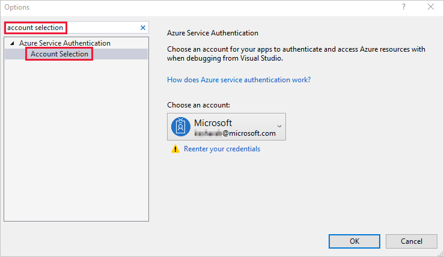

# Embed Power BI content with service principal and a certificate

[!INCLUDE[service principal overview](../../includes/service-principal-overview.md)]

>[!NOTE]
>We recommend that you secure your backend services using certificates, rather than secret keys. [Learn more about getting access tokens from Azure AD using secret keys or certificates](/azure/architecture/multitenant-identity/client-assertion).

## Certificate-based authentication

Certificate-based authentication enables you to be authenticated by Azure Active Directory (Azure AD) with a client certificate on a Windows, Android or iOS device, or kept in an [Azure Key Vault](/azure/key-vault/basic-concepts).

Using this method of authentication allows managing certificates from a central place, using the CA, for rotation or revocation.

You can learn more about certificates in Azure AD in the [Client credential flows](https://github.com/AzureAD/microsoft-authentication-library-for-dotnet/wiki/Client-credential-flows) GitHub page.

## Method

To use service principal and a certificate with embedded analytics, follow these steps:

1. Create a certificate.

2. Create an Azure AD Application.

3. Set up certificate authentication.

4. Get the certificate from Azure Key Vault.

5. Authenticate using service principal and a certificate.

## Step 1 - Create a certificate

You can procure a certificate from a trusted *Certificate Authority*, or generate a certificate yourself.

This section describes creating a certificate using [Azure Key Vault](/azure/key-vault/create-certificate), and downloading the *.cer* file which contains the public key.

1. Log into [Microsoft Azure](https://ms.portal.azure.com/#allservices).

2. Search for **Key Vaults** and click the **Key Vaults** link.

    

3. Click the key vault you want to add a certificate to.

    

4. Click **Certificates**.

    

5. Click **Generate/Import**.

    

6. Configure the **Create a certificate** fields as follows:

    * **Method of Certificate Creation** - General

    * **Certificate Name** - Enter a name for your certificate

    * **Type of Certificate Authority (CA)** - Self-signed certificate

    * **Subject** - An [X.500](https://wikipedia.org/wiki/X.500) distinguished name

    * **DNS Names** - 0 DNS names

    * **Validity Period (in months)** - Enter the certificate's validity duration

    * **Content Type** - PKCS #12

    * **Lifetime Action Type** - Automatically renew at a given percentage lifetime

    * **Percentage Lifetime** - 80

    * **Advanced Policy Configuration** - Not configured

7. Click **Create**. The newly created certificate is disabled by default. It can take up to five minutes to become enabled.

8. Select the certificate you created.

9. Click **Download in CER format**. The downloaded file contains the public key.

    

## Step 2 - Create an Azure AD Application

[!INCLUDE[service principal create app](../../includes/service-principal-create-app.md)]

## Step 3 - Set up certificate authentication

1. In your Azure AD application, click the **Certificates & secrets** tab.

     

2. Click **Upload certificate** and upload the *.cer* file you created and downloaded in the [first step](#step-1---create-a-certificate) of this tutorial. The *.cer* file contains the public key.

## Step 4 - Get the certificate from Azure Key Vault

Use Managed Service Identity (MSI) to get the certificate from Azure Key Vault. This process involves getting the *.pfx* certificate that contains both the public and private keys.

Refer to the code example for reading the certificate from Azure Key Vault. If you want to use Visual Studio, refer to [Configure Visual Studio to use MSI](#configure-visual-studio-to-use-msi).

```csharp
private X509Certificate2 ReadCertificateFromVault(string certName)
{
    var serviceTokenProvider = new AzureServiceTokenProvider();
    var keyVaultClient = new KeyVaultClient(new KeyVaultClient.AuthenticationCallback(serviceTokenProvider.KeyVaultTokenCallback));
    CertificateBundle certificate = null;
    SecretBundle secret = null;
    try
    {
        certificate = keyVaultClient.GetCertificateAsync($"https://{KeyVaultName}.vault.azure.net/", certName).Result;
        secret = keyVaultClient.GetSecretAsync(certificate.SecretIdentifier.Identifier).Result;
    }
    catch (Exception)
    {
        return null;
    }

    return new X509Certificate2(Convert.FromBase64String(secret.Value));
}
```

## Step 5 - Authenticate using service principal and a certificate

You can authenticate your app using service principal and a certificate that's stored in Azure Key Vault, by connecting to Azure Key Vault.

To connect and read the certificate from Azure Key Vault, refer to the code below.

>[!NOTE]
>If you already have a certificate created by your organization, upload the *.pfx* file to Azure Key Vault.

```csharp
// Preparing needed variables
var Scope = "https://analysis.windows.net/powerbi/api/.default"
var ApplicationId = "{YourApplicationId}"
var tenantSpecificURL = "https://login.microsoftonline.com/{YourTenantId}/"
X509Certificate2 certificate = ReadCertificateFromVault(CertificateName);

// Authenticating with a SP and a certificate
public async Task<AuthenticationResult> DoAuthentication(){
    IConfidentialClientApplication clientApp = null;
    clientApp = ConfidentialClientApplicationBuilder.Create(ApplicationId)
                                                    .WithCertificate(certificate)
                                                    .WithAuthority(tenantSpecificURL)
                                                    .Build();
    try
    {
        authenticationResult = await clientApp.AcquireTokenForClient(Scope).ExecuteAsync();
    }
    catch (MsalException)
    {
        throw;
    }
    return authenticationResult
}
```

## Configure Visual Studio to use MSI

When creating your embedded solution, it may be useful to configure Visual Studio to use Managed Service Identity (MSI). [MSI](/azure/active-directory/managed-identities-azure-resources/overview) is a feature that enables you to manage your Azure AD identity. Once configured, it will let Visual Studio authenticate against your Azure Key Vault.

1. Open your project in Visual Studio.

2. Click **Tools** > **Options**.

     

3. Search for **Account Selection** and click **Account Selection**.

    

4. Add the account that has access to your Azure Key Vault.

[!INCLUDE[service principal limitations](../../includes/service-principal-limitations.md)]

## Next steps

>[!div class="nextstepaction"]
>[Register an app](register-app.md)

>[!div class="nextstepaction"]
>[Power BI Embedded for your customers](embed-sample-for-customers.md)

>[!div class="nextstepaction"]
>[Application and service principal objects in Azure Active Directory](/azure/active-directory/develop/app-objects-and-service-principals)

>[!div class="nextstepaction"]
>[Row-level security using on-premises data gateway with service principal](embedded-row-level-security.md#on-premises-data-gateway-with-service-principal)

>[!div class="nextstepaction"]
>[Embed Power BI content with service principal and an application secret](embed-service-principal.md)