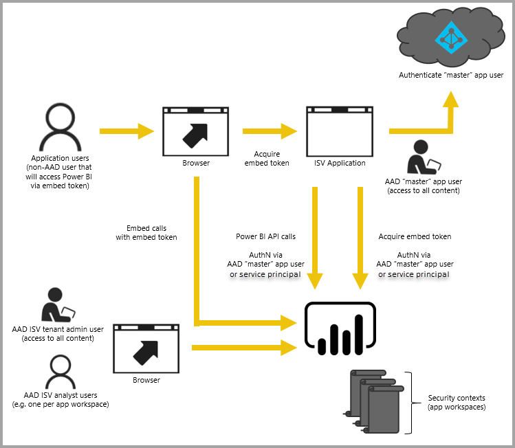

# Embedding with Power BI
Power BI offers APIs for embedding your dashboards and reports into applications. The Power BI APIs offer a consistent set of capabilities and access to the latest Power BI features – such as dashboards, gateways and app workspaces – when embedding content.

## A single API
There are two main scenarios when embedding Power BI content.  Embedding for users in your organization (who have licenses for Power BI) and embedding for your users and customers without requiring them to have Power BI licenses. The Power BI REST API allows for both scenarios. 

For customers and users without Power BI licenses, you can embed dashboards and reports into your custom application, using the same API to either service your organization or your customers. Your customers see the data that is managed by the application. And for Power BI users in your organization, they'll have the additional options to view *their own data* directly in Power BI or in the context of the embedded application. You can take full advantage of the JavaScript and REST APIs for your embedding needs.

To view a sample of how embedding works, see the [JavaScript embed sample](https://microsoft.github.io/PowerBI-JavaScript/demo/).

## Embedding for your organization
Embedding for your organization allows you to extend the Power BI service. This requires that users of your application sign into the Power BI service when they want to view their content. Once someone in your organization signs in, they will only have access to dashboards and reports that they own or that have been shared with them in the Power BI service.

*Examples of embedding for your organization include internal web application, the SharePoint Online web part and Microsoft Teams integration.*

For embedding for your organization, see the following:

* [Integrate a report into an app](integrate-report.md)
* [Integrate a dashboard into an app](integrate-dashboard.md)
* [Integrate a tile into an app](integrate-tile.md)

Self-service capabilities, such as edit, save and more, are available through the [JavaScript API](https://github.com/Microsoft/PowerBI-JavaScript) when embedding for Power BI users.

You can go through the [Onboarding experience tool to embed for your organization](https://aka.ms/embedsetup/UserOwnsData) to quickly get started and download a sample application that walks you through integrating a report for your organization.

## Embedding for your customers
Embedding for your customers provides the ability to embed dashboards and reports to users who don't have an account for Power BI. Your customers don't need to know anything about Power BI. At least one Power BI Pro account is needed to create an embedded application. The Power BI Pro account acts as a master account for your application. Think of this as a proxy account. The Power BI Pro account also allows you to generate embed tokens that provide access to dashboards and reports within the Power BI service that are owned/managed by your application.

*An example of embedding for your customers is an ISV application being sold to other companies.*

To embed dashboards, reports and tiles, you would use the same APIs that you would use for embedding for your organization.

> [!IMPORTANT]
> While embedding has a dependency on the Power BI service, there is not a dependency on Power BI for your customers. They do not need to sign up for Power BI to view the embedded content in your application.
> 

When you are ready to move to production, your app workspace must be assigned to a capacity. Power BI Embedded, within Microsoft Azure, offers capacity to use with your applications.

For details on how to embed, see [How to embed your Power BI dashboards, reports and tiles](embedding-content.md).

You can go through the [Onboarding experience tool to embed for your customers](https://aka.ms/embedsetup/AppOwnsData) to quickly get started and download a sample application that walks you through integrating a report into your application.

If you were using the Power BI Workspace Collections service within Azure, see [Migrate content from the Power BI Workspace Collections Azure service](migrate-from-powerbi-embedded.md) for information on how to migrate your content over.

## Next steps
[How to embed your Power BI dashboards, reports and tiles](embedding-content.md)  
[How to migrate Power BI Embedded workspace collection content to Power BI](migrate-from-powerbi-embedded.md)  
[Power BI Premium - what is it?](../service-premium.md)  
[JavaScript API Git repo](https://github.com/Microsoft/PowerBI-JavaScript)  
[Power BI C# Git repo](https://github.com/Microsoft/PowerBI-CSharp)  
[JavaScript embed sample](https://microsoft.github.io/PowerBI-JavaScript/demo/)  
[Embedded analytics capacity planning whitepaper](https://aka.ms/pbiewhitepaper)  
[Power BI Premium whitepaper](https://aka.ms/pbipremiumwhitepaper)  

More questions? [Try asking the Power BI Community](http://community.powerbi.com/)

