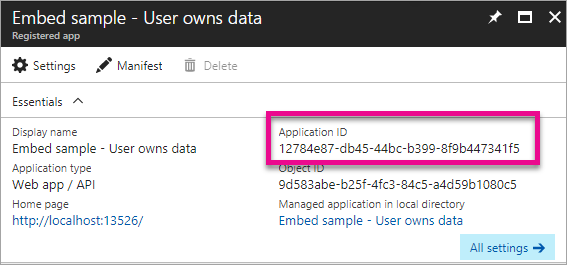
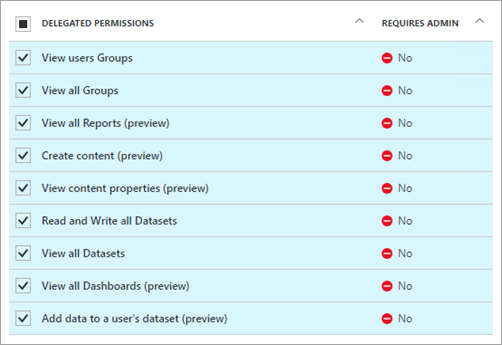

# Register an Azure AD app to embed Power BI content
Learn how to register an application within Azure Active Directory (Azure AD) for use with embedding Power BI content.

You register your application with Azure AD to allow your application access to the Power BI REST APIs. This allows you to establish an identity for your application and specify permissions to Power BI REST resources.

> [!IMPORTANT]
> Before you register a Power BI app you need an [Azure Active Directory tenant and an organizational user](create-an-azure-active-directory-tenant.md). If you haven't signed up for Power BI with a user in your tenant, the app registration doesn't complete successfully.
> 
> 

There are two ways to register your application. The first is with the [Power BI App Registration Tool](https://dev.powerbi.com/apps/) or you can do it directly within the Azure portal. The Power BI App Registration Tool is the easiest option since there are just a few fields to fill in. Use the Azure portal if you want to make changes to your app.

## Register with the Power BI App Registration Tool
You need to register your application in **Azure Active Directory** to establish an identity for your application and specify permissions to Power BI REST resources. When you register an application, such as a console app or a website, you receive an identifier which is used by the application to identify themselves to the users that they are requesting permissions from.

Here's how to register your application with the Power BI App Registration Tool:

1. Go to [dev.powerbi.com/apps](https://dev.powerbi.com/apps).
2. Select **Sign in with your existing account**.
3. Provide an **App Name**.
4. The App type selection depends on the type of application you are using.
   
   * Use **Native app** for apps that run on client devices. You need to choose **Native app** if you are embedding content for your customers regardless of what the actual application is. Even for web applications.
   * Use **Server-side Web app** for web apps or web APIs.

5. Enter a value for **Redirect URL** and **Home Page URL**. The **Redirect URL** works with any valid URL.
   
    **Home Page URL** is only available if you choose **Server-side Web app** for the application type.
   
    For the *embedding for your customers* and *integrate-dashboard-web-app* samples, the redirect URL is `http://localhost:13526/redirect`. For the report and tile sample, the redirect URL is `http://localhost:13526/`.
6. Choose the APIs for the application that has access. For more information about Power BI access permissions, see [Power BI Permissions](power-bi-permissions.md).
   
    
7. Select **Register App**.
   
    You are then provided a **Client ID**, and if you select **Server-side Web app**, you receive a **Client Secret**. The **Client ID** can be retrieved from the Azure portal, at a later time, if needed. If you lose the **Client Secret**, you need to create a new one within the Azure portal.

8. You need to navigate to Azure to select **Grant permissions**.
   > [!Note]
   > Must be a global admin in the Azure tenant to complete this

* Go to Azure.
* Search and select **App registrations**.
* Choose your app.
* Select **Settings**.
* Select **Required permissions**.
* Select **Power BI Service** to verify the permissions that you selected from the App registration site.
* Select **Grant Permissions**.

You can now use the registered application as part of your custom application to interact with the Power BI service.

> [!IMPORTANT]
> If you are embedding content for your customers, you need to configure additional permissions within the Azure portal. For more information, see [Apply permissions to your application](#apply-permissions-to-your-application).
> 

## Register with the Azure portal
Your other option for registering your application is to do so directly in the Azure portal. To register your application, follow these steps.

1. Accept the [Microsoft Power BI API Terms](https://powerbi.microsoft.com/api-terms).
2. Sign into the [Azure portal](https://portal.azure.com).
3. Choose your Azure AD tenant by selecting your account in the top right corner of the page.
4. In the left-hand navigation pane, choose **More Services**, select **App Registrations** under **Security + Identity** and select **New application registration**.
   
    
5. Follow the prompts and create a new application.
   
   * For Web Applications, provide the Sign-On URL, which is the base URL of your app, where users can sign in e.g. `http://localhost:13526`.
   * For Native Applications, provide a Redirect URI, which Azure AD uses to return token responses. Enter a value specific to your application, .e.g `http://myapplication/redirect`

For more information about how to register applications in Azure Active Directory, see [Integrating applications with Azure Active Directory](https://docs.microsoft.com/azure/active-directory/develop/active-directory-integrating-applications)

## How to get the client id
When you register an application, you receive a **Client ID**.  The **Client ID** requests permissions to the users by the application to identify themselves.

Here's how to get a client id:

1. Sign into the [Azure portal](https://portal.azure.com).
2. Choose your Azure AD tenant by selecting your account in the top right corner of the page.
3. In the left-hand navigation pane, choose **More Services** and select **App Registrations**.
4. Select the application that you want to retrieve the client id for.
5. You see **Application ID** listed as a GUID. This is the client id for the application.
   
    

## Apply permissions to your application within Azure AD
> [!IMPORTANT]
> This section only applies to applications that are **embedding content for your organization**.
> 

You need to enable additional permissions to your application in addition to what the app registration page provides. You can accomplish this through the Azure AD portal, or programmatically.

You want to be logged in with either the *master* account, used for embedding or a Global admin account.

### Using the Azure AD portal
1. Browse to [App registrations](https://portal.azure.com/#blade/Microsoft_AAD_IAM/ApplicationsListBlade) within the Azure portal and select the app that you are using for embedding.
   
    
2. Select **Required permissions** under **API Access**.
   
    

3. Within **Required permissions**, select **Power BI Service (Power BI)**.
   
    
   
   > [!NOTE]
   > If you created the app directly in the Azure AD portal, **Power BI Service (Power BI)** may not be present. If it is not, select **+ Add** and then **1 Select and API**. Select **Power BI Service** in the API list and select **Select**.  If **Power BI Service (Power BI)** is not available within **+ Add**, sign up for Power BI with at least one user.
   > 
   > 
4. Select all permissions under **Delegated Permissions**. You need to select them one by one to save the selections. Select **Save** when done.
   
    
5. Within **Required permissions**, select **Grant Permissions**.
   
    The **Grant Permissions** action is needed for the *master account* to avoid being prompted for consent by Azure AD. If the account performing this action is a Global Admin, you grant permissions to all users within your organization for this application. If the account performing this action is the *master account* and is not a Global Admin, you grant permissions only to the *master account* for this application.
   
    

### Applying permissions programmatically
1. You need to get the existing service principals (users) within your tenant. For information on how to do that, see [Get servicePrincipal](https://developer.microsoft.com/en-us/graph/docs/api-reference/beta/api/serviceprincipal_get).
   
    You can call the *Get servicePrincipal* API without {id}, and it gets you all of the service principals within the tenant.
2. Check for a service principal with you app client id as **appId** property.
3. Create a new service plan if missing from your app.
   
    ```
    Post https://graph.microsoft.com/beta/servicePrincipals
    Authorization: Bearer ey..qw
    Content-Type: application/json
    {
    "accountEnabled" : true,
    "appId" : "{App_Client_ID}",
    "displayName" : "{App_DisplayName}"
    }
    ```
4. Grant App Permissions to Power BI API
   
   If you are using an existing tenant, and not interested in granting permissions on behalf of all tenant users, you can grant permissions to a specific user by replacing the value of **contentType** to **Principal**.

   The value for **consentType** can supply either **AllPrincipals** or **Principal**.

   * **AllPrincipals** can only be used by a tenant admin to grant permissions on behalf of all users in the tenant.
   * **Principal** is used to grant permissions on behalf of a specific user. In this case, an additional property should be added to the request's body - *principalId={User_ObjectId}*.
    
     *Grant permissions* is needed for the master account to avoid being prompted for consent by Azure AD which is not possible when doing non-interactive sign-in.
   
     ```
     Post https://graph.microsoft.com/beta/OAuth2PermissionGrants
     Authorization: Bearer ey..qw
     Content-Type: application/json
     { 
     "clientId":"{Service_Plan_ID}",
     "consentType":"AllPrincipals",
     "resourceId":"c78b2585-1df6-41de-95f7-dc5aeb7dc98e",
     "scope":"Dataset.ReadWrite.All Dashboard.Read.All Report.Read.All Group.Read Group.Read.All Content.Create Metadata.View_Any Dataset.Read.All Data.Alter_Any",
     "expiryTime":"2018-03-29T14:35:32.4943409+03:00",
     "startTime":"2017-03-29T14:35:32.4933413+03:00"
     }
     ```

5. Grant App Permissions to Azure Active Directory (AAD)
   
   The value for **consentType** can supply either **AllPrincipals** or **Principal**.

   * **AllPrincipals** can only be used by a tenant admin to grant permissions on behalf of all users in the tenant.
   * **Principal** is used to grant permissions on behalf of a specific user. In this case, an additional property should be added to the request's body - *principalId={User_ObjectId}*.
    
   *Grant permissions* is needed for the master account to avoid being prompted for consent by Azure AD which is not possible when doing non-interactive sign-in.

   ```
   Post https://graph.microsoft.com/beta/OAuth2PermissionGrants
   Authorization: Bearer ey..qw
   Content-Type: application/json
   { 
   "clientId":"{Service_Plan_ID}",
   "consentType":"AllPrincipals",
   "resourceId":"61e57743-d5cf-41ba-bd1a-2b381390a3f1",
   "scope":"User.Read Directory.AccessAsUser.All",
   "expiryTime":"2018-03-29T14:35:32.4943409+03:00",
   "startTime":"2017-03-29T14:35:32.4933413+03:00"
   }
   ```

## Next steps
Now that you have registered your application within Azure AD, you need to authenticate users within your application. Have a look at [Authenticate users and get an Azure AD access token for your Power BI app](get-azuread-access-token.md) to learn more.

More questions? [Try asking the Power BI Community](http://community.powerbi.com/)
