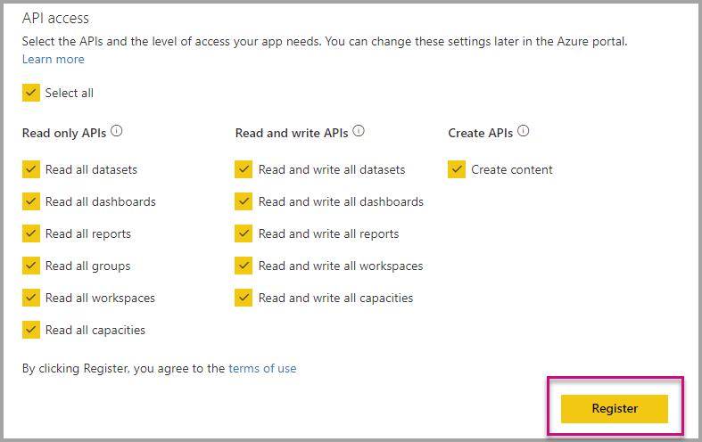
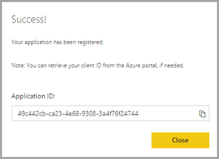
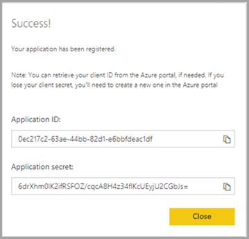
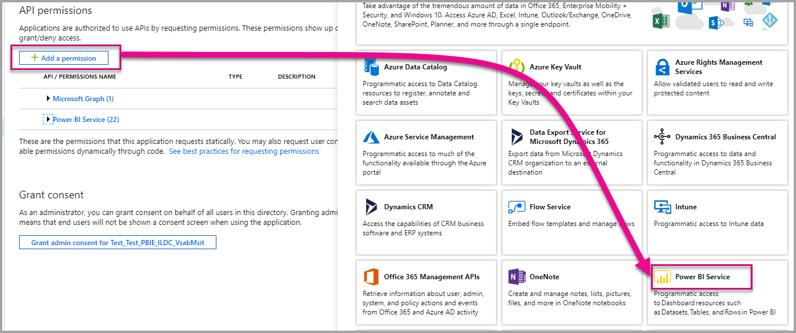

# Register an Azure AD application to use with Power BI

Learn how to register an application within Azure Active Directory (Azure AD) for use with embedding Power BI content.

You register your application with Azure AD to allow your application access to the [Power BI REST APIs](https://docs.microsoft.com/rest/api/power-bi/). Once you register your application, you can establish an identity for your application and specify permissions to Power BI REST resources.

> [!IMPORTANT]
> Before you register a Power BI app you need an [Azure Active Directory tenant and an organizational user](create-an-azure-active-directory-tenant.md). If you haven't signed up for Power BI with a user in your tenant, the app registration doesn't complete successfully.

There are two ways to register your application. The first is with the [Power BI App Registration Tool](https://dev.powerbi.com/apps/), or you can do it directly within the Azure portal. The Power BI App Registration Tool is more convenient to use since there are just a few fields to complete. Use the Azure portal if you want to make changes to your app.

## Register with the Power BI Application Registration Tool

Register your application in **Azure Active Directory** to establish an identity for your application and specify permissions to Power BI REST resources. When you register an application, such as a console app or a website, you receive an identifier, which is used by the application to identify themselves to the users that they're requesting permissions.

Here's how to register your application with the Power BI App Registration Tool:

1. Go to [dev.powerbi.com/apps](https://dev.powerbi.com/apps).

2. Select **Sign in** with your existing account then select **Next**.

3. Provide an **Application Name**.

4. Provide an **Application Type**.

    Here are the differences for why you choose **Native** versus **Server-side web applications** for an application type.

    Native:
    * You plan on creating an application that is [designed for your customers](embed-sample-for-customers.md) using a master user account (a Power BI Pro license used for signing in to Power BI) to authenticate.

    Server-side web application:
    * You plan on creating an application [designed for your organization](embed-sample-for-your-organization.md).
    * You plan on creating an application [designed for your customers](embed-sample-for-customers.md) using service principal to authenticate.
    * You plan on creating web apps or web APIs.

    

5. If you selected **Server-side web application** for the application type, then continue with entering a value for **Home Page URL** and **Redirect URL**. The **Redirect URL** works with any valid URL and should correspond with the application you've created. If you selected **Native**, then continue to step 6.

6. Choose the Power BI APIs that your application needs. For more information about Power BI access permissions, see [Power BI Permissions](power-bi-permissions.md). Then select **Register**.

    

    > [!Important]
    > If you enable service principals to be used with Power BI, the Azure Active Directory permissions don't take effect anymore. The permissions are managed through the Power BI admin portal.

7. If you choose **Native** for the application type, then you're then provided an **Application ID**. If you select **Server-side Web app** for the application type, then you receive an **Application ID** and an **Application secret**.

    > [!Note]
    > The **Application ID** can be retrieved from the Azure portal, at a later time, if needed. If you lose the **Application secret**, you need to create a new one within the Azure portal.

| Native | Server-side web application |
|--------|-----------------------------|
|  |  |

You can now use the registered application as part of your custom application to interact with the Power BI service and with your Power BI Embedded application.

## Register with the Azure portal

Your other option for registering your application is to do so directly in the Azure portal. To register your application, follow these steps.

1. Accept the [Microsoft Power BI API Terms](https://powerbi.microsoft.com/api-terms).

2. Sign into the [Azure portal](https://portal.azure.com).

3. Choose your Azure AD tenant by selecting your account in the top-right corner of the page.

4. In the left-hand navigation pane, go to **All services**, select **App Registrations** and then select **New registration**.

5. Follow the prompts and create a new application.

   For more information about how to register applications in Azure Active Directory, see [Register an app with the Azure Active Directory](https://docs.microsoft.com/azure/active-directory/develop/quickstart-v2-register-an-app)

## How to get the Application ID

When you register an application, you receive an [Application ID](embed-sample-for-customers.md#application-id).  The **Application ID** requests permissions to the users by the application to identify themselves.

## How to get the service principal object ID

When using the [Power BI APIs](https://docs.microsoft.com/rest/api/power-bi/), make sure to define operations using the [service principal object ID](embed-service-principal.md#how-to-get-the-service-principal-object-id) to reference the service principal - for example, applying a service principal as an admin to a workspace.

## Apply permissions to your application within Azure AD

Enable additional permissions to your application in addition to what the app registration page provides. You can accomplish this task through the Azure AD portal, or programmatically.

You want to be logged in with either the *master* account, used for embedding, or a Global admin account.

### Using the Azure AD portal

1. Browse to [App registrations](https://portal.azure.com/#blade/Microsoft_AAD_IAM/ApplicationsListBlade) within the Azure portal and select the app that you're using for embedding.

2. Select **API permissions** under **Manage**.

3. Within **API permissions**, select **Add a permission**, then select **Power BI Service**.

    

4. Select the specific permissions you need under **Delegated Permissions**. Select them one by one to save the selections. Select **Save** when done.

5. Select **Grant Consent**.

    The **Grant Consent** action needs for the *master account* to avoid being prompted for consent by Azure AD. If the account performing this action is a Global Admin, you grant permissions to all users within your organization for this application. If the account performing this action is the *master account* and isn't a Global Admin, you grant permissions only to the *master account* for this application.

### Applying permissions programmatically

1. You need to get the existing service principals (users) within your tenant. For information on how to do that, see [servicePrincipal](https://docs.microsoft.com/graph/api/resources/serviceprincipal?view=graph-rest-beta).

    You can call the *Get servicePrincipal* API without {ID}, and it gets you all of the service principals within the tenant.

2. Check for a service principal with your app application ID as **appId** property.

3. Create a new service plan if missing from your app.

    ```json
    Post https://graph.microsoft.com/beta/servicePrincipals
    Authorization: Bearer ey..qw
    Content-Type: application/json
    {
    "accountEnabled" : true,
    "appId" : "{App_Client_ID}",
    "displayName" : "{App_DisplayName}"
    }
    ```

4. Grant App Permissions to Power BI API

   If you're using an existing tenant, and not interested in granting permissions on behalf of all tenant users, you can grant permissions to a specific user by replacing the value of **contentType** to **Principal**.

   The value for **consentType** can supply either **AllPrincipals** or **Principal**.

   * **AllPrincipals** can only be used by a tenant admin to grant permissions on behalf of all users in the tenant.
   * **Principal** is used to grant permissions on behalf of a specific user. In this case, an additional property should be added to the request's body - *principalId={User_ObjectId}*.

     You need to *Grant permissions* for the master account to avoid being prompted for consent by Azure AD, which isn't possible when doing non-interactive sign-in.

     ```json
     Post https://graph.microsoft.com/beta/OAuth2PermissionGrants
     Authorization: Bearer ey..qw
     Content-Type: application/json
     {
     "clientId":"{Service_Plan_ID}",
     "consentType":"AllPrincipals",
     "resourceId":"c78a3685-1ce7-52cd-95f7-dc5aea8ec98e",
     "scope":"Dataset.ReadWrite.All Dashboard.Read.All Report.Read.All Group.Read Group.Read.All Content.Create Metadata.View_Any Dataset.Read.All Data.Alter_Any",
     "expiryTime":"2018-03-29T14:35:32.4943409+03:00",
     "startTime":"2017-03-29T14:35:32.4933413+03:00"
     }
     ```

    The **resourceId** *c78a3685-1ce7-52cd-95f7-dc5aea8ec98e* isn't universal but it's tenant dependant. This value is the objectId of the “Power BI Service” application in the Azure Active Directory (AAD) tenant.

    The user can quickly get this value in the Azure portal:
    1. https://portal.azure.com/#blade/Microsoft_AAD_IAM/StartboardApplicationsMenuBlade/AllApps

    2. Search for “Power BI Service” in the SearchBox

5. Grant App Permissions to Azure Active Directory (AAD)

   The value for **consentType** can supply either **AllPrincipals** or **Principal**.

   * **AllPrincipals** can only be used by a tenant admin to grant permissions for all users in the tenant.
   * **Principal** is used to grant permissions for a specific user. In this case, an additional property should be added to the request's body - *principalId={User_ObjectId}*.

   You need to *Grant permissions* for the master account to avoid being prompted for consent by Azure AD, which isn't possible when doing non-interactive sign-in.

   ```json
   Post https://graph.microsoft.com/beta/OAuth2PermissionGrants
   Authorization: Bearer ey..qw
   Content-Type: application/json
   { 
   "clientId":"{Service_Plan_ID}",
   "consentType":"AllPrincipals",
   "resourceId":"61e57743-d5cf-41ba-bd1a-2b381390a3f1",
   "scope":"User.Read Directory.AccessAsUser.All",
   "expiryTime":"2018-03-29T14:35:32.4943409+03:00",
   "startTime":"2017-03-29T14:35:32.4933413+03:00"
   }
   ```

## Next steps

Now that you've registered your application within Azure AD, you need to authenticate users within your application. Have a look at [Authenticate users and get an Azure AD access token for your Power BI app](get-azuread-access-token.md) to learn more.

More questions? [Try asking the Power BI Community](https://community.powerbi.com/)