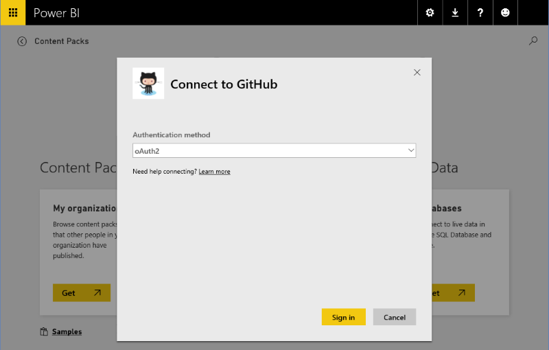

# Template content pack experiences in Power BI
This section highlights a typical experience for a user connecting to an ISV [content pack](../service-connect-to-services.md). 

Try the connection experience yourself by connecting to a released content pack at https://app.powerbi.com/getdata/services (such as the [GitHub content pack](https://app.powerbi.com/getdata/services/github) described below).

## Connect
To get started, a user browses the content pack gallery and selects a content pack to connect to. The content pack entry provides a name, an icon and a descriptive text providing more information to the user.

## Parameters
Once selected, the user will be prompted to provide parameters (if requried). The parameters dialog is provided declaratively by the author during the creation of the content pack.

Currently the parameters UI is very basic – there is no way to enumerate drop down lists and data input validation is constrained to regex.

## Credentials
After parameters, the user will be prompted to login.  If the source supports multiple types of authentication, the user will choose the appropriate option. If the source requires OAuth, then the service’s login UI will pop up when the user presses Sign In.  Otherwise, the user can enter their credentials in the provided dialog.

## Instantiation
When login succeeds, the artifacts included in the content pack - model, reports, and dashboard - appear in the navigation bar.  These artifacts are added to each users’ account.  The data load asynchronously to populate the dataset (model).  The user is then able to consume the dashboard, reports, and model.

By default a daily refresh schedule is configured for the user, which will re-evaluate the queries in the model.  The credentials provided to the user must allow them to refresh the data without being present.

## Exploration and Monitoring
Once the content pack is hydrated into the users’ account, they can explore and monitor the data/insights.

Typically this includes:

* Viewing and customizing the dashboard.
* Viewing and customizing the report.
* Using natural language to ask questions of the data
* Using the exploration canvas to explore the data in the data model

Consideration should be made for providing natural language modelling (synonyms) and understandable model schema to enable better exploration experiences.

