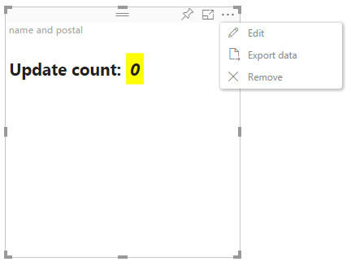

# Advanced edit mode

Visuals that require advanced UI controls can declare support of Advanced Edit Mode.
If supported, when in report editing mode, an `Edit` button will appear in the visual's menu.
When the `Edit` button is clicked, EditMode is set to `Advanced`.
The visual can use the EditMode flag to determine should display such UI controls.

By default, the visual isn't support Advanced Edit Mode.
If a different behavior is required, it should be explicitly stated in the visual's `capabilities.json` file, by setting the `advancedEditModeSupport` property.

The possible values are:

- 0 - NotSupported

- 1 - SupportedNoAction

- 2 - SupportedInFocus

## Entering Advanced Edit Mode

`Edit` button will be visible if:
- 1- `advancedEditModeSupport` property set in capabilities.json to either `SupportedNoAction` or `SupportedInFocus`
- 2- The visual is viewed in report editing mode.

If `advancedEditModeSupport` property is missing from capabilities.json, or set to `NotSupported`, the 'Edit' button will disappear.

When the user clicks on `Edit`, the visual will get an update() call with EditMode set to `Advanced`.
According to the value set in the capabilities, the following actions will occur:

* `SupportedNoAction` - No further action by the host.
* `SupportedInFocus` - The host pops out the visual into in focus mode.
