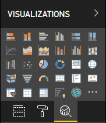

# Analytics pane

**Analytics pane** was [introduced for native visuals](https://docs.microsoft.com/power-bi/desktop-analytics-pane) on November 2018.
Custom visuals with api API v2.5.0 can present and manage their properties in the **Analytics pane**.



It's handled similarly to [managing properties in the Format pane](https://docs.microsoft.com/power-bi/developer/custom-visual-develop-tutorial-format-options), 
by defining an object in the visual's capabilities.json file. 

The differences are as follows:

1. Under the `object`'s definition, add an `objectCategory` field with a value of 2.

> [!NOTE]
> The `objectCategory` field is an optional field introduced in API 2.5.0. It defines the aspect of the visual that the object controls (1 = Formatting, 2 = Analytics). "Formatting" is used for look-and-feel, colors, axes, labels etc. "Analytics" is used for forecasts, trendlines, reference lines, and shapes so on.
>
> `objectCategory` defaults to "Formatting" if omitted.

2. The object must have the two following properties:
    1. `show` of type bool, with default value of false.
    2. `displayName` of type text. The default value you'll choose will become the instance's initial display name.

```json
{
  "objects": {
    "YourAnalyticsPropertiesCard": {
      "displayName": "Your analytics properties card's name",
      "objectCategory": 2,
      "properties: {
        "show": {
          "type": {
            "bool": true
          }
        },
        "displayName": {
          "type": {
            "text": true
          }
        },
      ... //any other properties for your Analytics card
      }
    }
  ...
  }
}
```

Any other properties may be defined in the same way as done for Format objects. Object enumeration is done exactly the same as in **Format pane**.

***Known limitations and issues***

  1. No multi-instance support yet (coming soon). Objects can't have a [selector](https://microsoft.github.io/PowerBI-visuals/docs/concepts/objects-and-properties/#selector) other than static (that is "selector": null), and custom visuals can't have user-defined multiple instances of a card.
  2. Properties of type `integer` are't displayed correctly. As a workaround, use type `numeric` instead.

> [!NOTE]
> Use the Analytics pane only for objects that add new information or shed new light on the presented information. For instance, dynamic reference lines illustrating important trends.
> Any options that control the look-and-feel of the visual, that is, formatting, should be kept in the Formatting pane.
