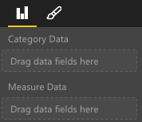
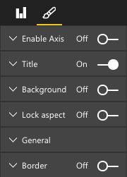
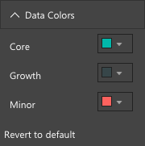

# Building Bar Chart
This is step by step guide how to build simple Bar Chart Visual.

It includes following parts:
* [Building a Static Visual](#building-a-static-visual)
* [Adding Databinding to Bar Chart](#adding-databinding-to-bar-chart)
* [Adding Color to your Visual](#adding-color-to-your-visual)
* [Adding Selection and Interactions with Other Visuals](#adding-selection-and-interactions-with-other-visuals)
* [Adding static objects to property pane](#adding-static-objects-to-property-pane)
* [Adding Databound Objects to Property Pane](#adding-databound-objects-to-property-pane)
* [Adding ToolTips to the Bar Chart](#adding-tooltips-to-the-bar-chart)
* [Adding a Slider control to the Bar Chart](#adding-a-slider-control-to-the-bar-chart)
* [Final Package for Distribution](#final-package-for-distribution)

## Building a Static Visual
Typically, it is easier to build your visual with static data before adding Power BI data binding.
See the [commit](https://github.com/Microsoft/PowerBI-visuals-sampleBarChart/commit/f5ef02a5851c98671b46fedc1e7f7e7133001d7c) for what was added at this step.

### Setting up ViewModel
It is important to define your view model now and iterate on what is exposed to your visual as you are building it.

```typescript
/**
 * Interface for BarCharts viewmodel.
 *
 * @interface
 * @property {BarChartDataPoint[]} dataPoints - Set of data points the visual will render.
 * @property {number} dataMax                 - Maximum data value in the set of data points.
 */
interface BarChartViewModel {
    dataPoints: BarChartDataPoint[];
    dataMax: number;
};

/**
 * Interface for BarChart data points.
 *
 * @interface
 * @property {number} value    - Data value for the point.
 * @property {string} category - Corresponding category of the data value.
 */
interface BarChartDataPoint {
    value: number;
    category: string;
};
```

### Using Static Data
Using static data is a great way to test your visual without databinding.
Please note that your view model will not be changed even when databinding is added. We will go into how to add databinding to your visual later.

```typescript
let testData: BarChartDataPoint[] = [
    {
        value: 10,
        category: 'a'
    },
    {
        value: 20,
        category: 'b'
    },
    {
        value: 1,
        category: 'c'
    },
    {
        value: 100,
        category: 'd'
    },
    {
        value: 500,
        category: 'e'
    }];

let viewModel: BarChartViewModel = {
    dataPoints: testData,
    dataMax: d3.max(testData.map((dataPoint) => dataPoint.value))
};
```

## Adding Databinding to Bar Chart
Databinding can be done by defining your visual capabilities.
See the [commit](https://github.com/Microsoft/PowerBI-visuals-sampleBarChart/commit/3c6e8186436b63bf0cf97d2cdd5dde8aa8d08709) for what was added at this step.

To add databinding, all changes will be located in `capabilities.json`. A sample schema is already in place for you.

Databinding can be done on the field well.



### Adding Data Roles
Currently, data roles are added for you, but it still can be customized.

`displayName` is the name shown on the field well.
`name` is the internal name used to refer to this data role.

`0` for the kind property refers to the grouping or category. Groupings resemble a discrete number of values.
`1` for the kind property refers to the values for each of the groupings.

```json
"dataRoles": [
    {
        "displayName": "Category Data",
        "name": "category",
        "kind": 0
    },
    {
        "displayName": "Measure Data",
        "name": "measure",
        "kind": 1
    }
],
```

For more information, see the section about [Data Roles](./capabilities.md#define-the-data-fields-your-visual-expects-dataroles).

### Adding Conditions to DataViewMapping
Define conditions within your dataViewMappings to determine how many fields can be bound for each field well.
Use the internal `name` defined in your dataRoles to refer to each field.

```json
    "dataViewMappings": [
        {
            "conditions": [
                {
                    "category": {
                        "max": 1
                    },
                    "measure": {
                        "max": 1
                    }
                }
            ],
        }
    ]
```

For more information, see the section about [Data View Mapping](./dataview-mappings.md).

### Defining and Using `visualTransform`
DataView is the structure that PowerBI provides to your visual and it contains the queried data to be visualized.

However, `DataView` provides your data in different forms such as categorical and tabular forms. In this instance we're building a categorical visual and we will only need to use the categorical property on the `DataView`.

Defining `visualTransform` will allow you to convert `DataView` into a view model your visual will use.

`IVisualHost` is required, if you are going to assign colors and selection to them when defining individual data points.

```typescript
/**
 * Function that converts queried data into a view model that will be used by the visual
 *
 * @function
 * @param {VisualUpdateOptions} options - Contains references to the size of the container
 *                                        and the dataView which contains all the data
 *                                        the visual had queried.
 * @param {IVisualHost} host            - Contains references to the host which contains services
 */
function visualTransform(options: VisualUpdateOptions, host: IVisualHost): BarChartViewModel {
    /*Convert dataView to your viewModel*/
}

```
See the [commit](https://github.com/Microsoft/PowerBI-visuals-sampleBarChart/commit/3c6e8186436b63bf0cf97d2cdd5dde8aa8d08709) for what was added to visualTransform.

## Adding Color to your Visual 
Color is exposed as one of the services available on `IVisualHost`.

See the [commit](https://github.com/Microsoft/PowerBI-visuals-sampleBarChart/commit/a521bc6b9930f630861dc08e27330030766ae057) for what was added at this step.

### Add Color to Data Points
Each data point will be represented by a different color. Add color to the BarChartDataPoint interface.

```typescript
/**
 * Interface for BarChart data points.
 *
 * @interface
 * @property {number} value    - Data value for the point.
 * @property {string} category - Corresponding category of the data value.
 * @property {string} color    - Color corresponding to the data point.
 */
interface BarChartDataPoint {
    value: number;
    category: string;
    color: string;
};
```

### Color Palette
`colorPalette` is a service that manages the colors used in your visual, its instance is available on `IVisualHost`.

### Assigning Color to Data Points
We defined `visualTransform` as a construct to convert `dataView` to a view model Bar Chart can use.
Since we iterate through the data points in `visualTransform` it is also the ideal place to assign colors.

```typescript
let colorPalette: IColorPalette = host.colorPalette; // host: IVisualHost
for (let i = 0, len = Math.max(category.values.length, dataValue.values.length); i < len; i++) {
    barChartDataPoints.push({
        category: category.values[i],
        value: dataValue.values[i],
        color: colorPalette.getColor(category.values[i]).value,
    });
}
```

## Adding Selection and Interactions with Other Visuals
Selection provides the ability for the user to interact both with your visual and other visuals.

See the [commit](https://github.com/Microsoft/PowerBI-visuals-sampleBarChart/commit/b765940e9b9a14b3360cded30b329224ab572475) for what was added at this step.

### Adding Selection to Each Data Point
Since each data point is unique, selection must be added to each data point. Add a property for selection on `BarChartDataPoint` interface.

```typescript
/**
 * Interface for BarChart data points.
 *
 * @interface
 * @property {number} value             - Data value for the point.
 * @property {string} category          - Corresponding category of data value.
 * @property {string} color             - Color corresponding to data point.
 * @property {ISelectionId} selectionId - Id assigned to data point for cross filtering
 *                                        and visual interaction.
 */
interface BarChartDataPoint {
    value: number;
    category: string;
    color: string;
    selectionId: ISelectionId;
};
```

### Assigning Selection Ids to Each Data Point
Since we iterate through the data points in `visualTransform` it is also the ideal place to create your selection IDs.
The host variable is a `IVisualHost`, which contains services that the visual may use, such as color and selection builder.

Use the selection builder factory method on `IVisualHost` to create a new selection id.
Since we're making selection only based on the category, we only need to define selection `withCategory`.

> **NOTE**: A new selection builder must be created per data point.

```typescript
for (let i = 0, len = Math.max(category.values.length, dataValue.values.length); i < len; i++) {
    barChartDataPoints.push({
        category: category.values[i],
        value: dataValue.values[i],
        color: colorPalette.getColor(category.values[i]).value,
        selectionId: host.createSelectionIdBuilder()
            .withCategory(category, i)
            .createSelectionId()
    });
}
```

For more information, see the section about using [Selection Id Builder](./selection-api.md#create-an-instance-of-the-selection-builder).

### Interacting with your Data Points
Each bar of the Bar Chart can be interacted with, once a selection id is assigned to the data point.
The bar chart will listen to click events.

Use the selection manager factory method on `IVisualHost` to create selection manager for cross filtering and clearing selections.

```typescript
let selectionManager = this.selectionManager;

//This must be an anonymous function instead of a lambda because
//d3 uses 'this' as the reference to the element that was clicked.
bars.on('click', function(d) {
    selectionManager.select(d.selectionId).then((ids: ISelectionId[]) => {
        bars.attr({
            'fill-opacity': ids.length > 0 ? BarChart.Config.transparentOpacity : BarChart.Config.solidOpacity
        });

        d3.select(this).attr({
            'fill-opacity': BarChart.Config.solidOpacity
        });
    });

    (<Event>d3.event).stopPropagation();
});
```

For more information, see the section about using [Selection Manager](./selection-api.md#how-to-use-selectionmanager-to-select-data-points).


## Adding static objects to property pane
Objects can be added to further customize what the visual can do. These customizations can just be UI changes, but can also be changes related to the data that was queried.
We will use static objects to render the X-axis for the Bar Chart.

Objects can be toggled on the property pane.



See the [commit](https://github.com/Microsoft/PowerBI-visuals-sampleBarChart/commit/7602bb5c34aca97f02ea8e713f841a4ce19929c7) for what was added at this step.

### Define Object in Capabilities
Define an objects property inside your capabilities. This defines the object you plan to display in the property pane.
`enableAxis` is the internal name that will be referred to in the `dataView`.
`displayName` is the name that will be shown on the property pane.

`bool` is a `PrimitiveValue` and it is typically used with static objects such as text boxes or switches.

**NOTE**: `show` is a special property on `properties`. It enables the switch on the actual object. Since show is a switch, it is typed as a `bool`.


```typescript
"objects": {
    "enableAxis": {
        "displayName": "Enable Axis",
        "properties": {
            "show": {
                "displayName": "Enable Axis",
                "type": { "bool": true }
            }
        }
    }
}
```

For more information, see the section about using [Objects](./objects-properties.md).

### DataViewObjectsParser class for parsing property settings

The basic principles of defining property settings are described below.
Please note, that you can also use the utility classes defined in powerbi-visuals-utils-dataviewutils package for defining settings properties.

For more information on this topic see the [documentation](https://github.com/Microsoft/powerbi-visuals-utils-dataviewutils/blob/master/docs/api/data-view-objects-parser.md) and sample on how to use `DataViewObjectsParser` class.

### Defining Property Settings
Although this is optional, it is best to localize most settings onto a single object so that all settings can be easily referenced.

```typescript
/**
 * Interface for BarCharts viewmodel.
 *
 * @interface
 * @property {BarChartDataPoint[]} dataPoints - Set of data points the visual will render.
 * @property {number} dataMax                 - Maximum data value in the set of data points.
 * @property {BarChartSettings} settings      - Object property settings
 */
interface BarChartViewModel {
    dataPoints: BarChartDataPoint[];
    dataMax: number;
    settings: BarChartSettings;
};

/**
 * Interface for BarChart settings.
 *
 * @interface
 * @property "show" enableAxis - Object property that allows axis to be enabled.
 */
interface BarChartSettings {
    enableAxis: {
        show: boolean;
    };
}
```

### Defining and Using Object Enumeration Utility
Object property values are available as metadata on the `dataView`. However, there is currently no service to help retrieve these properties.
ObjectEnumerationUtility is a set of static functions used to retrieve object values from the `dataView`. ObjectEnumerationUtility can be used for other visual projects.

**NOTE**: Object Enumeration Utility is optional, but it is great option to iterate through the `dataView` and retrieve object properties.

```typescript
/**
 * Gets property value for a particular object.
 *
 * @function
 * @param {DataViewObjects} objects - Map of defined objects.
 * @param {string} objectName       - Name of desired object.
 * @param {string} propertyName     - Name of desired property.
 * @param {T} defaultValue          - Default value of desired property.
 */
export function getValue<T>(objects: DataViewObjects, objectName: string, propertyName: string, defaultValue: T ): T {
    if(objects) {
        let object = objects[objectName];
        if(object) {
            let property: T = object[propertyName];
            if(property !== undefined) {
                return property;
            }
        }
    }
    return defaultValue;
}
```

See [objectEnumerationUtility.ts](https://github.com/Microsoft/PowerBI-visuals-sampleBarChart/blob/master/src/objectEnumerationUtility.ts) for source code.

### Retrieving Property Values from DataView
`visualTransform` is the ideal place to manipulate the visual's viewmodel. We will continue this pattern and retrieve the object properties from the `dataView`.

Define the default state of the property and use getValue to retrieve the property from the `dataView`.

```typescript
let defaultSettings: BarChartSettings = {
    enableAxis: {
        show: false,
    }
};

let barChartSettings: BarChartSettings = {
    enableAxis: {
        show: getValue<boolean>(objects, 'enableAxis', 'show', defaultSettings.enableAxis.show),
    }
}
```

### Populate Property Pane with `enumerateObjectInstances`
`enumerateObjectInstances` is an optional method on `IVisual`. Its purpose is to enumerate through all objects and to place them within the property pane.
Each object will be called with `enumerateObjectInstances`. The object's name will be available on `EnumerateVisualObjectInstancesOptions`.

For each object, define the property with its current state.

```typescript
/**
 * Enumerates through the objects defined in the capabilities and adds the properties to the format pane
 *
 * @function
 * @param {EnumerateVisualObjectInstancesOptions} options - Map of defined objects
 */
public enumerateObjectInstances(options: EnumerateVisualObjectInstancesOptions): VisualObjectInstanceEnumeration {
    let objectName = options.objectName;
    let objectEnumeration: VisualObjectInstance[] = [];

    switch(objectName) {
        case 'enableAxis':
            objectEnumeration.push({
                objectName: objectName,
                properties: {
                    show: this.barChartSettings.enableAxis.show,
                },
                selector: null
            });
    };

    return objectEnumeration;
}
```

### Control Property Logic in Update
Once an object has been added to the property pane, each toggle will trigger an update.
Add specific object logic in `if` blocks.

```typescript
if(settings.enableAxis.show) {
    let margins = BarChart.Config.margins;
    height -= margins.bottom;
}
```

## Adding Databound Objects to Property Pane
Databound objects are similar to static objects, however they typically deal with data selection.
We will change the color associated with the data point.



See the [commit](https://github.com/Microsoft/PowerBI-visuals-sampleBarChart/commit/3018a4ef020ee5de8a87be5f29f008bd5cf8fe63) for what was added at this step.

### Define Object in Capabilities
Similar to static objects, we will define another object in the capabilities
`colorSelector` is the internal name that will be referenced in the `dataView`.
`displayName` is the name that will be shown on the property pane.

`fill`  is a `StructuralObjectValue` and it is not associated with a primitive type.

```typescript
"colorSelector": {
    "displayName": "Data Colors",
    "properties": {
        "fill": {
            "displayName": "Color",
            "type": {
                "fill": {
                    "solid": {
                        "color": true
                    }
                }
            }
        }
    }
}
```

For more information, see the section about using [Objects](./objects-properties.md).

### Using Object Enumeration Utility
Similarly with static objects, we will need to retrieve object details from the `dataView`. However, instead of the object values being within metadata, the object values are associated with each category.

```typescript
/**
 * Gets property value for a particular object in a category.
 *
 * @function
 * @param {DataViewCategoryColumn} category - List of category objects.
 * @param {number} index                    - Index of category object.
 * @param {string} objectName               - Name of desired object.
 * @param {string} propertyName             - Name of desired property.
 * @param {T} defaultValue                  - Default value of desired property.
 */
export function getCategoricalObjectValue<T>(category: DataViewCategoryColumn, index: number, objectName: string, propertyName: string, defaultValue: T): T {
    let categoryObjects = category.objects;

    if(categoryObjects) {
        let categoryObject: DataViewObject = categoryObjects[index];
        if(categoryObject) {
            let object = categoryObject[objectName];
            if(object) {
                let property: T = object[propertyName];
                if(property !== undefined) {
                    return property;
                }
            }
        }
    }
    return defaultValue;
}
```

See [objectEnumerationUtility.ts](https://github.com/Microsoft/PowerBI-visuals-sampleBarChart/blob/master/src/objectEnumerationUtility.ts) for source code.

### Defining Default Color and Retrieving Categorical Object from DataView
Each color is now associated with each category inside `dataView`. We will set each data point to its corresponding color.

```typescript
for (let i = 0, len = Math.max(category.values.length, dataValue.values.length); i < len; i++) {
    let defaultColor: Fill = {
        solid: {
            color: colorPalette.getColor(category.values[i]).value
        }
    }

    barChartDataPoints.push({
        category: category.values[i],
        value: dataValue.values[i],
        color: getCategoricalObjectValue<Fill>(category, i, 'colorSelector', 'fill', defaultColor).solid.color,
        selectionId: host.createSelectionIdBuilder()
            .withCategory(category, i)
            .createSelectionId()
    });
}
```

### Populate Property Pane with `enumerateObjectInstances`
`enumerateObjectInstances` is used to populate the property pane with objects. 
For this instance, we would like to add a color picker per category we have. Each category will be rendered on the property pane.

We will do this by adding an additional case to the switch statement for `colorSelector` and iterate through each data point with the associated color.

Selection is required to associate the color with the datapoint.

```typescript
/**
 * Enumerates through the objects defined in the capabilities and adds the properties to the format pane
 *
 * @function
 * @param {EnumerateVisualObjectInstancesOptions} options - Map of defined objects
 */
public enumerateObjectInstances(options: EnumerateVisualObjectInstancesOptions): VisualObjectInstanceEnumeration {
    let objectName = options.objectName;
    let objectEnumeration: VisualObjectInstance[] = [];

    switch(objectName) {
        case 'enableAxis':
            objectEnumeration.push({
                objectName: objectName,
                properties: {
                    show: this.barChartSettings.enableAxis.show,
                },
                selector: null
            });
            break;
        case 'colorSelector':
            for(let barDataPoint of this.barDataPoints) {
                objectEnumeration.push({
                    objectName: objectName,
                    displayName: barDataPoint.category,
                    properties: {
                        fill: {
                            solid: {
                                color: barDataPoint.color
                            }
                        }
                    },
                    selector: barDataPoint.selectionId.getSelector()
                });
            }
            break;
    };

    return objectEnumeration;
}
```

After providing a selector for each property, you will get the following dataView object array:


Where each item in the array `dataViews[0].categorical.categories[0].objects` corresponds to the concrete category of the dataset.

The function `getCategoricalObjectValue` just provides a convenient way of accessing properties by their category index. You must provide an `objectName` and `propertyName` matching with the object and property respectively in `capabilities.json`.


## Adding ToolTips to the Bar Chart
Tooltips were added to the sample BarChart for reference.
See the [commit](https://github.com/Microsoft/PowerBI-visuals-sampleBarChart/commit/981b021612d7b333adffe9f723ab27783c76fb14) for what was added at this step.
More detailed infromation can be found in the [documentation](./add-tooltips.md).

## Adding a Slider control to the Bar Chart
A Slider control was added to the sample BarChart for reference.
See the [commit](https://github.com/Microsoft/PowerBI-visuals-sampleBarChart/commit/e2e0bc5888d9a3ca305a7a7af5046068645c8b30) for what was added at this step.

## Final Package for Distribution

Before you can load your visual into [PowerBI Desktop](https://powerbi.microsoft.com/en-us/desktop/) or share it with the community in the [PowerBI Visual Gallery](https://visuals.powerbi.com/) you'll need to generate a `pbiviz` file.

To package your visual navigate to the root folder of your visual project (the directory containing `pbiviz.json`) and use the following command to generate a pbiviz file:

```bash
pbiviz package
```
This command will create a pbiviz file in the `dist/` directory of your visual project. If there is already a pbiviz file (from previous package operations) it will be overwritten.

## Next steps
Also you can add the following additional abilities to your visual:
* [Adding Context-Menu to the Bar Chart](./context-menu.md)
* [Landing page](./landing-page.md)
* [Launch url](./launch-url.md)
* [Locale support](./localization.md)