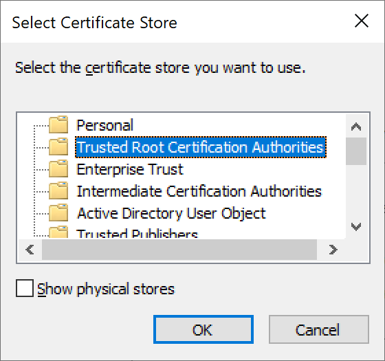
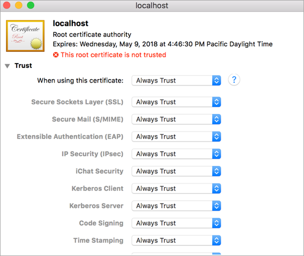
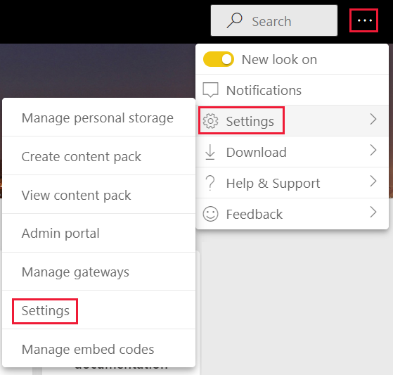

# Set up your environment for developing a Power BI visual

In this article, you'll learn how to set up your environment for developing a Power BI visual.

Before you start development, you'll need to install **node.js** and the **pbiviz** package. You'll also need to create and install a certificate.

When your local environment is set up, you'll need to prepare Power BI service for development.

## Installing node.js

*Node.js* is a JavaScript runtime built on Chrome's V8 JavaScript engine. It allows developers to run any apps created on JavaScript.

1. To install *node.js*, in a web browser, navigate to [node.js](https://nodejs.org).

2. Download the latest feature MSI installer.

3. Run the installer, and then follow the installation steps. Accept the terms of the license agreement and all defaults.

4. Restart your computer.

## Installing pbiviz

The *pbiviz* tool, which is written using JavaScript, compiles the visual source code of the *pbiviz* package.

The *pbiviz* package is a zipped Power BI visual with all the needed scripts and assets.

In this tutorial, you'll install the *pbiviz* package and make changes to it. You can view these changes in any Power BI report you can edit.

The *pbiviz*

1. Open Windows PowerShell and enter the following command.

    ```powershell
    npm i -g powerbi-visuals-tools
    ```

## Creating and installing a certificate

For a client (your computer) and a server (Power BI service) to interact securely, a [Secure Sockets Layer (SSL) Certificate](create-ssl-certificate.md) is required. Without a certificate to ensure secure interactions, they will be blocked by the browser.

# [Windows](#tab/windows)

This process describes running a PowerShell command that launches the **Certificate Import Wizard**. Follow the steps below to configure the certificate in the wizard.

>[!IMPORTANT]
>Do not close the PowerSell window during this procedure.

1. Open Windows PowerShell and enter the following command.

    ```powershell
    pbiviz --install-cert
    ```

    This command does two things:
    * It returns a result that produces a *passphrase*. In this case, the *passphrase* is **9765328806094**.
    * It also starts the Certificate Import Wizard.
    
    >[!div class="mx-imgBorder"]
    >

2. In the Certificate Import Wizard, verify that the store location is set to *Current User*, and click **Next**.

    >[!div class="mx-imgBorder"]
    >

3. In the **File to Import** window, click **Next**.

4. In the **Private Key Protection** window, in the *Password* box, paste the passphrase you received when executing the PowerShell command (step 1) and click **Next**. In this example, it's **9765328806094**.

    >[!div class="mx-imgBorder"]
    >

5. In the **Certificate Store** window, select the **Place all certificates in the following store** option, and click **Browse**.

    >[!div class="mx-imgBorder"]
    >

6. In the **Select Certificate Store** window, select **Trusted Root Certification Authorities** and then click **OK**.

    >[!div class="mx-imgBorder"]
    >

7. Click *Next* in the **Certificate Store** window.

    >[!div class="mx-imgBorder"]
    >

8. In the **Completing the Certificate Import Wizard** window, verify your settings and click **Finish**.

    >[!NOTE]
    >If you receive a security warning, click **Yes**.


# [OSX](#tab/sdk2osx)

1. If the lock in the upper left is locked, select it to unlock. Search for *localhost* and double-click on the certificate.

    

2. Select **Always Trust** and close the window.

    

3. Enter your username and password. Select **Update Settings**.

    

4. Close any browsers that you have open.

> [!NOTE]
> If the certificate is not recognized, you may need to restart your computer.

---

## Verify that your environment is set up

After setting up your environment, confirm that the Power BI visuals tools package is installed.

In PowerShell, run the command `pbiviz` and review the output, including the list of supported commands.

>[!div class="mx-imgBorder"]
>

## Set up Power BI service for development

To develop a Power BI visual, you'll need to enable custom visual debugging in Power BI service. Follow the instructions in this section to enable this option.

1. Sign in to [PowerBI.com](https://powerbi.microsoft.com/).

2. Navigate to **Settings** > **Settings** > **Settings**.

    >[!div class="mx-imgBorder"]
    >

3. From the **General** tab, select **Developer**. In the **Developer Settings** select the **Enable custom visual debugging using the developer visual** check box, and click **Apply**.

    >[!div class="mx-imgBorder"]
    >

## Next steps

> [!div class="nextstepaction"]
> [Create a Power BI circle card visual](develop-circle-card.md)

> [!div class="nextstepaction"]
> [Create a Power BI bar chart visual](create-bar-chart.md)