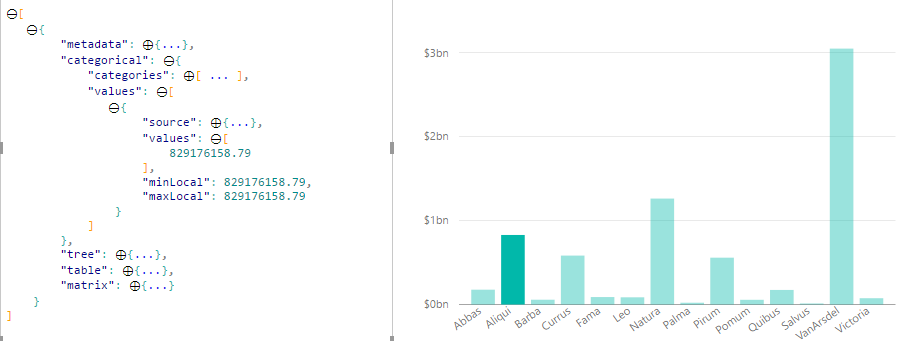
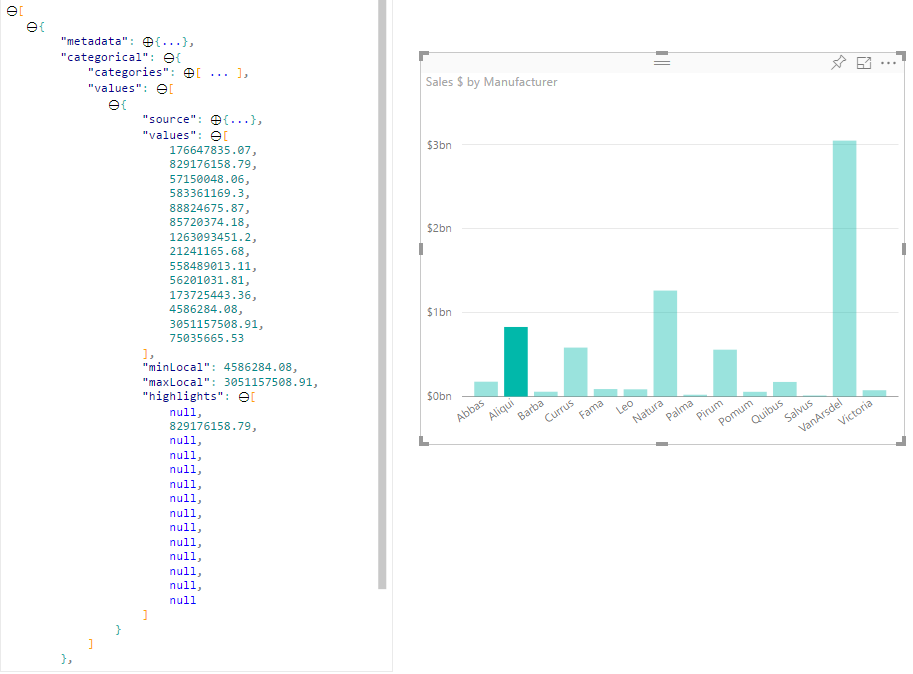

# Highlighting

By default whenever an element is selected the `values` array in the `dataView` object will be filtered to just the selected values. This will cause all other visuals on the page to display just the selected data.

## supportsHighlight

If you set the `supportsHighlight` property in your `capabilities.json` to `true` you will receive the full unfiltered `values` array along with a `highlights` array. The `highlights` array will be the same length as the values array and any non-selected values will be set to `null`. With this property enabled it is the visual's responsiblity to highlight the appropriate data by comparing the `values` array to the `highlights` array.

In the example above you'll notice that the one bar that is selected is the only value in the highlights array. It is also important to note there could be multiple selections and partial highlight (where the corresponding numeric value in the values and highlights arrays will be present but different) 