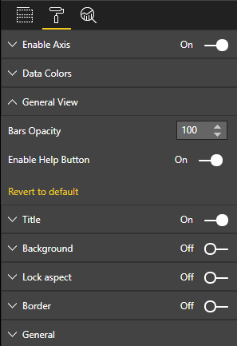

# Create a launch URL

By creating a launch URL, you can open a new browser tab (or window) by delegating the actual work to Power BI.

## Sample

```typescript
   this.host.launchUrl('https://powerbi.microsoft.com');
```

## Usage

Use the `host.launchUrl()` API call, passing your destination URL as a string argument:

```typescript
this.host.launchUrl('http://some.link.net');
```

## Restrictions

* Use only absolute paths, not relative paths. For example, use an absolute path such as `http://some.link.net/subfolder/page.html`. The relative path,`/page.html`, won't be opened.

* Currently, only *HTTP* and *HTTPS* protocols are supported. Avoid *FTP*, *MAILTO*, and so on.

## Best practices

* Usually, it's best to open a link only as a response to a user's explicit action. Make it easy for the user to understand that clicking the link or button will result in opening a new tab. Triggering a `launchUrl()` call without a user's action, or as a side effect of a different action can be confusing or frustrating for the user.

* If the link isn't essential for the proper functioning of the visual, we recommend that you give the report's author a way to disable and hide the link. This recommendation is especially relevant for special Power BI use cases, such as embedding a report in a third-party application or publishing it to the web.

* Avoid triggering a `launchUrl()` call from inside a loop, the visual's `update` function, or any other frequently recurring code.

## A step-by-step example

### Add a link-launching element

The following lines were added to the visual's `constructor` function:

```typescript
    this.helpLinkElement = this.createHelpLinkElement();
    options.element.appendChild(this.helpLinkElement);
```

A private function that creates and attaches the anchor element was added:

```typescript
private createHelpLinkElement(): Element {
    let linkElement = document.createElement("a");
    linkElement.textContent = "?";
    linkElement.setAttribute("title", "Open documentation");
    linkElement.setAttribute("class", "helpLink");
    linkElement.addEventListener("click", () => {
        this.host.launchUrl("https://docs.microsoft.com/power-bi/developer/custom-visual-develop-tutorial");
    });
    return linkElement;
};
```

Finally, an entry in the *visual.less* file defines the style for the link element:

```less
.helpLink {
    position: absolute;
    top: 0px;
    right: 12px;
    display: block;
    width: 20px;
    height: 20px;
    border: 2px solid #80B0E0;
    border-radius: 20px;
    color: #80B0E0;
    text-align: center;
    font-size: 16px;
    line-height: 20px;
    background-color: #FFFFFF;
    transition: all 900ms ease;

    &:hover {
        background-color: #DDEEFF;
        color: #5080B0;
        border-color: #5080B0;
        transition: all 250ms ease;
    }

    &.hidden {
        display: none;
    }
}
```

### Add a toggling mechanism

To add a toggling mechanism, you need to add a static object so that the report's author can toggle the visibility of the link element. (The default is set to *hidden*.) For more information, see the [static object tutorial](https://microsoft.github.io/PowerBI-visuals/docs/concepts/objects-and-properties).

A `showHelpLink` Boolean static object was added to the *capabilities.json* file's objects entry, as shown in the following code:

```typescript
"objects": {
    "generalView": {
            "displayName": "General View",
            "properties":
                "showHelpLink": {
                    "displayName": "Show Help Button",
                    "type": {
                        "bool": true
                    }
                }
            }
        }
    }
```



And, in the visual's `update` function, the following lines were added:

```typescript
if (settings.generalView.showHelpLink) {
    this.helpLinkElement.classList.remove("hidden");
} else {
    this.helpLinkElement.classList.add("hidden");
}
```

The *hidden* class is defined in the *visual.less* file to control the display of the element.
