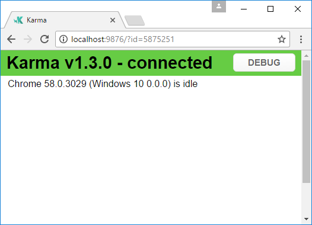
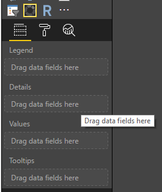
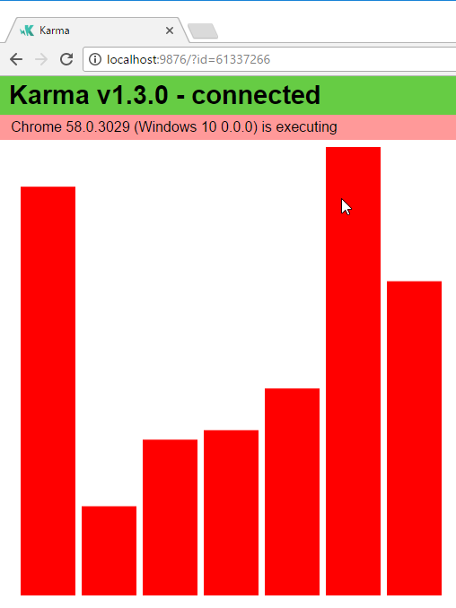
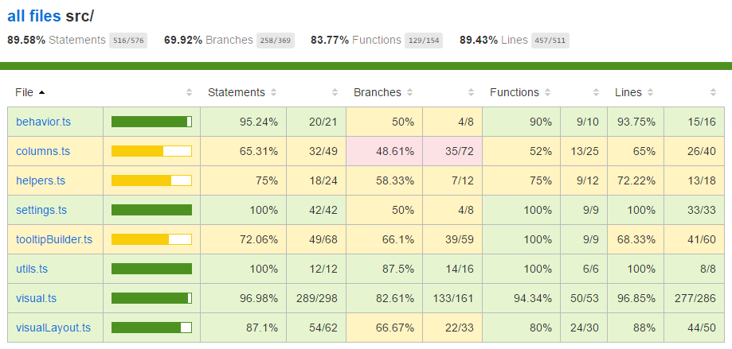
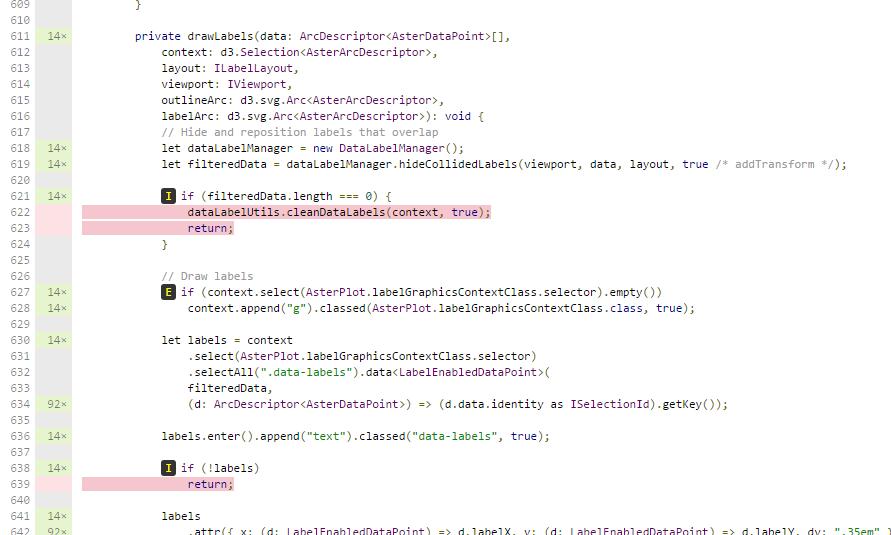

# Custom visuals unit tests

This tutorial describes basics of writing unit tests for your custom visuals. In this tutorial, we'll consider how to use test runner karma.js, testing framework - jasmine.js and also we'll consider how to use powerbi-visuals-utils-testutils package. It's a set of mocks and fakes to simplify unit testing for Power BI custom visuals.

## Install and configure karma.js and jasmine

Add required libraries into package.json at `devDependencies` section:

```json
"@babel/polyfill": "^7.2.5",
"@types/d3": "5.5.0",
"@types/jasmine": "2.5.37",
"@types/jasmine-jquery": "1.5.28",
"@types/jquery": "2.0.41",
"@types/karma": "3.0.0",
"@types/lodash-es": "4.17.1",
"coveralls": "3.0.2",
"istanbul-instrumenter-loader": "^3.0.1",
"jasmine": "2.5.2",
"jasmine-core": "2.5.2",
"jasmine-jquery": "2.1.1",
"jquery": "3.1.1",
"karma": "3.1.1",
"karma-chrome-launcher": "2.2.0",
"karma-coverage": "1.1.2",
"karma-coverage-istanbul-reporter": "^2.0.4",
"karma-jasmine": "2.0.1",
"karma-junit-reporter": "^1.2.0",
"karma-sourcemap-loader": "^0.3.7",
"karma-typescript": "^3.0.13",
"karma-typescript-preprocessor": "0.4.0",
"karma-webpack": "3.0.5",
"puppeteer": "1.17.0",
"style-loader": "0.23.1",
"ts-loader": "5.3.0",
"ts-node": "7.0.1",
"tslint": "^5.12.0",
"webpack": "4.26.0"
```

See the description below to find out more about the package.

Save `package.json` and execute on command line at `package.json` location:

```
npm install
```

The package manager will install all new packages added to `package.json`

For running unit tests, we'll need to configure the test runner and webpack config. The sample of config you can find here 

Sample of `test.webpack.config.js`:

```typescript
const path = require('path');
const webpack = require("webpack");

module.exports = {
    devtool: 'source-map',
    mode: 'development',
    optimization : {
        concatenateModules: false,
        minimize: false
    },
    module: {
        rules: [
            {
                test: /\.tsx?$/,
                use: 'ts-loader',
                exclude: /node_modules/
            },
            {
                test: /\.json$/,
                loader: 'json-loader'
            },
            {
                test: /\.tsx?$/i,
                enforce: 'post',
                include: /(src)/,
                exclude: /(node_modules|resources\/js\/vendor)/,
                loader: 'istanbul-instrumenter-loader',
                options: { esModules: true }
            },
            {
                test: /\.less$/,
                use: [
                    {
                        loader: 'style-loader'
                    },
                    {
                        loader: 'css-loader'
                    },
                    {
                        loader: 'less-loader',
                        options: {
                            paths: [path.resolve(__dirname, 'node_modules')]
                        }
                    }
                ]
            }
        ]
    },
    externals: {
        "powerbi-visuals-api": '{}'
    },
    resolve: {
        extensions: ['.tsx', '.ts', '.js', '.css']
    },
    output: {
        path: path.resolve(__dirname, ".tmp/test")
    },
    plugins: [
        new webpack.ProvidePlugin({
            'powerbi-visuals-api': null
        })
    ]
};
```

Sample of `karma.conf.ts`

```typescript
"use strict";

const webpackConfig = require("./test.webpack.config.js");
const tsconfig = require("./test.tsconfig.json");
const path = require("path");

const testRecursivePath = "test/visualTest.ts";
const srcOriginalRecursivePath = "src/**/*.ts";
const coverageFolder = "coverage";

process.env.CHROME_BIN = require("puppeteer").executablePath();

import { Config, ConfigOptions } from "karma";

module.exports = (config: Config) => {
    config.set(<ConfigOptions>{
        mode: "development",
        browserNoActivityTimeout: 100000,
        browsers: ["ChromeHeadless"],
        colors: true,
        frameworks: ["jasmine"],
        reporters: [
            "progress",
            "junit",
            "coverage-istanbul"
        ],
        junitReporter: {
            outputDir: path.join(__dirname, coverageFolder),
            outputFile: "TESTS-report.xml",
            useBrowserName: false
        },
        singleRun: true,
        plugins: [
            "karma-coverage",
            "karma-typescript",
            "karma-webpack",
            "karma-jasmine",
            "karma-sourcemap-loader",
            "karma-chrome-launcher",
            "karma-junit-reporter",
            "karma-coverage-istanbul-reporter"
        ],
        files: [
            "node_modules/jquery/dist/jquery.min.js",
            "node_modules/jasmine-jquery/lib/jasmine-jquery.js",
            {
                pattern: './capabilities.json',
                watched: false,
                served: true,
                included: false
            },
            testRecursivePath,
            {
                pattern: srcOriginalRecursivePath,
                included: false,
                served: true
            }
        ],
        preprocessors: {
            [testRecursivePath]: ["webpack", "coverage"]
        },
        typescriptPreprocessor: {
            options: tsconfig.compilerOptions
        },
        coverageIstanbulReporter: {
            reports: ["html", "lcovonly", "text-summary", "cobertura"],
            dir: path.join(__dirname, coverageFolder),
            'report-config': {
                html: {
                    subdir: 'html-report'
                }
            },
            combineBrowserReports: true,
            fixWebpackSourcePaths: true,
            verbose: false
        },
        coverageReporter: {
            dir: path.join(__dirname, coverageFolder),
            reporters: [
                // reporters not supporting the `file` property
                { type: 'html', subdir: 'html-report' },
                { type: 'lcov', subdir: 'lcov' },
                // reporters supporting the `file` property, use `subdir` to directly
                // output them in the `dir` directory
                { type: 'cobertura', subdir: '.', file: 'cobertura-coverage.xml' },
                { type: 'lcovonly', subdir: '.', file: 'report-lcovonly.txt' },
                { type: 'text-summary', subdir: '.', file: 'text-summary.txt' },
            ]
        },
        mime: {
            "text/x-typescript": ["ts", "tsx"]
        },
        webpack: webpackConfig,
        webpackMiddleware: {
            stats: "errors-only"
        }
    });
};
```

You can modify this configuration if it's required.

Some settings of `karma.conf.js`:

* `recursivePathToTests` variable locates place of code of tests.

* `srcRecursivePath` variable locates output JS code after compiling.

* `srcCssRecursivePath` variable locates output CSS after compilling less file with styles.

* `srcOriginalRecursivePath` variable locates source code of your visual.

* `coverageFolder` - variable determines a place where the report of coverage will be created.

Some properties of config:

* `singleRun: true` - tests run on CI system. And it's enough to single one time. 
You can change to `false` for debugging your tests. Karma will keep running browser, and it will allow you to use the console for debugging.

* `files: [...]` - in this array, you can set files for loading to the browser.
Usually, there are source files, test cases, libraries (jasmine, test utils). You can add to list other files if you need.

* `preprocessors` - this section of config you configure actions, which execute before unit tests execution. There are precompiling of typescript to JS and preparing source map files and generating code to generate code coverage report. You can disable `coverage` for debugging your tests. Coverage generates additional code for check code for the test coverage and it will complicate debugging tests. 

**Description of all configurations you can find in the [documentation](https://karma-runner.github.io/1.0/config/configuration-file.html) of karma.js**

o convenient use, you can add test command into `scripts`:

```json
"scripts": {
    "pbiviz": "pbiviz",
    "start": "pbiviz start",
    "typings":"node node_modules/typings/dist/bin.js i",
    "lint": "tslint -r \"node_modules/tslint-microsoft-contrib\"  \"+(src|test)/**/*.ts\"",
    "pretest": "pbiviz package --resources --no-minify --no-pbiviz --no-plugin",
    "test": "karma start"
},
```

So, you are ready to begin writing your unit tests.

## Simple unit test for check DOM element of the visual.

For testing visual, we must create an instance of visual. 

Add `visualBuilder.ts` file into `test` folder with next code:

```typescript
import {
    VisualBuilderBase
} from "powerbi-visuals-utils-testutils";

import {
    BarChart as VisualClass
} from "../src/visual";

import  powerbi from "powerbi-visuals-api";
import VisualConstructorOptions = powerbi.extensibility.visual.VisualConstructorOptions;

export class BarChartBuilder extends VisualBuilderBase<VisualClass> {
    constructor(width: number, height: number) {
        super(width, height);
    }

    protected build(options: VisualConstructorOptions) {
        return new VisualClass(options);
    }

    public get mainElement() {
        return this.element.children("svg.barChart");
    }
}
```

There is `build` method for creating an instance of your visual. `mainElement` is a get method, which returns an instance of "root" DOM element in your visual. The getter is optional but it makes writing unit test easier..

So, we have the builder of an instance of visual. Let's write the test case. It will be a test case to check those SVG elements created when your visual displays.

Add `visualTest.ts` file for test cases with these codes:

```typescript
import powerbi from "powerbi-visuals-api";

import { BarChartBuilder } from "./VisualBuilder";

import {
    BarChart as VisualClass
} from "../src/visual";

import VisualBuilder = powerbi.extensibility.visual.test.BarChartBuilder;

describe("BarChart", () => {
    let visualBuilder: VisualBuilder;
    let dataView: DataView;

    beforeEach(() => {
        visualBuilder = new VisualBuilder(500, 500);
    });

    it("root DOM element is created", () => {
        expect(visualBuilder.mainElement).toBeInDOM();
    });
});
```

There are calling of several methods.

* [`describe`](https://jasmine.github.io/api/2.6/global.html#describe) method describes test case. In a context of jasmine framework often called suite or group of specs.

* `beforeEach` method will be called before each call of `it` method, which defined inside in [`describe`](https://jasmine.github.io/api/2.6/global.html#beforeEach) method. 

* `it` defines a single spec. [`it`](https://jasmine.github.io/api/2.6/global.html#it) method should contain one or more `expectations`.

* [`expect`](https://jasmine.github.io/api/2.6/global.html#expect) - method creates expectation for a spec. A spec will succeed if all expectations pass without any failures.

* `toBeInDOM` - it's one of matchers methods. About exists matchers you can read in [documentation](https://jasmine.github.io/api/2.6/matchers.html) of jasmine framework.

**Read more about jasmine framework in official [documentation](https://jasmine.github.io/).**

After that, you can run your unit test typing a command in command-line tool.

This test checks that root SVG element of the visuals is created.

To run the unit test, you can type this command in the command-line tool.

```
npm run test 
```

> Note that Google Chrome has to be installed locally.

karma.js will run chrome browser and will execute the test case.



In command line you'll get following output:

```
> karma start

23 05 2017 12:24:26.842:WARN [watcher]: Pattern "E:/WORKSPACE/PowerBI/PowerBI-visuals-sampleBarChart/data/*.csv" does not match any file.
23 05 2017 12:24:30.836:WARN [karma]: No captured browser, open http://localhost:9876/
23 05 2017 12:24:30.849:INFO [karma]: Karma v1.3.0 server started at http://localhost:9876/
23 05 2017 12:24:30.850:INFO [launcher]: Launching browser Chrome with unlimited concurrency
23 05 2017 12:24:31.059:INFO [launcher]: Starting browser Chrome
23 05 2017 12:24:33.160:INFO [Chrome 58.0.3029 (Windows 10 0.0.0)]: Connected on socket /#2meR6hjXFmsE_fjiAAAA with id 5875251
Chrome 58.0.3029 (Windows 10 0.0.0): Executed 1 of 1 SUCCESS (0.194 secs / 0.011 secs)

=============================== Coverage summary ===============================
Statements   : 27.43% ( 65/237 )
Branches     : 19.84% ( 25/126 )
Functions    : 43.86% ( 25/57 )
Lines        : 20.85% ( 44/211 )
================================================================================
```

## How to add static data for unit tests

Create `visualData.ts` file in `test`folder. With these codes:

```typescript
import powerbi from "powerbi-visuals-api";
import DataView = powerbi.DataView;

import {
    testDataViewBuilder,
    getRandomNumbers
} from "powerbi-visuals-utils-testutils";

export class SampleBarChartDataBuilder extends TestDataViewBuilder {
    public static CategoryColumn: string = "category";
    public static MeasureColumn: string = "measure";

    public constructor() {
        super();
        ...
    }

    public getDataView(columnNames?: string[]): DataView {
        let dateView: any = this.createCategoricalDataViewBuilder([
            ...
        ],
        [
            ...
        ], columnNames).build();

        //there is client side computed maxValue
        let maxLocal = 0;
        this.valuesMeasure.forEach((item) => {
                if (item > maxLocal) {
                    maxLocal = item;
                }
        });
        (<any>dataView).categorical.values[0].maxLocal = maxLocal;
    }
}
```

The `SampleBarChartDataBuilder` class extends `TestDataViewBuilder` and implements abstract method `getDataView`.

When you put data into data field buckets, Power BI produces a categorical dataview object based on your data.



In unit tests, you don't have Power BI core functions to reproduce it. But you need to map your static data to categorical dataview. And `TestDataViewBuilder` class will help you in it.

[Read more about DataViewMapping](https://github.com/Microsoft/PowerBI-visuals/blob/master/Capabilities/DataViewMappings.md)

In `getDataView` method, you just call `createCategoricalDataViewBuilder` method with your data.

In `sampleBarChart` visual [capabilities.json](https://github.com/Microsoft/PowerBI-visuals-sampleBarChart/blob/master/capabilities.json#L2), we have a dataRoles and dataViewMapping objects:

```json
"dataRoles": [
    {
        "displayName": "Category Data",
        "name": "category",
        "kind": "Grouping"
    },
    {
        "displayName": "Measure Data",
        "name": "measure",
        "kind": "Measure"
    }
],
"dataViewMappings": [
    {
        "conditions": [
            {
                "category": {
                    "max": 1
                },
                "measure": {
                    "max": 1
                }
            }
        ],
        "categorical": {
            "categories": {
                "for": {
                    "in": "category"
                }
            },
            "values": {
                "select": [
                    {
                        "bind": {
                            "to": "measure"
                        }
                    }
                ]
            }
        }
    }
],
```

To generate the same mapping, you must set the following params to `createCategoricalDataViewBuilder` method:

```typescript
([
    {
        source: {
            displayName: "Category",
            queryName: SampleBarChartData.ColumnCategory,
            type: ValueType.fromDescriptor({ text: true }),
            roles: {
                Category: true
            },
        },
        values: this.valuesCategory
    }
],
[
    {
        source: {
            displayName: "Measure",
            isMeasure: true,
            queryName: SampleBarChartData.MeasureColumn,
            type: ValueType.fromDescriptor({ numeric: true }),
            roles: {
                Measure: true
            },
        },
        values: this.valuesMeasure
    },
], columnNames)
```

Where `this.valuesCategory` array of categories.

```ts
public valuesCategory: string[] = ["Monday", "Tuesday", "Wednesday", "Thursday", "Friday", "Saturday", "Sunday"];
```

and `this.valuesMeasure` array of measure for each category. Example:

```ts
public valuesMeasure: number[] = [742731.43, 162066.43, 283085.78, 300263.49, 376074.57, 814724.34, 570921.34];
```

Now, you can use `SampleBarChartDataBuilder` class in your unit test.

`ValueType` class defined in `powerbi-visuals-utils-testutils` package. And 
`createCategoricalDataViewBuilder` method requires `lodash` library.

Add these packages to dependencies.

In `package.json` at `devDependencies` section
```json
"lodash-es": "4.17.1",
"powerbi-visuals-utils-testutils": "2.2.0"
```

Call 
```
npm install 
```

to install `lodash-es` library.

Now, you can run the unit test again. You must get this output

```
> karma start

23 05 2017 16:19:54.318:WARN [watcher]: Pattern "E:/WORKSPACE/PowerBI/PowerBI-visuals-sampleBarChart/data/*.csv" does not match any file.
23 05 2017 16:19:58.333:WARN [karma]: No captured browser, open http://localhost:9876/
23 05 2017 16:19:58.346:INFO [karma]: Karma v1.3.0 server started at http://localhost:9876/
23 05 2017 16:19:58.346:INFO [launcher]: Launching browser Chrome with unlimited concurrency
23 05 2017 16:19:58.394:INFO [launcher]: Starting browser Chrome
23 05 2017 16:19:59.873:INFO [Chrome 58.0.3029 (Windows 10 0.0.0)]: Connected on socket /#NcNTAGH9hWfGMCuEAAAA with id 3551106
Chrome 58.0.3029 (Windows 10 0.0.0): Executed 1 of 1 SUCCESS (1.266 secs / 1.052 secs)

=============================== Coverage summary ===============================
Statements   : 56.72% ( 135/238 )
Branches     : 32.54% ( 41/126 )
Functions    : 66.67% ( 38/57 )
Lines        : 52.83% ( 112/212 )
================================================================================
```

And you must see started Chrome Browser with your visual.



Make attention coverage summary increased. Open `coverage\index.html` to find out more about current code coverage


Or in scope of `src` folder



In the scope of file, you can look at source code. `Coverage` utils would mark row background to red if a code were not executed during running of unit tests.



But code coverage doesn't mean that you have good functionality coverage of visual. One simple unit test provided over 96% of coverage in `src\visual.ts`.

