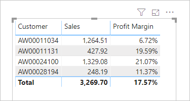

# DAX: Avoid converting BLANKs to values

As a data modeler, when writing measure expressions you might come across cases where a meaningful value can't be returned. In these instances, you may be tempted to return a value—like zero. We suggest you carefully determine whether this design is efficient and practical.

Consider the following measure definition.

```dax
Profit Margin =
DIVIDE([Profit], [Sales], 0)
```

The [DIVIDE](/dax/divide-function-dax) function divides the **Profit** measure by the **Sales** measure. Should the result be zero or BLANK, the third argument—the alternate result (which is optional)—is returned. In this example, because zero is passed as the alternate result, the measure is guaranteed to always return a value.

This measure design is inefficient and can lead to poor report designs. When it's added to a report visual, Power BI attempts to retrieve all groupings within the filter context. The evaluation and retrieval of a large query result can lead to slow report rendering. Also, too many groupings often overwhelm your report users.

Let's see what happens when the measure is added to a table visual, grouping by customer.


The table visual displays an overwhelming number of rows. (There are in fact 18,484 customers in the model, and so the table is attempting to display all of them.) Notice that the customers in view haven't achieved any sales. Yet, because the **Profit Margin** measure always returns a value, they are displayed.

> [!NOTE]
> When there are too many data points to display in a visual, Power BI may use data reduction strategies to remove or summarize large query results. For more information, see [Data point limits and strategies by visual type](../visuals/power-bi-data-points.md).

Let's see what happens when the measure definition is improved. It now returns a value only when the **Sales** measure isn't BLANK (or zero).

```dax
Profit Margin =
DIVIDE([Profit], [Sales])
```

The table visual now focuses on customers who have made sales within the current filter context. The improved measure results in a more efficient and practical experience your report users.



> [!TIP]
> When necessary, you can configure a visual to display all groupings (that return values or BLANK) within the filter context by enabling the [Show Items With No Data](../desktop-show-items-no-data.md) option.

## Recommendation

We recommend that your measures return BLANK when a meaningful value cannot be returned.

Returning BLANK is better because report visuals—by default—eliminate groupings when summarizations are BLANK. This design approach is also efficient, allowing Power BI to render reports faster.

## Next steps

For more information about this article, check out the following resources:

- [Data Analysis Expressions (DAX) Reference](/dax/)
- Questions? [Try asking the Power BI Community](https://community.powerbi.com/)
