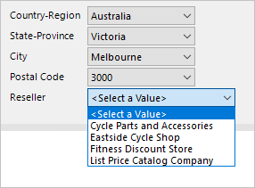

# Use cascading parameters in paginated reports

This article targets you as a report author designing Power BI [paginated reports](../paginated-reports-report-builder-power-bi.md). It provides scenarios for designing cascading parameters.

Cascading parameters are report parameters with dependencies. When a report user selects a parameter value (or values) it's used to set available values for another parameter. For information on how to develop cascading parameters, see [Add Cascading Parameters to a Report (Report Builder and SSRS)](/sql/reporting-services/report-design/add-cascading-parameters-to-a-report-report-builder-and-ssrs).

## Design scenarios

There are two design considerations for using cascading parameters. They can be used to limit _large sets_ of available items, and to present _relevant_ available items.

### Example database

The scenarios described in this article are based on an Azure SQL database. The database records sales operations, and contains various tables storing customers, products, and sales orders.

A table named **Reseller** stores one row for each reseller, and it contains many thousands of rows. The **Reseller** table has these columns:

- ResellerCode (integer)
- ResellerName
- Country-Region
- State-Province
- City
- PostalCode

There's a table named **Sales**, too. It stores sales order rows, and it defines a foreign key relationship to the **Reseller** table, using the **ResellerCode** column.

### Limit large sets of available items

There's a requirement to develop a Reseller Profile report. The report must be designed to display information for a single reseller. It's not appropriate to have the report user enter the reseller code, as they rarely memorize them.

#### Filter by related columns

In this scenario, the report user interacts with several report parameters, selecting country-region, state-province, city, and then postal code. A final parameter lists resellers that reside in that postal code.



This is how you can develop this design:

1. Create a dataset that retrieves distinct country-region values, using the following query statement:
    ```sql
    SELECT DISTINCT
    [Country-Region]
    FROM
    [Reseller]
    ORDER BY
    [Country-Region]
    ```
2. Create a dataset that retrieves distinct state-province values for the selected country-region, using the following query statement:
    ```sql
    SELECT DISTINCT
    [State-Province]
    FROM
    [Reseller]
    WHERE
    [Country-Region] = @CountryRegion
    ORDER BY
    [State-Province]
    ```
3. Create a dataset that retrieves distinct city values for the selected country-region, and the state-province, using the following query statement:
    ```sql
    SELECT DISTINCT
    [City]
    FROM
    [Reseller]
    WHERE
    [Country-Region] = @CountryRegion
    AND [State-Province] = @StateProvince
    ORDER BY
    [City]
    ```
4. Continue this pattern to create the postal code dataset.
5. Create a dataset to retrieve all resellers for the selected geographic values, using the following query statement:
    ```sql
    SELECT
    [ResellerCode],
    [ResellerName]
    FROM
    [Reseller]
    WHERE
    [Country-Region] = @CountryRegion
    AND [State-Province] = @StateProvince
    AND [City] = @City
    AND [PostalCode] = @PostalCode
    ORDER BY
    [ResellerName]
    ```
6. Create report parameters in the correct sequence, setting the available values to use their corresponding datasets
7. Ensure each dataset, except the first, map their query parameters to the report parameters.

> [!NOTE]
> The query parameters (prefixed with the @ symbol) shown in these examples could be embedded within SELECT statements, or passed to stored procedures.
>
> Generally, stored procedures are a better design approach. Their query plans are cached for quicker execution, and they allow you develop more sophisticated logic, if needed.

### Present relevant available items

TODO

## Recommendations

Whenever possible, we recommend you design your reports with cascading parameters. It's because they can:

- Provide intuitive and helpful experiences for your report users
- Deliver efficiencies, by retrieving smaller sets of available values

When possible, be sure to optimize your data sources by:

- Using stored procedures, whenever possible
- Adding appropriate indexes for efficient data retrieval
- Materializing data rows, or column values, to avoid expensive query-time evaluations

## Next steps

For more information related to this article, check out the following resources:

- [Report parameters in Power BI Report Builder](../report-builder-parameters.md)
- [Add Cascading Parameters to a Report (Report Builder and SSRS)](/sql/reporting-services/report-design/add-cascading-parameters-to-a-report-report-builder-and-ssrs)
- Questions? [Try asking the Power BI Community](https://community.powerbi.com/)
- Suggestions? [Contribute ideas to improve Power BI](https://ideas.powerbi.com)
