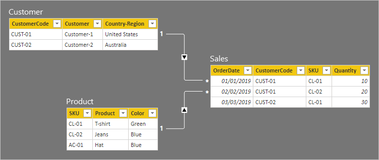
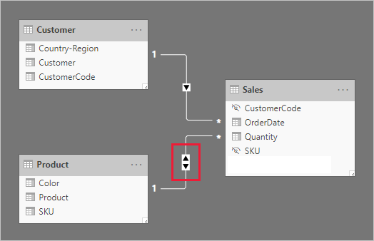
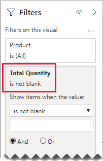
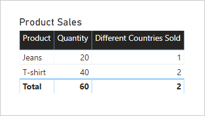

# Bi-directional relationship guidance

This article targets you as a data modeler working with Power BI Desktop. It provides you with guidance on when to create bi-directional model relationships. A bi-directional relationship is one that filters in _both directions_.

> [!NOTE]
> An introduction to model relationships is not covered in this article. If you're not completely familiar with relationships, their properties or how to configure them, we recommend that you first read the [Model relationships in Power BI Desktop](../desktop-relationships-understand.md) article.
>
> It's also important that you have an understanding of star schema design. For more information, see [Understand star schema and the importance for Power BI](star-schema.md).

 Generally, we recommend minimizing the use of bi-directional relationships. They can negatively impact on model query performance, and possibly deliver confusing experiences for your report users.

There are three scenarios when bi-directional filtering can solve specific requirements:

- [Special model relationships](#special-model-relationships)
- [Slicer items "with data"](#slicer-items-with-data)
- [Dimension-to-dimension analysis](#dimension-to-dimension-analysis)

## Special model relationships

Bi-directional relationships play an important role when creating the following two special model relationship types:

- **One-to-one**: All one-to-one relationships must be bi-directional—it isn't possible to configure otherwise. Generally, we don't recommend creating these types of relationships. For a complete discussion and alternative designs, see [One-to-one relationship guidance](relationships-one-to-one.md).
- **Many-to-many**: When relating two dimension-type tables, a bridging table is required. A bi-directional filter is required to ensure filters propagate across the bridging table. For more information, see [Many-to-many relationship guidance (Relate many-to-many dimensions)](relationships-many-to-many.md#relate-many-to-many-dimensions).

## Slicer items "with data"

Bi-directional relationships can deliver slicers that limit items to where data exists. (If you're familiar with Excel PivotTables and slicers, it's the default behavior when sourcing data from a Power BI dataset, or an Analysis Services model.) To help explain what it means, first consider the following model diagram.


The first table is named **Customer**, and it contains three columns: **Country-Region**, **Customer**, and **CustomerCode**. The second table is named **Product**, and it contains three columns: **Color**, **Product**, and **SKU**. The third table is named **Sales**, and it contains four columns: **CustomerCode**, **OrderDate**, **Quantity**, and **SKU**. The **Customer** and **Product** tables are dimension-type tables, and each has a one-to-many relationship to the **Sales** table. Each relationship filters in a single direction.

To help describe how bi-directional filtering works, the model diagram has been modified to reveal the table rows. All examples in this article are based on this data.

> [!NOTE]
> It's not possible to display table rows in the Power BI Desktop model diagram. It's done in this article to support the discussion with clear examples.



The row details for the three tables are described in the following bulleted list:

- The **Customer** table has two rows:
  - **CustomerCode** CUST-01, **Customer** Customer-1, **Country-Region** United States
  - **CustomerCode** CUST-02, **Customer** Customer-2, **Country-Region** Australia
- The **Product** table has three rows:
  - **SKU** CL-01, **Product** T-shirt, **Color** Green
  - **SKU** CL-02, **Product** Jeans, **Color** Blue
  - **SKU** AC-01, **Product** Hat, **Color** Blue
- The **Sales** table has three rows:
  - **OrderDate** January 1 2019, **CustomerCode** CUST-01, **SKU** CL-01, **Quantity** 10
  - **OrderDate** February 2 2019, **CustomerCode** CUST-01, **SKU** CL-02, **Quantity** 20
  - **OrderDate** March 3 2019, **CustomerCode** CUST-02, **SKU** CL-01, **Quantity** 30

Now consider the following report page.


The page consists of two slicers and a card visual. The first slicer is for **Country-Region** and it has two items: Australia and United States. It currently slices by Australia. The second slicer is for **Product**, and it has three items: Hat, Jeans, and T-shirt. No items are selected (meaning _no products_ are filtered). The card visual displays a quantity of 30.

When report users slice by Australia, you might want to limit the **Product** slicer to display items where data _relates_ to Australian sales. It's what's meant by showing slicer items "with data". You can achieve this behavior by configuring the relationship between the **Product** and **Sales** table to filter in both directions.



The **Product** slicer now lists a single item: T-shirt. This item represents the only product sold to Australian customers.


We first suggest you consider carefully whether this design works for your report users. Some report users find the experience confusing. They don't understand why slicer items dynamically appear or disappear when they interact with other slicers.

If you do decide to show slicer items "with data", we don't recommend you configure bi-directional relationships. Bi-directional relationships require more processing and so they can negatively impact on query performance—especially as the number of bi-directional relationships in your model increases.

There's a better way to achieve the same result: Instead of using bi-directional filters, you can apply a visual-level filter to the **Product** slicer itself.

Let's now consider that the relationship between the **Product** and **Sales** table no longer filters in both directions. And, the following measure definition has been added to the **Sales** table.

```dax
Total Quantity = SUM(Sales[Quantity])
```

To show the **Product** slicer items "with data", it simply needs to be filtered by the **Total Quantity** measure using the "is not blank" condition.



## Dimension-to-dimension analysis

A different scenario involving bi-directional relationships treats a fact-type table like a bridging table. This way, it supports analyzing dimension-type table data within the filter context of a different dimension-type table.

Using the example model in this article, consider how the following questions can be answered:

- How many colors were sold to Australian customers?
- How many countries purchased jeans?

Both questions can be answered _without_ summarizing data in the bridging fact-type table. They do, however, require that filters propagate from one dimension-type table to the other. Once filters propagate, summarization of dimension-type table columns can be achieved using the [DISTINCTCOUNT](/dax/distinctcount-function-dax) DAX function—and possibly the [MIN](/dax/min-function-dax) and [MAX](/dax/max-function-dax) DAX functions.

As the fact-type table behaves like a bridging table, you can follow the many-to-many relationship guidance to relate two dimension-type tables. It will require configuring at least one relationship to filter in both directions. For more information, see [Many-to-many relationship guidance (Relate many-to-many dimensions)](relationships-many-to-many.md#relate-many-to-many-dimensions).

However, as already described in this article, this design will likely result in a negative impact on performance, and the user experience consequences related to [slicer items "with data"](#slicer-items-with-data). So, we recommend that you activate bi-directional filtering _in a measure definition_ by using the [CROSSFILTER](/dax/crossfilter-function) DAX function instead. The CROSSFILTER function can be used to modify filter directions—or even disable the relationship—during the evaluation of an expression.

Consider the following measure definition added to the **Sales** table. In this example, the model relationship between the **Customer** and **Sales** tables has been configured to filter in a _single direction_.

```dax
Different Countries Sold = 
CALCULATE(
    DISTINCTCOUNT(Customer[Country-Region]),
    CROSSFILTER(
        Customer[CustomerCode],
        Sales[CustomerCode],
        BOTH
    )
)
```

During the evaluation of the **Different Countries Sold** measure expression, the relationship between the **Customer** and **Sales** tables filters in both directions.

The following table visual present statistics for each product sold. The **Quantity** column is simply the sum of quantity values. The **Different Countries Sold** column represents the distinct count of country-region values of all customers who have purchased the product.



## Next steps

For more information related to this article, check out the following resources:

- [Model relationships in Power BI Desktop](../desktop-relationships-understand.md)
- [Understand star schema and the importance for Power BI](star-schema.md)
- [Many-to-many relationship guidance](relationships-many-to-many.md)
- [One-to-one relationship guidance](relationships-one-to-one.md)
- Questions? [Try asking the Power BI Community](https://community.powerbi.com/)
