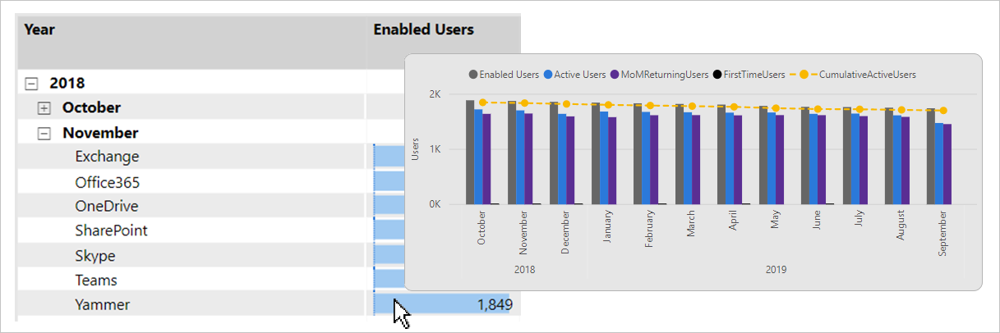
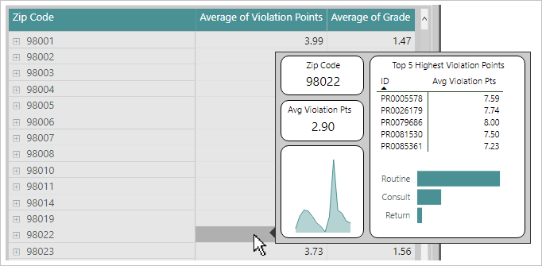

# Extend visuals with report page tooltips

This article targets you as a report author designing Power BI reports. It provides suggestions and recommendations when creating [report page tooltips](../create-repor../create-reports/desktop-tooltips.md).

## Suggestions

Report page tooltips can enhance the experience for your report users. Page tooltips allow your report users to quickly and efficiently gain deeper insights from a visual. They can be associated with different report objects:

- **Visuals:** On a visual-by-visual basis, you can configure which visuals will reveal your page tooltip. Per visual, it's possible to have the visual reveal no tooltip, default to the visual tooltips (configured in the visual fields pane), or use a specific page tooltip.
- **Visual headers:** You can configure specific visuals to display a page tooltip. Your report users can reveal the page tooltip when they hover their cursor over the visual header icon—be sure to educate your users about this icon.

> [!NOTE]
> A report visual can only reveal a page tooltip when tooltip page filters are compatible with the visual's design. For example, a visual that groups by _product_ is compatible with a tooltip page that filters by _product_.
>
> Page tooltips don't support interactivity. If you want your report users to interact, create a [drillthrough page](../create-reports/desktop-drillthrough.md) instead.
>
> Power BI visuals do not support page tooltips.

Here are some suggested design scenarios:

- [Different perspective](#different-perspective)
- [Add detail](#add-detail)
- [Add help](#add-help)

### Different perspective

A page tooltip can visualize the same data as the source visual. It's done by using the same visual and pivoting groups, or by using different visual types. Page tooltips can also apply different filters than those filters applied to the source visual.

The following example shows what happens when the report user hovers their cursor over the **EnabledUsers** value. The filter context for the value is Yammer in November 2018.

A page tooltip is revealed. It presents a different data visual (line and clustered column chart) and applies a contrasting time filter. Notice that the filter context for the data point is November 2018. Yet the page tooltip displays trend over _a full year of months_.

### Add detail

A page tooltip can display additional details and add context.

The following example shows what happens when the report user hovers their cursor over the **Average of Violation Points** value, for zip code 98022.

A page tooltip is revealed. It presents specific attributes and statistics for zip code 98022.

### Add help

Visual headers can be configured to reveal page tooltips to visual headers. You can add help documentation to a page tooltip by using richly formatted text boxes. It's also possible to add images and shapes.

Interestingly, buttons, images, text boxes, and shapes can also reveal a visual header page tooltip.

The following example shows what happens when the report user hovers their cursor over the [visual header icon](../create-repor../create-reports/desktop-visual-elements-for-reports.md).

A page tooltip is revealed. It presents rich formatted text in four text boxes, and a shape (line). The page tooltip conveys help by describing each acronym displayed in the visual.

## Recommendations

At report design time, we recommend the following practices:

- **Page size:** Configure your page tooltip to be small. You can use the built-in **Tooltip** option (320 pixels wide, 240 pixels high). Or, you can set custom dimensions. Take care not to use a page size that's too large—it can obscure the visuals on the source page.
- **Page view:** In report designer, set the page view to **Actual Size** (page view defaults to **Fit to Page**). This way, you can see the true size of the page tooltip as you design it.
- **Style:** Consider designing your page tooltip to use the same theme and style as the report. This way, users feel like they are in the same report. Or, design a complimentary style for your tooltips, and be sure to apply this style to all page tooltips.
- **Tooltip filters:** Assign filters to the page tooltip so that you can preview a realistic result as you design it. Be sure to remove these filters before you publish your report.
- **Page visibility:** Always hide tooltip pages—users shouldn't navigate directly to them.

## Next steps

For more information related to this article, check out the following resources:

- [Create tooltips based on report pages in Power BI Desktop](../create-repor../create-reports/desktop-tooltips.md)
- [Customizing tooltips in Power BI Desktop](../create-reports/desktop-custom-tooltips.md)
- [Use visual elements to enhance Power BI reports](../create-repor../create-reports/desktop-visual-elements-for-reports.md)
- Questions? [Try asking the Power BI Community](https://community.powerbi.com/)
- Suggestions? [Contribute ideas to improve Power BI](https://ideas.powerbi.com/)

