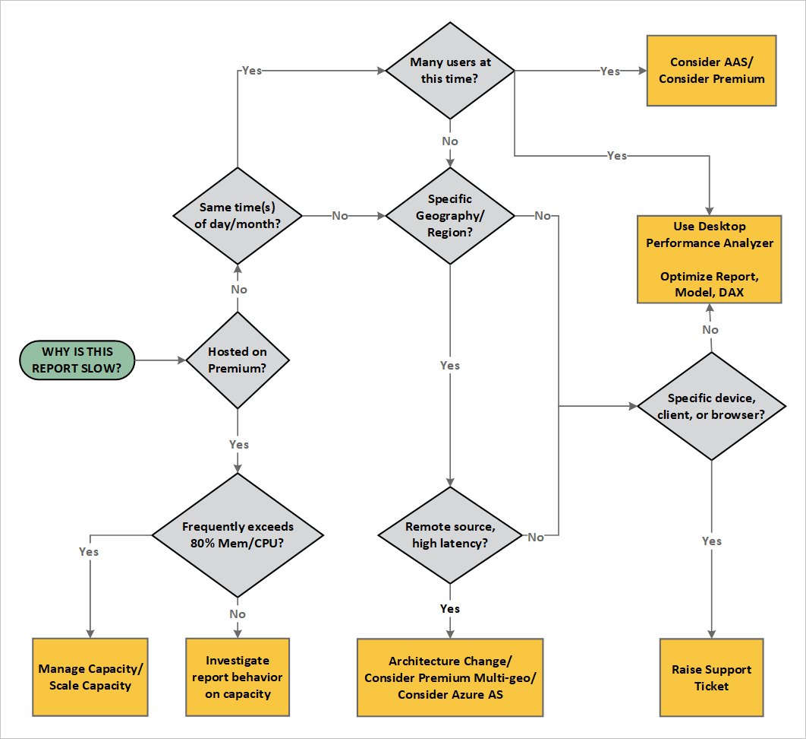

# Troubleshoot report performance

This article provides guidance that enables developers and administrators to troubleshoot slow report performance. It applies to Power BI reports, and also Power BI paginated reports.

Slow reports can be identified by report users who experience reports that are slow to load, or slow to update when interacting with slicers or other features. When reports are hosted on a Premium capacity, slow reports can also be identified by monitoring the [Power BI Premium Metrics app](../service-admin-premium-monitor-capacity.md). This app helps you to monitor the health and capacity of your Power BI Premium subscription.

## Take appropriate action

Use the following flowchart to help understand the cause of slow performance, and to take appropriate action.

The first consideration is to understand if the slow report is hosted on a Premium capacity.

### Premium capacity

When the report is hosted on a Premium capacity, use the **Power BI Premium Metrics app** to determine if the report-hosting capacity frequently exceeds capacity resources. It's the case for CPU when it frequently exceeds 80%. For memory, it's when the [active memory metric](../service-premium-metrics-app.md#the-active-memory-metric) exceeds 50. When there's pressure on resources, it may be time to [manage or scale the capacity](../service-admin-premium-manage.md). When there are adequate resources, investigate report behavior on the capacity.

### Shared capacity

When the report is hosted on shared capacity, it's not possible to monitor capacity health. You'll need to take a different investigative approach.

First, determine if slow performance occurs at specific times of the day or month. If it does—and many users are opening the report at these times—consider two options:

1. Increase query throughput by migrating the dataset to [Azure Analysis Services](/azure/analysis-services/analysis-services-overview), or a Premium capacity.
1. Use Power BI Desktop [Performance Analyzer](../desktop-performance-analyzer.md) to find out how each of your report elements—such as visuals and DAX formulas—are doing. It's especially useful to determine whether it's the query or visual rendering that's contributing to performance issues.

If you determine there's no time pattern, next consider if slow performance is isolated to a specific geography or region. If it is, it's likely that the data source is remote and there's high network latency. In this case, consider changing architecture by:

- Using Power BI Premium [Multi-Geo](../service-admin-premium-multi-geo.md) to deploy Power BI content on datacenters in regions other than the home region of the Power BI tenant.
- Using [Azure Analysis Services](/azure/analysis-services/analysis-services-overview).

Finally, if you determine there's no time pattern _and_ slow performance occurs in all regions, investigate whether slow performance occurs on specific devices, clients, or web browsers. If it doesn't, use Power BI Desktop [Performance Analyzer](../desktop-performance-analyzer.md), as described earlier, to optimize the report or model.

When you determine specific devices, clients, or web browsers contribute to slow performance, we recommend creating a support ticket through the [Power BI support page](https://powerbi.microsoft.com/support/).

## Next steps

For more information about this article, check out the following resources:

- [Power BI guidance](index.yml)
- [Monitoring report performance](monitor-report-performance.md)
- [Performance Analyzer](../desktop-performance-analyzer.md)
- Whitepaper: [Planning a Power BI Enterprise Deployment](https://go.microsoft.com/fwlink/?linkid=2057861)
- Questions? [Try asking the Power BI Community](https://community.powerbi.com/)
- Suggestions? [Contribute ideas to improve Power BI](https://ideas.powerbi.com/)
