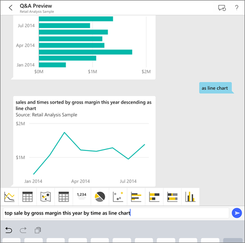
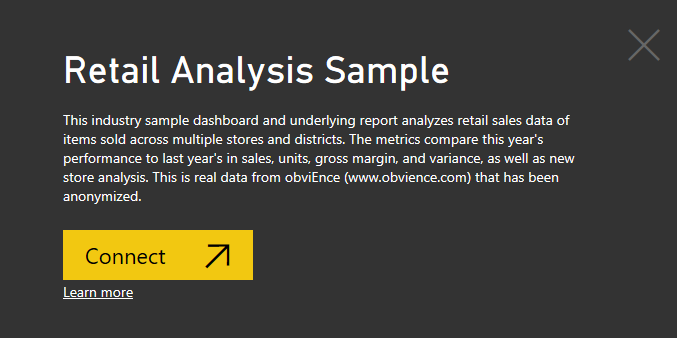
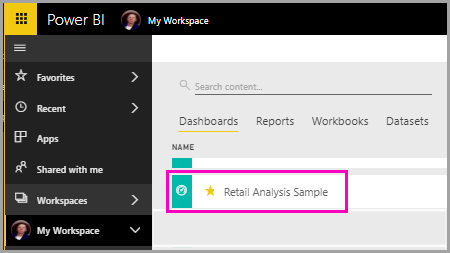
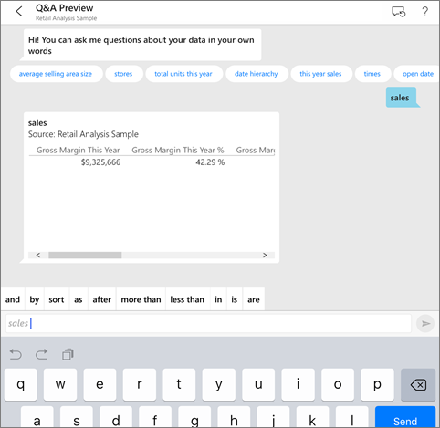
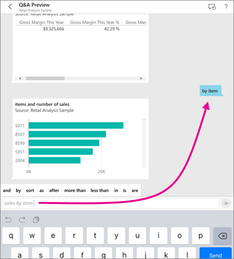
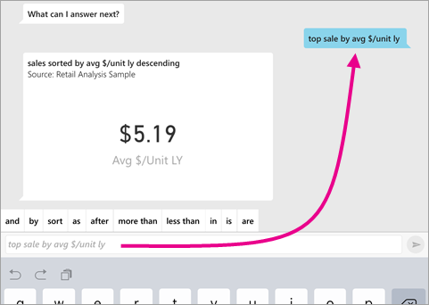

# Q&A virtual analyst in iOS apps - Power BI

The easiest way to learn about your data is to ask questions about it in your own words. In this article, you ask questions and view featured insights about sample data with the Q&A virtual analyst in the Microsoft Power BI mobile app on your iPad, iPhone, and iPod Touch. 

Applies to:

|  |  |
|:--- |:--- |
| iPhones |iPads |

The Q&A virtual analyst is a conversational BI experience that accesses underlying Q&A data in the Power BI service [(https://powerbi.com)](https://powerbi.com). It suggests data insights, and you can type or speak your own questions.

If you're not signed up for Power BI, [sign up for a free trial](https://app.powerbi.com/signupredirect?pbi_source=web) before you begin.

## Prerequisites

### Install the Power BI for iOS app
[Download the iOS app](http://go.microsoft.com/fwlink/?LinkId=522062 "Download the iPhone app")  from the Apple App Store to your iPad, iPhone, or iPod Touch.

These versions support the Power BI for iOS app:
- iPad with iOS 10 or later.
- iPhone 5 and above, with iOS 10 or later. 
- iPod Touch with iOS 10 or later.

### Download samples
The first step is to download the Retail Analysis and Opportunity Analysis samples in the Power BI service.

**Get the Retail Analysis sample**

1. Open the Power BI service (app.powerbi.com) and sign in.

2. In the left navigation pane, select **Workspaces**, **My Workspace**.

3. In the lower-left corner select **Get data**.
   
    

3. On the Get Data page, select the **Samples** icon.
   
   

4. Select the **Retail Analysis Sample**.
 
    
 
8. Select **Connect**.  
  
   
   
5. Power BI imports the content pack and adds a new dashboard, report, and dataset to your current workspace.
   
   

**Get the Opportunity Analysis sample**

- Go through the same steps as you did for the Retail Analysis sample, but in Step 4, select the **Opportunity Analysis sample**.

    
  
OK, you're ready to view the samples on your iOS device.

## Try asking questions on your iPhone or iPad
1. On your iPhone or iPad, Tap the global navigation button  > **Workspaces** > **My Workspace**, and open the Retail Analysis Sample dashboard.

2. Tap the Q&A virtual analyst icon  from the action menu at the bottom of the page (at the top of the page on an iPad).
     The Q&A virtual analyst offers some suggestions to get started.
3. Type **show**, tap **sales** from the suggestion list > **Send** .

    
4. Tap **by** from the keywords, then tap **item** from the suggestion list > **Send** .

    
5. Tap **as** from the keywords, tap the column chart icon , then tap **Send** .
6. Long-tap the resulting chart, then tap **Expand**.

    

    The chart opens in focus mode in the app.

    
7. Tap the arrow in the upper-left corner to go back to the Q&A virtual analyst chat window.
8. Tap the X at the right of the text box to delete the text and start over.
9. Try a new question: Tap **top** from the keywords, tap **sale by avg $/unit ly** > **Send** .

    
10. Choose **by** from the keywords, tap **time** from the suggestion list at the top > **Send** .

     
11. Type **as**, pick the line chart icon  from the suggestion list > **Send** .

    

## Try saying your questions
You can now ask questions about your data in the Power BI mobile app by speaking instead of typing.

1. Tap the Q&A virtual analyst icon  from the action menu at the bottom of the page (at the top of the page on an iPad).
2. Tap the microphone icon .

    

1. When the microphone icon is active, start speaking. For example, say "average unit price by time", then tap **Send** .

    

### Questions about privacy when using speech-to-text?
See the Speech Recognition section of [What's New in iOS](https://go.microsoft.com/fwlink/?linkid=845624) in the Apple iOS Developer Guides.

## Help and feedback
* Need help? Just say "Hi" or "Help", and you'll get assistance with starting a new question.
* Care to provide feedback on the results? Long-tap a chart or other result, then tap the smiley or frowny face.

    

    Your feedback is anonymous, and helps us improve our answers to questions.

## Enhance your Q&A virtual analyst results
You can improve the results you and your customers get when they use the Q&A virtual analyst on a dataset, either by asking more targeted questions or by enhancing the dataset.

### How to ask questions
* Follow these [tips for asking questions in Q&A](service-q-and-a-tips.md) in the Power BI service or the Q&A virtual analyst in your iOS mobile app.

### How to enhance the dataset
* Enhance the dataset in Power BI Desktop or in the Power BI service to [make your data work well with Q&A and the Q&A virtual analyst](service-prepare-data-for-q-and-a.md).

## Next steps
* [Q&A in the Power BI service](power-bi-q-and-a.md)
* Questions? Check the [Mobile apps section of the Power BI Community](https://go.microsoft.com/fwlink/?linkid=839277)
