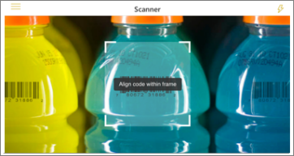
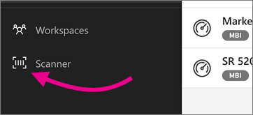

# Scan a barcode with your iPhone from the Power BI mobile app
Scan barcodes in the real world to go directly to filtered BI information in the Power BI mobile app.

Say a colleague has [tagged a barcode field in a report Power BI Desktop](desktop-mobile-barcodes.md) and shared the report with you. 

When you scan a product barcode with the scanner in the Power BI app on your iPhone, you see the report (or list of reports) with that barcode. You can open that report on your iPhone, filtered to that barcode.

## Scan a barcode with the Power BI scanner
1. In the Power BI mobile app open the main navigation menu  in the upper left. 
2. Scroll down to **Scanner** and select it. 
   
    
3. If your camera is not enabled, you need to approve the Power BI app to use the camera. This is a one-time approval. 
4. Point the scanner at a barcode on a product. 
   
    You see a list of reports associated with that barcode.
5. Tap the report name to open it on your iPhone, automatically filtered to that barcode.

## Filter by other barcodes while in a report
While looking at a report filtered by a barcode on your iPhone, you may want to filter the same report by a different barcode.

* If the barcode icon has a filter , the filter is active and report Is already filtered by a barcode. 
* If the icon doesn’t contain a filter , the filter isn't active and the report isn’t filtered by a barcode. 

Either way, tap the icon to open a small menu with a floating scanner.

* Focus the scanner on the new item to change the filter of the report to a different barcode value. 
* Select **Clear barcode filter** to go back to the unfiltered report.
* Select **Filter by recent barcodes** to change the report filter to one of the barcodes you've scanned within the current session.

## Issues with scanning a barcode
Here are some messages you may see when you scan a barcode on a product.

### “Couldn’t filter report...”
The report you choose to filter is based on a data model that does not include this barcode value. For example, the product "mineral water" isn't included in the report.  

### All/some of the visuals in the report don’t contain any value
The barcode value you scanned exists in your model but all/Some of the visuals on your report don’t contain this value and therefore filtering will return an empty state. Try looking into other report pages or edit your reports in Power BI desktop to contain this value 

### “Looks like you don’t have any reports that can be filtered by barcodes.”
This means you don’t have any barcode-enabled reports. The barcode scanner can only filter reports that have a column marked as **Barcode**.  

Make sure you or the report owner has tagged a column as **Barcode** in Power BI Desktop. Learn more about [tagging a barcode field in Power BI Desktop](desktop-mobile-barcodes.md)

### “Couldn’t filter report - Looks like this barcode doesn't exist in the report data.”
The report you chose to filter is based on a data model that doesn't include this barcode value. For example, the product "mineral water" isn't included in the report. You can scan a different product, choose a different report (if more than one report is available), or view the report unfiltered. 

## Next steps
* [Tag a barcode field in Power BI Desktop](desktop-mobile-barcodes.md)
* [Dashboard tiles in Power BI](service-dashboard-tiles.md)
* [Dashboards in Power BI](service-dashboards.md)

