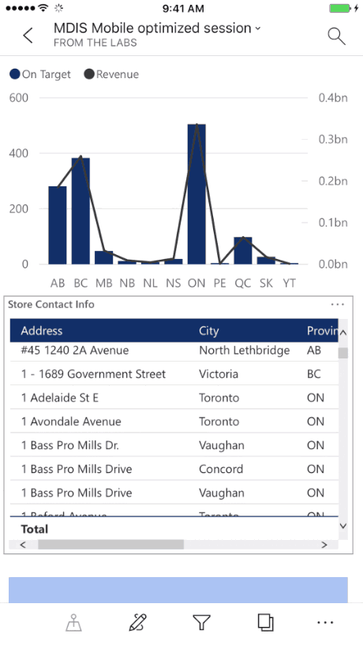
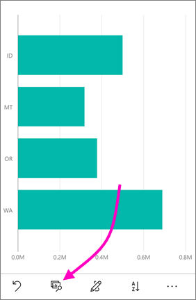
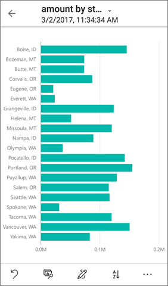
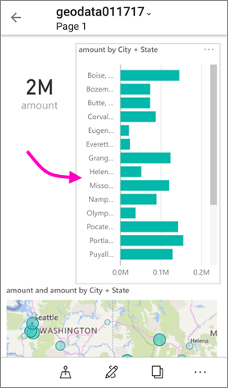

# View Power BI reports optimized for your phone

Applies to:

|  |  |
|:--- |:--- |
| iPhones |Android phones |

When you create a Power BI report in Power BI Desktop, you can also [create a version of that report optimized for viewing](desktop-create-phone-report.md) in the Power BI app on a phone.

Then, when you open a Power BI report on a phone, Power BI detects if the report has been optimized for phones and automatically opens the optimized report in portrait view.

If a phone-optimized report doesn’t exist, the report still opens, but in the non-optimized landscape views. Even in a phone-optimized report, if you turn your phone sideways, the report opens in the non-optimized view with the original report layout. If only some pages are optimized, you see a message in portrait view, indicating the report is available in landscape.

All the other features of Power BI reports still work in phone-optimized reports. Read more about what you can do in:

* [Reports on iPhones](mobile-reports-in-the-mobile-apps.md). 
* [Reports on Android phones](mobile-reports-in-the-mobile-apps.md).

## Filter the report page on a phone
If a phone-optimized report has filters defined, when you view the report on a phone you can use those filters. 

1. Tap the filter icon  at the bottom of the page. 
2. Use basic or advanced filtering to see the results you're interested in.
   
    

## Cross-highlight visuals
Cross highlighting visuals in phone reports works the same as it does in the Power BI service and in reports on phones in landscape view: When you select data in one visual, it highlights related data in the other visuals on that page.

Read more about [filtering and highlighting in Power BI](power-bi-reports-filters-and-highlighting.md).

## Select visuals
In phone reports when you select a visual, the phone report highlights that visual and focuses on it, neutralizing canvas gestures.

With the visual selected, you can do things like scroll within the visual. To de-select a visual, just touch anywhere outside the visual area.

## Open visuals in focus mode
Phone reports also offer a focus mode, so you can get a bigger view of a single visual and explore it and the report.

* In a phone report, tap the ellipsis (**...**) in the upper-right corner of a visual  > **Expand to focus mode**.
  
    

What you do in focus mode carries over to the report canvas and vice versa, for a seamless exploration experience. For example, if you highlight a value in a visual, then return to the whole report, the report as a whole will be filtered to the value you highlighted in the visual.

Some actions are only possible in focus mode, due to screen size constraints:

* **Drill down** into the information displayed in a visual. Read more about [drilling down and up](mobile-apps-view-phone-report.md#drill-down-in-a-visual) in a phone report, below.
* **Sort** the values in the visual.
* **Revert**: Clear exploration steps you've taken on a visual and revert to the definition set when the report was created.
  
    To clear all exploration from a visual, tap the ellipsis (**...**) > **Revert**.
  
    
  
    Revert is available at the report level, clear all exploration from all visuals, or at the visual level, clearing all exploration from the specific visual selected.   

## Drill down in a visual
If hierarchy levels are defined in a visual, you can drill down into the detailed information displayed in a visual, then back up. You [add drill-down to a visual](power-bi-visualization-drill-down.md) either in the Power BI service or in Power BI Desktop. Drill-down only works in phone-optimized Power BI reports when you view them on a phone. 

1. In a report on a phone, tap the ellipsis (**...**) in the upper-right corner > **Expand to focus mode**.
   
    
   
    In this example, the bars show the values for states.
2. Tap the explore icon  in the lower-left.
   
    
3. Tap **Show next level** or **Expand to next level**.
   
    
   
    Now the bars show the values for cities.
   
    
4. If you tap the arrow in the upper-left corner, you return to the phone report with the values still expanded to the lower level.
   
    
5. To go back up to the original level, tap the ellipsis (**...**) again > **Revert**.
   
    

## Next steps
* [Create reports optimized for the Power BI phone apps](desktop-create-phone-report.md)
* [Create a phone view of a dashboard in Power BI](service-create-dashboard-mobile-phone-view.md)
* [Create responsive visuals optimized for any size](desktop-create-responsive-visuals.md)
* More questions? [Try asking the Power BI Community](http://community.powerbi.com/)

