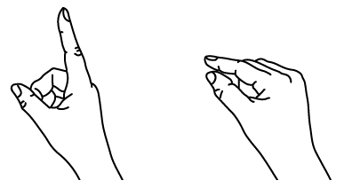
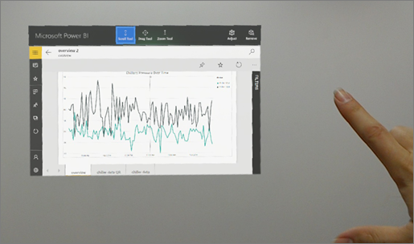
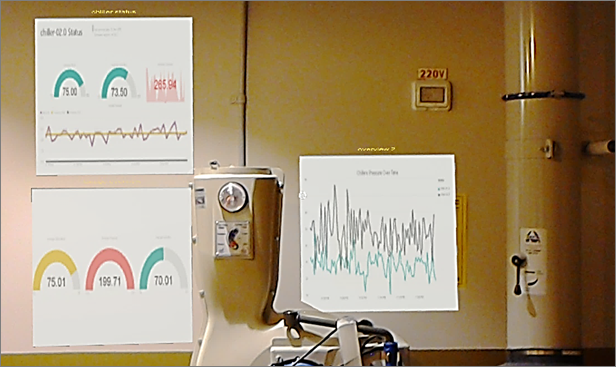

# Power BI for Mixed Reality app
View your dashboards and reports in the Power BI for Mixed Reality app while immersed in the virtual world, or place them in specific locations in the context of your environment. 

[Download the Power BI for Mixed Reality](https://www.microsoft.com/p/power-bi-mobile/9nblgggzlxn1?activetab=pivot%3aoverviewtab) app from the Windows store: In the Windows Store, it's called "Power BI Mobile." Interact with your dashboards and reports in the virtual world, then select the ones you want to place. 

## Two views: Windows classic and holographic

Power BI for Mixed Reality is based on the Power BI Windows mobile app with additional capabilities unique to mixed reality. When you start Power BI for Mixed Reality, you're in this "classic" Windows view of Power BI. In this view, you can navigate between the dashboards and reports you have access to. When you find the one you want, you can switch from the classic Windows view to the holographic experience. 

## Windows classic view basics

If you're new to the mixed-reality experience, this section is for you. Interacting with a mixed-reality app is different from interacting with a computer, or even with a tablet or phone. In the Windows classic view, mixed-reality apps respond to a set of gestures and voice commands that replace the traditional mouse and keyboard, or the phone tap. 

**Air tap**

The air tap is the most basic gesture you need to know to interact with almost every mixed reality app. You tap the thumb and forefinger together with your hand held upright, similar to a mouse click or phone tap.  

In Power BI you use an air tap in the Windows classic app anywhere you would use a mouse click. You can air tap to open a dashboard or report in your workspace, or air tap part of a visual to filter or cross highlight other visuals, and so on.

 

Read more about [Microsoft hand gestures in mixed reality](https://developer.microsoft.com/windows/mixed-reality/gestures).

**Pin an item** 

Air tap the **Pin** icon  to pin a dashboard or report from Windows classic view to holographic view. You can pin a number of items to holographic view. 

**Switch to holographic view**

After you've pinned items in the Windows classic view, you air tap the **Full Screen** icon  to switch to holographic view. 

## Holographic view basics

Now that you're in holographic view, all the artifacts you pinned are in your docking belt. You can place these pinned items in specific locations in the physical space -- for example, next to the piece of equipment that the item describes. In holographic view, voice commands complement the hand gestures. Here are some common voice commands.

**"Follow me"** 

Pick up a Power BI artifact, so it will stay in your main field of vision and follow your gaze until you place it somewhere.

**"Dock"** 

Use the “dock” command to place an artifact in your Power BI docking belt, so it will follow you, outside of your main field of vision, for easy access.

**"Place here"**

This command places a dashboard or report on a wall or object, or hovering in space.

**"Go home"**

Say “go home” to return to the Power BI classic Windows view. 

**"Remove"**

Use this command to remove an artifact from holographic view.

**"Remove all"** 

Use this command to remove all artifacts from holographic view.

## Scan a report QR code in holographic view

You can scan the QR code for a report in holographic view, just as you can [scan QR codes with the Power BI mobile apps](mobile-apps-qr-code.md) for iPhone and Android.

- While in holographic view, gaze at a QR code. Power BI opens the report associated with that QR code.

## Limitations and considerations

Here are a few limitations and considerations for holographic view.

- You don't see cross-filtering or highlighting you may have set in Windows classic view.
- Your view of your pinned dashboards and reports is private. We don't currently support shared experiences.
- The dashboards and reports refresh every 45 seconds, as data changes.

## Next steps

- [Get data from the real world with the Power BI mobile apps](mobile-apps-data-in-real-world-context.md)

 

