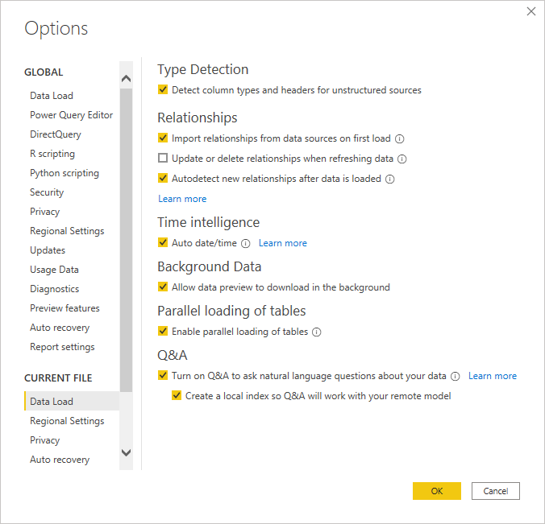

# Use natural language with import, live connect, and direct query

The Q&A feature in Power BI lets you quickly get answers from your data by using natural language to ask questions about that data. This article describes how indexing and caching are used to improve performance for each supported configuration.

## What data sources are supported in Q&A

Q&A is supported in the following configurations:

- Import mode
- Live connect mode – Using on-premises SQL Server Analysis Services, Azure Analysis Services, or Power BI datasets
- Direct Query – Azure Synapse, Azure SQL, and SQL Server 2019. Although other sources may work in direct query mode, we do not officially support these sources.

By default, Q&A is enabled inside a report if you use the Q&A visual. A prompt will appear if you're using Direct Query or Live connect. You can explicitly turn on/off the natural language capabilities for a report by going into options.

For more information, see [Limitations of Power BI Q&A](q-and-a-limitations.md).

## How does indexing work with Q&A

When you enable Q&A, an index is built to quickly provide real-time feedback to the user and to help interpret the user’s questions. The index can take some time to build and will have the following elements and limitations.

- All column names and tables are inserted into the index unless it has been explicitly turned off from within the Q&A tooling.
- All text values fewer than 100 characters will be indexed. Text values greater than 100 characters won't be indexed. 
- Q&A will store a maximum of 5 million unique values in its index. If you exceed this threshold, the index won't hold all the potential values which may decrease the accuracy of the results you receive from Q&A.
- If an error occurs during indexing, the index will remain in a partial state and will be recreated on the next refresh, as described in the next section.

## How often is the index refreshed and cached

In Power BI Desktop, the index is created at the time you use Q&A. A small icon will appear letting you know the index is being built. During this time, the Q&A visual, including suggestions, may take some time to load.

In Power BI Service, the index is recreated on publish/republish and refresh. The Q&A index isn't always created automatically and will sometimes be based upon an on-demand basis to optimize the dataset refreshes. For Direct Query, we'll index the data at most once per day to reduce the impact on the Direct Query source.

## Next steps

You can integrate natural language in your reports in a variety of ways. For more information, see these articles:

* [Q&A visual](../visuals/power-bi-visualization-q-and-a.md)
* [Q&A best practices](q-and-a-best-practices.md)
