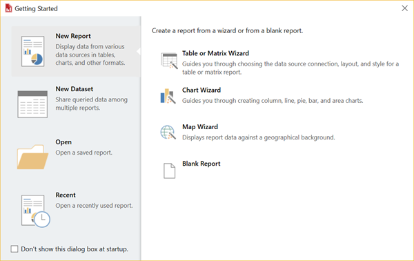

# Tutorial: Create a paginated report and upload it to the Power BI service

In this tutorial, you connect to a sample Azure SQL database and use a wizard in Report Builder to create a paginated report. Then you upload the paginated report to a workspace in a Premium capacity in the Power BI service. Paginated reports in the Power BI service are currently in preview.

If you don't have an Azure subscription, create a [free account](https://azure.microsoft.com/free/?WT.mc_id=A261C142F) before you begin.
 
## Prerequisites  

These are the prerequisites for creating the paginated report:

- Install [Report Builder from the Microsoft Download Center](http://go.microsoft.com/fwlink/?LinkID=734968). 

- Follow the quickstart [Create an Azure SQL database sample  in the Azure portal](https://docs.microsoft.com/azure/sql-database/sql-database-get-started-portal). Copy and save the value in the **Server name** box on the **Overview** tab, and remember the user name and password you created in Azure.

These are the prerequisites for uploading your paginated report to the Power BI service:

- You need a [Power BI Pro license](service-admin-power-bi-pro-in-your-organization.md).
- Your **My Workspace** or another app workspace on the service needs to be in a [Power BI Premium capacity](service-premium.md). Look for the diamond icon  next to the workspace name.

## Create the paginated report
  
1.  Start Report Builder from your computer.  
  
     The **Getting Started** dialog box opens.  
  
     
  
1.  In the left pane, verify that **New Report** is selected.  
  
3.  In the right pane, select **Table or Matrix Wizard**, and then select **Create**.  
  
4.  In the **Choose a dataset** page, select **Create a dataset**, and then select **Next**.  
  
5.  In the **Choose a connection to a data source** page, select **New**.  
  
     The **Data Source Properties** dialog box opens.  
  
6.  You can name a data source anything you want, using characters and underscores. In the **Name** box, type **MyAzureDataSource**.  
  
7.  In the **Select connection type** box, select **Microsoft Azure SQL Database**.  
  
8.  Select **Build** next to the **Connection string** box. 

## In Azure

9. Go back to the Azure portal and select **SQL databases**.

1. Select the Azure SQL database you created in the quickstart Create an Azure SQL database sample  in the Azure portal in the Prerequisites section of this article.

1. On the **Overview** tab, copy the value in the **Server name** box.

## In Report Builder

1. In Report Builder in the **Connection Properties** dialog box, under **Server name** paste the server name you copied. 

1. For **Log on to the server**, make sure **Use SQL Server Authentication** is selected, then type the user name and password you created in Azure for the sample database.

1. Under **Connect to a database**, select the drop-down arrow and select the database name you created in Azure.

1. Select **Test Connection**. You see the **Test results** message that **Test connection succeeded**.

1. Select **OK** > **OK**. 

1. In the **Connection string** box, Report Builder displays the connection string you just created. 

1. Select **OK**.
  
9. In the **Choose a connection to a data source** page, select the data source connection you just created (you see "(in this Report)") under the name > **Next**.  

10. Type the same user name and password in the box. 
  
10. In the **Design a query** page...  
  
1.      "Report Builder New Chart Run"  
  
     Now that you've made your pie chart report, you can play with it. 

18. Save the report to your local computer.
  
## Make the chart bigger  
You may want the pie chart to be bigger. 

1. On the **Run** tab of the Ribbon, select **Design**, so you can continue modifying it.  
 
2. Select the chart, but not on any element in the chart, and drag the lower-right corner to resize it.  

Notice the design surface gets larger as you drag.
  
## Add a report title  

1. Select the words **Chart title** at the top of the page, then type **Sales Pie Chart**.  
2. With the title selected, in the Properties pane, change **Color** to **Blue**.
  
## Add percentages  
 
1.  Right-click the pie chart and select **Show Data Labels**. The data labels appear within each slice on the pie chart.  
  
2.  Right-click the labels and select **Series Label Properties**. The **Series Label Properties** dialog box appears.  
  
3.  In the **Label data** box, type **#PERCENT{P0}**.  
  
     The **{P0}** gives you the percentage without decimal places. If you type just **#PERCENT**, your numbers will have two decimal places. **#PERCENT** is a keyword that performs a calculation or function for you; there are many others.  
     
4. Select **Yes** to confirm you want to set **UseValueAsLabel** to **False**.

5. On the **Font** tab, select **Bold** and change **Color** to **White**.

6. Select **OK**.     
  
##  Upload the report to the Power BI service

Now that you've created this paginated report, it's time to upload it to the service.

1. In the Power BI service (http://app.powerbi.com), go to the workspace. It needs to have a diamond icon next to the name to show that it's in a Premium capacity.
    
    

    If the workspace isn't in a Premium capacity, when you try to upload your report you see the message, "Unable to upload paginated report." Contact your Power BI administrator to move the workspace.

1. Select **Get Data**.
2. In the **Files** box > **Get**.
3. Select **Local File**, navigate to where you saved the file > **Open**.
   Power BI imports your file.

## Next steps

[What are paginated reports in Power BI Premium? (Preview)](paginated-reports-report-builder-power-bi.md)
[What are paginated reports in Power BI Premium? (Preview)](paginated-reports-report-builder-power-bi.md)
  

